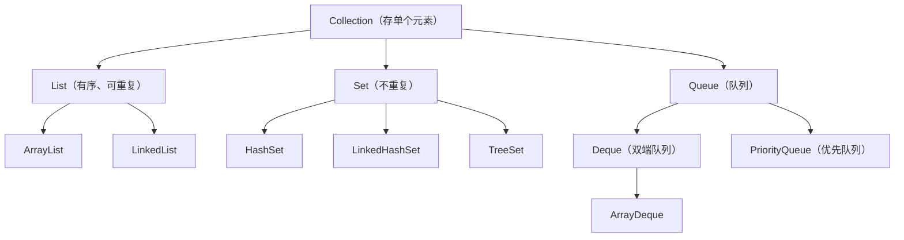
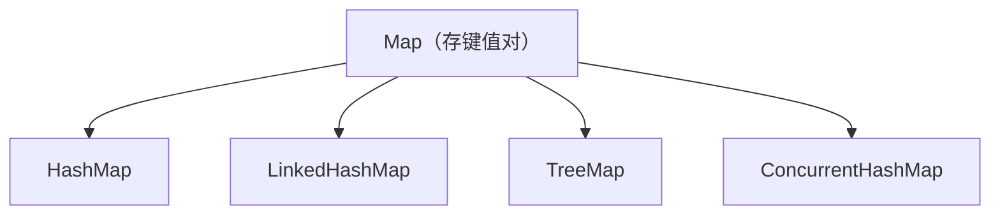
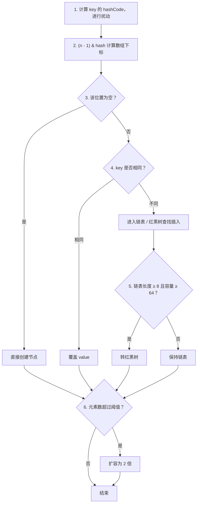

# Java集合

Java 集合框架是面试最高频的基础考点之一。重点掌握 **HashMap** 和 **ConcurrentHashMap**，把 put 流程、扩容机制、JDK 7 / JDK 8 区别讲到能脱稿。

---

## 1. 集合体系总览




| 接口 | 存什么 | 核心特点 |
|---|---|---|
| `List` | 单个元素 | 有序、可重复 |
| `Set` | 单个元素 | 不重复 |
| `Queue` | 单个元素 | 队列，通常 FIFO |
| `Map` | 键值对 | key 不重复 |

**Collection vs Collections**：`Collection` 是顶层接口；`Collections` 是工具类（`sort`、`reverse`、`unmodifiableList` 等）。

---

## 2. ArrayList

| 对比项 | ArrayList | LinkedList |
|---|---|---|
| 底层结构 | 动态数组 `Object[]` | 双向链表 |
| 随机访问 | O(1) | O(n) |
| 尾部插入 | O(1) 均摊 | O(1) |
| 中间插入 / 删除 | O(n) | 找位置 O(n)，修改 O(1) |
| 内存占用 | 较低 | 较高 |
| 线程安全 | 否 | 否 |

### 扩容机制

容量不足时扩容至原容量的 **1.5 倍**（JDK 8：`oldCapacity + (oldCapacity >> 1)`）。

扩容涉及数组复制，单次 O(n)，但尾部添加均摊 O(1)。

默认容量 10 时的序列：`10 → 15 → 22 → 33 → ...`

### 为什么查询快？

底层是连续数组，通过下标直接定位：`elementData[index]` → O(1)。

### 为什么 `elementData` 是 `transient`？

数组容量可能大于实际元素数（例如 `capacity = 10, size = 6`）。直接序列化会浪费空间，因此自定义序列化只写实际元素。

### 线程安全替代方案

- `Collections.synchronizedList(list)`
- `CopyOnWriteArrayList`（读多写少场景）
- `Collections.unmodifiableList(list)` → **只读，不等于线程安全**

---

## 3. HashSet

| 集合 | 底层 | 顺序 |
|---|---|---|
| HashSet | HashMap | 不保证顺序 |
| LinkedHashSet | LinkedHashMap | 保持插入顺序 |
| TreeSet | TreeMap（红黑树） | 按规则排序 O(log n) |

原理：元素作为 HashMap 的 key，value 固定为一个常量 `PRESENT`。利用 HashMap key 不重复的特性实现去重。

---

## 4. HashMap

### 底层结构（JDK 8）

```text
数组 + 链表 + 红黑树
```

数据先存数组，hash 冲突时用链表 / 红黑树解决。

- 链表长度 **≥ 8** 且数组容量 **≥ 64** 时，链表转红黑树
- 红黑树节点 **≤ 6** 时，退化为链表

### 为什么用红黑树而不是 AVL 树？

- AVL 树严格平衡，旋转次数多
- 红黑树平衡要求宽松，插入 / 删除调整成本低
- HashMap 频繁修改，红黑树综合性能更优

### 核心设计

| 设计点 | 说明 |
|---|---|
| 数组长度 2 的幂 | ① `(n - 1) & hash` 快速算下标；② 扩容时只需判断新增位，迁移高效 |
| `(n - 1) & hash` | 位运算替代 `%`，效率更高 |
| hash 扰动 `h ^ (h >>> 16)` | 高位信息参与低位计算，减少 hash 冲突 |
| 默认负载因子 0.75 | 空间与时间的折中：太大冲突多，太小浪费内存 |
| 默认容量 16 | 阈值 = `16 × 0.75 = 12`，超过即扩容 |
| 扩容容量 | 原容量的 2 倍 |

### put 流程（面试必背）



### 高频计算题

往 HashMap 放 25 个元素，扩容几次？

- 默认 16，阈值 12 → 放第 13 个时扩容到 32
- 新阈值 24 → 放第 25 个时扩容到 64
- **答案：2 次**

---

## 5. LinkedHashMap

- HashMap 子类，底层 = **HashMap + 双向链表**
- 可维护 **插入顺序** 或 **访问顺序**（LRU 场景）
- 经典应用：LRU 缓存
  - 设置 `accessOrder = true`
  - 重写 `removeEldestEntry()` 控制容量

---

## 6. TreeMap / TreeSet

| 特性 | 说明 |
|---|---|
| 底层 | 红黑树 |
| 排序方式 | key 的自然顺序（`Comparable`）或 `Comparator` 指定 |
| 复杂度 | 查找 / 插入 / 删除 O(log n) |

### Comparable vs Comparator

| Comparable | Comparator |
|---|---|
| 定义在对象内部 | 外部独立类 |
| `compareTo()` | `compare()` |
| 「我自己和别人比」 | 「找裁判来比较」 |
- Comparable 和 Comparator 都用于对象之间的比较和排序。Comparable 是内部比较器，需要让实体类实现 Comparable 接口并重写 compareTo 方法，定义对象的默认排序规则；Comparator 是外部比较器，通过实现 Comparator 接口或者 Lambda 表达式定义比较规则，不需要修改实体类，而且可以根据不同场景定义多种排序规则。
---

## 7. Queue / Deque

| Queue | Deque |
|---|---|
| 单端队列，FIFO | 双端队列，头尾都可操作 |
| 普通队列 | 既可当队列，也可当栈 |

### 核心方法对比

| 操作 | 成功 | 失败（空队列） |
|---|---|---|
| `poll()` | 返回队首元素 | 返回 `null` |
| `remove()` | 返回队首元素 | 抛 `NoSuchElementException` |

### ArrayDeque vs LinkedList

| ArrayDeque | LinkedList |
|---|---|
| 循环数组 | 双向链表 |
| 优先使用（更快、内存更省） | 需要链表特性时再用 |

### PriorityQueue

- 底层：小顶堆（默认）
- 应用：Top K、合并 K 个有序链表、任务优先级

---

## 8. Iterator / Fail-fast

### Iterator 核心方法

```java
hasNext()  // 是否有下一个
next()     // 返回下一个
remove()   // 安全删除当前元素
```

### Fail-fast 机制

- 迭代器记录 `modCount` 和 `expectedModCount`
- 遍历中发生结构性修改（增删），两者不一致 → 抛 `ConcurrentModificationException`
- 只是尽早发现问题，**不是线程安全机制**，也不保证 100% 抛异常

---

## 9. ConcurrentHashMap

| | ConcurrentHashMap | Hashtable |
|---|---|---|
| 线程安全 | 是 | 是 |
| 实现方式 | JDK 7：Segment 分段锁<br>JDK 8：CAS + synchronized + Node 数组 | `synchronized` 全表锁 |
| null key / value | 不允许 | 不允许 |
| 性能 | 高（细粒度锁，多线程操作不同桶不阻塞） | 低（单锁） |
| 推荐程度 | 推荐 | 历史遗留，不推荐 |

注意：**JDK 8 不再使用 Segment**。正确说法是 **CAS + synchronized**。

### 为什么不允许 null key / value？

并发场景下，`null` 会产生二义性：是值不存在，还是值为 `null`？

---

## 10. equals 与 hashCode

**黄金法则：重写 `equals` 必须同时重写 `hashCode`。**

Java 约定：`equals` 相等 → `hashCode` 必须相等。

HashMap / HashSet 依赖 `hashCode` 定位桶，再用 `equals` 判断相等。只重写 `equals` 不重写 `hashCode`，会出现 `equals` 相等但 `hashCode` 不同，集合判断异常。

---

## 11. 面试必背清单

| 编号 | 知识点 |
|---|---|
| ① | List / Set / Map 区别 |
| ② | ArrayList：底层数组、扩容、查询快原因、vs LinkedList、线程安全 |
| ③ | HashSet：底层 HashMap、如何保证不重复 |
| ④ | HashMap：底层结构、hash 扰动、下标计算、put 流程、扩容、负载因子、2 的幂、链表转红黑树、为什么红黑树、hash 冲突 |
| ⑤ | LinkedHashMap：HashMap + 双向链表 → LRU |
| ⑥ | TreeMap / TreeSet：红黑树 + 排序 |
| ⑦ | Comparable / Comparator 区别 |
| ⑧ | Queue / Deque：`poll` vs `remove`、ArrayDeque、PriorityQueue |
| ⑨ | Iterator + Fail-fast 机制 |
| ⑩ | ConcurrentHashMap：JDK 7 Segment、JDK 8 CAS + synchronized、为什么比 Hashtable 快 |
| ⑪ | 重写 equals 必须重写 hashCode |
