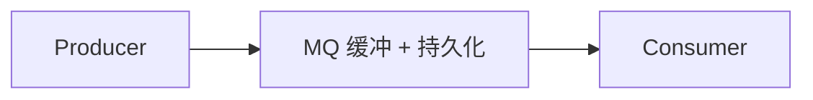
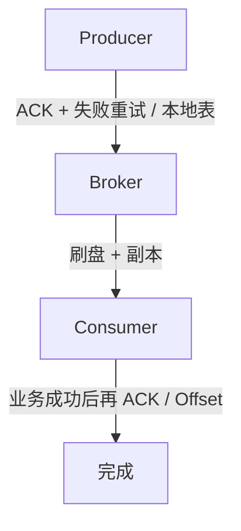

# MQ 基础

面试先答通用题，再进 Kafka / RocketMQ。每题先核心结论，再展开。

---

## 1. 什么是消息队列？

跨进程、跨服务的 **异步通信中间件**。生产者写入，消费者取出处理，双方不必同时在线，也不必知道对方是谁。



和 RPC 对比：RPC 是打电话（双方必须同时在线）；MQ 是发邮件（投递即返回）。

模型：

| 模型 | 含义 | 典型 |
|------|------|------|
| 点对点 Queue | 一条消息只被一个消费者拿走 | 传统队列 |
| 发布订阅 Topic | 一条消息可被多个订阅方各消费一次 | Kafka / RocketMQ |

> MQ = 生产者和消费者之间的异步通信缓冲区。

---

## 2. 为什么用 MQ？三大作用

| 作用 | 解决什么 | 例子 |
|------|----------|------|
| **异步** | 主流程不等待耗时操作 | 下单只发消息，积分 / 短信 / 物流自己消化 |
| **解耦** | 上游不依赖下游接口 | 新增积分系统，订单只多订一份 Topic |
| **削峰** | 瞬时洪峰先堆在队列里 | 秒杀 10 万请求进 MQ，消费者按能力写库 |

没有 MQ：订单同步打库存、积分、短信、物流，强耦合且 RT 被最慢的那个拖死。

有 MQ：订单只负责发消息。

> 记忆：**异、解、削**。拆分也有代价：消息延迟、重复、顺序、排查链路变长。不是所有调用都该上 MQ。

---

## 3. 使用场景

| 场景 | 例子 | 对应能力 |
|------|------|----------|
| 异步处理 | 下单后短信、优惠券、积分 | 异步 |
| 服务解耦 | 订单 → 库存 / 物流 / 积分 | 解耦 |
| 流量削峰 | 秒杀、大促 | 削峰 |
| 数据分发 | binlog、缓存 / ES 同步 | 异步 + 解耦 |
| 日志采集 | 应用日志 → Kafka → ELK / Flink | 大数据管道 |
| 延迟任务 | 30 分钟未支付关单 | RocketMQ 延迟消息 |
| 最终一致性 | 本地事务 + 发消息 | 事务消息 / Outbox |

万能答：异步、解耦、削峰。再补 **日志、延迟、事务** 三个特色。

---

## 4. 如何保证消息不丢？

按三段答：



**① 生产：Producer → Broker**

同步发送并等确认（Kafka `acks=all`，RocketMQ 看 `SEND_OK`）。失败重试，仍失败落本地表 / 告警，不能假装发出去了。

**② 存储：Broker 自身**

消息落盘；多副本（Kafka ISR，RocketMQ 主从同步双写）。主挂了从能顶上。

**③ 消费：Broker → Consumer**

先处理业务，成功后再提交 Offset / 回 ACK。

错误顺序：拉消息 → 提交 Offset → 再处理。进程在中间挂了，消息当成功，实际没做，**丢了**。

> 口诀：**发送要确认，落盘要持久，消费完再提交。**

Kafka 的具体开关见 [Kafka · 不丢失](./kafka#11-如何保证消息不丢失)。

---

## 5. 消息重复怎么办？幂等

MQ 通常只保证 **至少一次（at-least-once）**，很难单独保证业务 Exactly Once。重复投递必须由 **消费端幂等** 兜住。

为何会重复：ACK 丢失、生产者重试、Consumer 处理完没提交就挂、Rebalance 换人。

| 手段 | 做法 |
|------|------|
| 业务唯一 ID | `orderId` 已处理则直接返回 |
| 数据库唯一索引 | `UNIQUE(order_id)`，第二次插入冲突 |
| Redis SET NX | `SET order:10001 1 NX EX ...` |
| 状态机 | 只允许 `待支付 → 已支付`，条件更新 0 行则跳过 |

> MQ 管「至少一次」，业务管「只算一次」。**先查再改，唯一约束兜底。**

更细的幂等写法见 [分布式面试题](/ssm/microservice/distributed#三幂等重试补偿消息可靠性)。

---

## 6. 如何保证消息顺序？

**全局有序**（整个 Topic 严格 A→B→C）等于单队列单消费者，吞吐崩掉。生产做 **局部有序**：同一业务 key（订单号）有序即可。

公式：

```text
同 key → hash 进同一分区 / Queue → 同一消费者单线程消费
```

顺序被打乱的两个原因：消息散到多个队列；消费端多线程并发。

代价：热点 key 单点；扩容、重试可能短暂乱序，要评估业务能不能忍。

---

## 7. 消息积压怎么处理？

先问：**生产突然快了，还是消费变慢了？**

常见原因：Consumer 宕机 / 太少、业务慢（DB、RPC）、突发流量、频繁 Rebalance。

应急：

1. 加消费者（Kafka：**消费者数 ≤ 分区数**，多出来的闲着）
2. 提高并发：批量消费、线程池（注意顺序场景不能乱并发）
3. 优化慢 SQL / 下游
4. 存量太大：临时 Topic 扩更多分区做「搬运泄洪」
5. 非核心消息可降级跳过

根因：看生产速度、消费速度、分区数、消费者数，找到真正瓶颈。

> 先救急（扩消费、批量、分流），再治病（慢查询、Rebalance、容量）。
