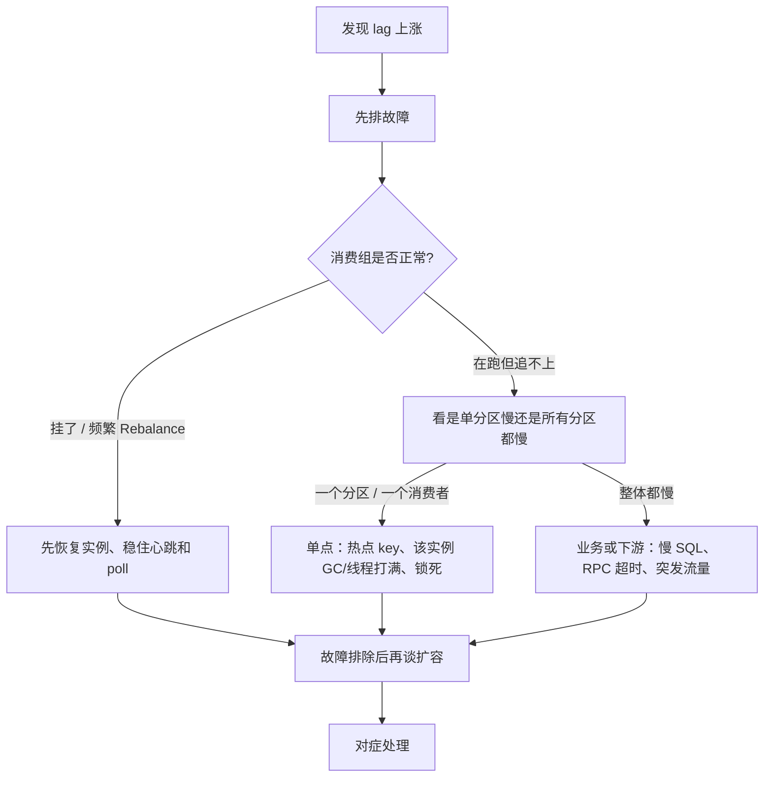

# Kafka

从「整体架构」一路问到吞吐、副本、Exactly Once。通用不丢 / 幂等 / 积压见 [MQ 基础](./basics)，这里只补 Kafka 特有配置和机制。

---

## 1. 整体架构


| 组件 | 职责 |
|------|------|
| Producer | 生产消息 |
| Broker | 存消息、接生产、供消费 |
| Topic | 一类消息的逻辑名 |
| Partition | Topic 的物理分片，真正存数据 |
| Consumer / Group | 组内瓜分分区，组间各消费一份 |
| Controller | 选分区 Leader、管元数据（旧 ZK，现 KRaft） |

读写都走分区 **Leader**，Follower 只同步做热备。

---

## 2. Topic 和 Partition

**Topic** 是逻辑分类（`order-topic`）。**Partition** 是磁盘上的追加日志，消息只保证 **分区内有序**。

为什么拆分区：

1. **水平扩展**：容量和写入打到多台 Broker
2. **并行消费**：组内一个分区同时只能给一个 Consumer，**分区数 = 消费并发上限**

没有分区：一个地方写、一个地方读。有分区：P0 / P1 / P2 并行。

副作用：分区过多则文件句柄多、选举变慢。按目标吞吐规划，且 **分区只能增不能减**。

---

## 3. Partition 与 Consumer / Group

同一 Group 内：**一个 Partition 同时只给一个 Consumer**；一个 Consumer 可以管多个 Partition。

```text
3 分区 + 3 消费者 → 一人一块
3 分区 + 5 消费者 → 多出的 2 个空闲
```

所以「消费慢就加实例」只在 **消费者数 < 分区数** 时有效。

**Consumer Group** 同时实现两种模型：

| | 效果 |
|--|------|
| 同组 | 瓜分分区，每条消息组内只消费一次（队列） |
| 异组 | 各自一份 offset，每条消息每个组都消费（发布订阅） |

offset 存在内部 Topic `__consumer_offsets`。组由某个 Broker 上的 **Group Coordinator** 管理。

> 一分区一消费者（组内），一消费者可多分区。加消费者的前提是分区够。

---

## 4. Rebalance

组成员变化或分区数变化时，**重新分配分区所有权**。传统 Eager 协议期间全组停消费（stop-the-world）。

触发：成员加入 / 退出 / 宕机、心跳超时（`session.timeout.ms`）、两次 poll 间隔超时（`max.poll.interval.ms`）、分区数或订阅变化。

危害：消费停顿 → 延迟和积压；已处理未提交的区间会被新人重拉 → **重复消费**。

少触发：心跳和 poll 超时配合理；消费别太重导致 poll 超时；`group.instance.id` 静态成员；用 CooperativeSticky 增量再平衡。

### 分配策略

| 策略 | 规则 | 特点 |
|------|------|------|
| Range | 按 Topic 分段均分 | 多 Topic 时余数容易堆给前面的人 |
| RoundRobin | 所有分区大轮询 | 最均匀 |
| Sticky | 均匀，且尽量保持原分配 | 少搬家 |
| CooperativeSticky | Sticky + 只迁必须动的分区 | 不全组停工 |

> 人变了就重新分地盘；分地盘时全组可能停工。Range 分段、RR 轮询、Sticky 少动、Cooperative 渐进。

---

## 5. Producer 发送流程

```text
拦截 → 序列化 → 选分区 → RecordAccumulator 攒批 → Sender → Leader → 按 acks 确认
```

选分区：指定 partition 则直达；有 key 则 `hash(key) % n`（同 key 同分区，顺序基础）；无 key 用粘性分区器攒满一批再换。

**攒批**（`batch.size` / `linger.ms`）是高吞吐第一功臣，不是每条立刻发。

`acks`：`0` 不等待（可能丢）；`1` Leader 写入即回；`all` 等 ISR 都写入。要可靠再配 `min.insync.replicas≥2`，否则 ISR 只剩 Leader 时约等于 `acks=1`。

重试可能乱序：严格有序可设 `max.in.flight.requests.per.connection=1`。幂等 Producer 见下文 Exactly Once。

> 拦截序列化分区，攒批异步发，acks 定可靠。

---

## 6. Consumer 消费流程

Kafka 是 **Consumer Pull**，不是 Broker 强推，消费者自己控制速度。

```text
入组拿分区 → 循环 poll → 处理 → 提交 Offset
```

两个超时常考：

| 参数 | 含义 |
|------|------|
| `session.timeout.ms` | 心跳断了当死亡，踢出组 |
| `max.poll.interval.ms` | 两次 poll 间隔太长当卡住，触发 Rebalance |

消费逻辑太重导致 poll 超时，是线上频繁 Rebalance 的常见原因。

---

## 7. Offset

分区内消息的单调序号，也是消费进度。不是 Topic 全局唯一。

| 位置 | 含义 |
|------|------|
| LEO | 下一条待写入的 offset |
| HW（高水位） | ISR 都同步到的最大 offset，**消费者只能读 HW 之前** |
| Committed Offset | 本组提交的进度 |

**提交时机决定丢还是重：**

- 先提交后处理 → 可能丢
- 先处理后提交 → 可能重复

自动提交（`enable.auto.commit=true`）省事但窗口大。生产多用 **手动提交**：处理成功后再 `commit`，关前同步兜底。没有免费的 Exactly Once，重复靠幂等。

---

## 8. 消息怎么存？

Partition 是追加日志，切成多个 **Segment**：

| 文件 | 作用 |
|------|------|
| `.log` | 消息本体 |
| `.index` | offset → 文件位置（稀疏索引，二分再顺序扫） |
| `.timeindex` | 时间 → offset |

分段方便过期整段删。清理：`delete`（按时间 / 大小）或 `compact`（同 key 只留最新）。

> 分区切分段：log 存数据，index 定位，timeindex 查时间。

---

## 9. 为什么这么快？

六件事叠在一起，分别砍掉一类开销：

```text
① 顺序写        → 减少随机 IO（寻道）
② Partition     → 多 Broker / 多分区并行读写
③ Page Cache    → 写先落内存，少次真实磁盘 IO
④ Zero Copy     → 消费时少拷贝、少用户态
⑤ Batch         → 少网络往返、少系统调用
⑥ Compression   → 少传输量和落盘量
```

**① 顺序写**

消息只追加到日志末尾，不允许随机改。机械盘随机写瓶颈在寻道（毫秒级），顺序写连续扇区，吞吐可接近内存量级。删除也是整段删，不破坏追加特性。

**② Partition 并行**

一个 Topic 拆到多台 Broker。生产可同时打多个分区，消费组内一人一块，读写天然并行。没有分区就只能一个地方写、一个地方读。

**③ Page Cache**

写先进操作系统页缓存就返回，由内核异步刷盘，Kafka 自己不再做一套应用层缓存。消费追得上生产时，数据多半还在内存里，几乎不打磁盘。

**④ Zero Copy**

消费路径是「文件原样发给网卡」，不需要加工。用 Linux `sendfile`：

| | 路径 | 代价 |
|--|------|------|
| 传统 | 磁盘 → 内核 → 用户态 → Socket → 网卡 | 约 4 次拷贝、4 次切换 |
| Kafka | 磁盘 / PageCache → Socket → 网卡 | 约 2 次拷贝、2 次切换 |

CPU 不搬数据，吞吐上去。

**⑤ Batch**

Producer 在 `RecordAccumulator` 里攒够 `batch.size` 或等到 `linger.ms` 再发；Consumer 一次 `poll` 拉一批。一次系统调用 / 一次网络请求摊很多条消息。

**⑥ Compression**

按批做 gzip / snappy / lz4 / zstd。网络和磁盘上走的是压缩后的 RecordBatch，单位开销再降一截。

> 口诀：**顺、分、页、零、批、压**。磁盘当磁带，只追加不修改。

和 RocketMQ 的吞吐对比见 [为什么 Kafka 吞吐通常更高](./compare#2-为什么-kafka-吞吐通常更高)。

---

## 10. 副本、Leader、ISR、LEO、HW

一个分区多个 Replica（常 3 个），跨不同 Broker。所有读写走 **Leader**，Follower 只从 Leader **拉**数据做热备。Leader 挂了，从 ISR 里选新主。

和 MySQL 读写分离不同：Follower **不分担读**，只保证副本在、能顶上。

### Leader / Follower / ISR

| 概念 | 是什么 |
|------|--------|
| **Leader** | 该分区唯一的生产、消费入口 |
| **Follower** | 落后副本，主动 fetch Leader 日志 |
| **ISR**（In-Sync Replicas） | **当前跟得上 Leader 的副本集合，包含 Leader 自己**。只有 ISR 里的成员有资格当新 Leader |

进出 ISR：Follower 的进度落后 Leader 不超过 `replica.lag.time.max.ms`（默认约 30s）就留在 ISR；持续落后踢到 OSR，追上再加回来。

`acks=all` 的含义是：Leader 等 **ISR 里的副本都写入** 才返回成功，不是「集群里每一个副本」。ISR 只剩 Leader 自己时，`acks=all` 约等于 `acks=1`，所以还要配 `min.insync.replicas≥2`。

### LEO 和 HW

每个副本都有自己的 LEO。

| 概念 | 全称 | 含义 |
|------|------|------|
| **LEO** | Log End Offset | **这条副本日志的末尾**：下一条将要写入的 offset。Leader 每收到一条新消息，自己的 LEO 先往前走；Follower 同步到了，自己的 LEO 再往前走 |
| **HW** | High Watermark | **高水位 = ISR 中最小的那个 LEO**。表示「ISR 都已经同步到这里」。**消费者只能读 HW 之前的消息**，保证读到的都是已复制的，Leader 突然挂也不至于让人读到「只有 Leader 有、Follower 还没有」的数据 |

```text
Leader   ：消息 0 1 2 3 4      LEO = 5
Follower ：消息 0 1 2          LEO = 3
ISR 最小 LEO = 3
HW = 3  → 消费者最多读到 offset 2
```

关系一句话：**LEO 是「我写到哪了」，HW 是「大家都写到哪了」。**

### 选举和脏选举

Leader 宕机，Controller 从 **ISR** 里选新 Leader。

| 配置 | 行为 |
|------|------|
| `unclean.leader.election.enable=false`（默认） | 非 ISR 不能当 Leader，宁可短暂不可用，也不丢未同步数据 |
| `true` | 落后副本当 Leader，可用性高，**可能丢 HW 之后、只在旧 Leader 上的消息** |

> ISR = 跟得上的俱乐部；LEO = 本副本写到哪；HW = 俱乐部里最慢的那个，消费者只能读 HW 之前。选举只在俱乐部内部进行。

---

## 11. 如何保证消息不丢失？

三段落到配置：

| 阶段 | 关键 |
|------|------|
| Producer | `acks=all` + 重试 + `min.insync.replicas≥2` |
| Broker | `replication.factor≥3`，禁止脏选举 |
| Consumer | 处理成功再提交 Offset；失败重试或进死信 |

> 不能只说 `acks=all` 就绝对不丢，三端一起保。

---

## 12. 为什么会重复消费？

典型：处理成功，Offset 还没提交，Consumer 挂了或 Rebalance，新人从旧位点再拉一遍。

生产端未开幂等时，重试也会写出重复消息。

默认语义 **at-least-once**。解决：消费幂等 + 合理提交时机。

---

## 13. Exactly Once 是什么？和「至少一次」什么关系？

先分清三种 **投递语义**，Exactly Once 是其中最严的一种：

| 语义 | 英文 | 含义 | 典型怎么来的 |
|------|------|------|----------------|
| 至多一次 | At-Most-Once | 每条消息最多处理一次，**可能丢、不会重** | 先提交 Offset 再处理；`acks=0` |
| 至少一次 | At-Least-Once | 每条消息至少处理一次，**不会丢、可能重** | 先处理再提交 Offset；发送失败重试 |
| 精确一次 | Exactly-Once | 效果上 **既不丢也不重** | Kafka 幂等 + 事务；或至少一次 + 消费幂等 |

Kafka **默认是至少一次（At-Least-Once）**：为了不丢，处理成功才提交 Offset、发送失败会重试，于是出现「处理完没提交就挂了 → 再拉一遍」的重复窗口。所以消费端通常还要做业务幂等。

**Exactly Once** 不是「Broker 魔法让每条消息物理上只出现一次」，而是：**端到端看起来只生效一次**。Kafka 自己能做到的范围要讲清楚，分两层：

**① 幂等 Producer**（`enable.idempotence=true`）

每个 Producer 有 `PID`，每个分区消息带序号。Broker 按 `<PID, 分区>` 去重，重试不会在 **同一分区、同一次会话** 里写出重复消息。这只解决「生产侧重试重复」，不管消费侧，也不管跨分区。

**② 事务**（`transactional.id`）

一批写入要么全提交要么全 abort。消费端 `isolation.level=read_committed` 只能读已提交的。流处理把「写出的新消息 + 消费 Offset」放进 **同一个事务** 提交，实现 Kafka 内部的 consume-transform-produce 精确一次。

跨出 Kafka（消费后写 MySQL / 调 RPC）事务管不到，仍是至少一次 + **业务幂等** / Outbox。

> 默认至少一次（不丢可能重）。Exactly Once = 效果上一次。Kafka 内：幂等去重 + 事务；出 Kafka：还得业务幂等。

---

## 14. Kafka 积压怎么处理？

不要一上来加消费者、加分区。**先定性：是故障还是容量，是单点还是普遍慢。**



### 第一步：排查原因

| 先看什么 | 可能原因 |
|----------|----------|
| Consumer 是否在线、有没有一直 Rebalance | 进程挂了、心跳 / `max.poll.interval.ms` 超时、发布导致组成员抖动 |
| lag 是个别分区飙还是全部分区一起涨 | **单点**：某分区热点、某台消费者 Full GC / 线程池打满、某条毒消息卡住顺序消费；**普遍**：下游集体变慢或生产突增 |
| 生产 QPS 是否突增 | 大促、重放、上游故障重试风暴 |
| 单条处理耗时、DB / RPC / 错误率 | 业务故障，加机器也救不了 |

Kafka 组内一个分区只给一个消费者。某个 Consumer 挂了，它的分区会 Rebalance 到别人身上；若别人也吃不消，或 Rebalance 停消费太久，lag 会继续堆。

### 第二步：对症处理

**故障类（先修）**

- 消费者宕机：拉起实例，确认能重新入组
- 频繁 Rebalance：加长 poll 间隔、减轻单次处理、静态成员 `group.instance.id`
- 毒消息 / 异常死循环：跳过或进死信，避免堵死分区
- 单实例 GC、线程打满：先扩这台的资源或摘掉，不要误以为「分区不够」

**容量 / 速度类**

| 情况 | 做法 | 注意 |
|------|------|------|
| 消费者数 < 分区数，且实例健康 | 加消费者 | 多出来的人没有分区会闲着 |
| 消费者已经等于分区数 | 先加分区再加人 | 分区只能增不能减；历史消息不重分布；key 路由变了，可能影响顺序 |
| 人够、分区够，仍然慢 | 优化消费：批量写库、砍慢 SQL / 下游超时、线程池并发（无序场景） | 不是再加人 |
| 生产突发、存量巨大 | 临时 Topic 开更多分区做搬运泄洪 | 业务允许乱序 / 可并行才行 |
| 非核心且可丢 | 评估把 offset 拨到最新，丢掉积压 | 要业务签字 |

> 先问「谁出问题了」：挂没挂、是一个分区还是全组、是业务慢还是流量暴。故障先修，再扩容；扩容受分区数上限约束。

---

## 15. 为什么从 ZooKeeper 转向 KRaft？

先说 ZK 在旧架构里干什么，再说它哪里不行，最后才是 KRaft 补了什么。

### ZooKeeper 当时管什么？

Kafka 自己只存消息日志，**集群元数据不在 Broker 里**，交给 ZK：

- Broker 上下线、Topic / 分区 / 副本在哪台机器
- **Controller 选举**：集群里选一个特殊 Broker，负责分区 Leader 选举、分区分配
- ACL、配置等集群状态

客户端和 Broker 通过 ZK（以及 Controller）感知拓扑变化。一套 Kafka 必须再养一套 ZK。

### 为什么不够好？

| 问题 | 表现 |
|------|------|
| 运维成本 | Kafka 集群 + ZK 集群，监控、安全、升级翻倍 |
| 元数据规模 | 分区、副本、ACL 都在 ZK **内存**里，分区到几十万级 ZK 先扛不住 |
| Controller 切换慢 | Controller 挂了要从 ZK **全量加载**元数据，分区越多恢复越慢 |
| 一致性复杂 | Controller 与 ZK 之间状态同步链路长，可能读到过期元数据，还有脑裂风险 |

ZK 适合「少量关键协调」，不适合当「百万分区的元数据库」。

### KRaft 做了什么？

**KRaft = Kafka Raft**：Kafka 用自己的 Raft，把元数据当成内部日志来管，不再依赖 ZK。

- 元数据事件写进内部 Topic `__cluster_metadata`，在 Controller 仲裁组（quorum）里复制
- Broker **增量拉取**元数据，不必每次全量灌内存
- Controller 故障切换时，元数据已在内存 / 日志里，恢复到秒级
- 部署只剩 Kafka 自己，支撑更大分区规模（目标到百万级）

2.8 引入，3.3+ 可生产，4.0 去掉 ZK。

```text
以前：Kafka 存消息  +  ZooKeeper 存元数据、选 Controller
现在：Kafka 存消息  +  KRaft 用 Raft 复制元数据日志
```

> ZK 管过路由和选主，但多一套依赖、内存扛不住海量分区、切换慢。KRaft 把元数据变成 Kafka 自己的 Raft 日志，去依赖、提规模、快恢复。
