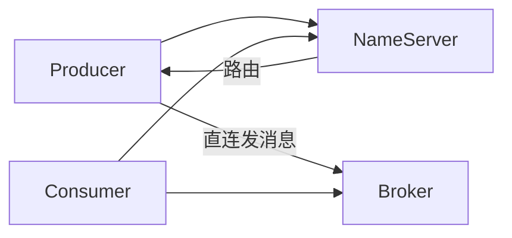
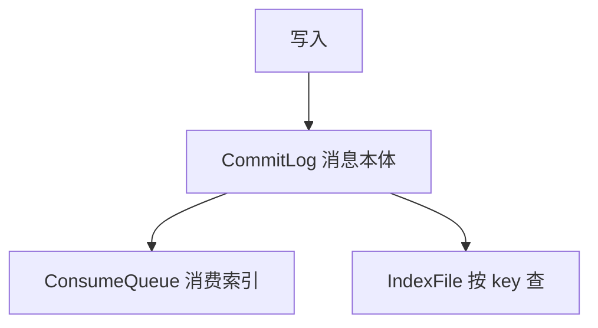
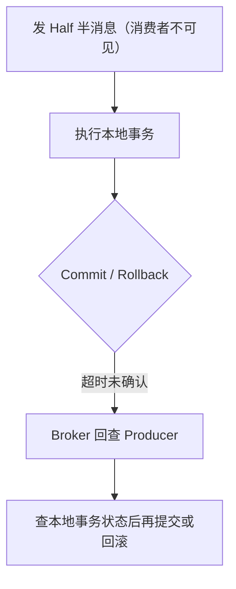

# RocketMQ

业务消息向的中间件。架构比 Kafka 多 NameServer；存储是 CommitLog 统一写；事务、延迟、重试 / 死信是面试重点。

---

## 1. 整体架构

Producer 向 NameServer 问路由，**真正发消息是直连 Broker**。NameServer 不存消息。

| 组件 | 职责 |
|------|------|
| NameServer | 路由 / 服务发现，无状态 |
| Broker | 存储和转发，Master 读写、Slave 备份 |
| Producer / Consumer | 拉路由后打 Broker；消费底层也是拉（Push 是长轮询封装） |

Broker 向 **所有** NameServer 报心跳。客户端连任意一台就能拿到全量路由。

---

## 2. NameServer

轻量注册中心：Topic → Queue → Broker。节点 **互不通信、无状态**，允许短暂不一致（AP）：客户端本地缓存路由，Broker 定时上报。

心跳超时（默认 120s）从路由表摘除。5.0 前 NameServer **不负责选主**，Master 挂了要人工或 DLedger / Raft。

对比：NameServer ≈ 只管路由的轻量 ZK，不管选举。

> 无状态路由表，Broker 全量上报，客户端本地缓存。

---

## 3. 存储：CommitLog / ConsumeQueue / IndexFile

所有 Topic 的消息 **顺序追加进同一条 CommitLog**，再异步建索引。Topic / 队列再多，写路径仍是一次顺序写。

| 文件 | 记什么 | 干什么 |
|------|--------|--------|
| **CommitLog** | 消息完整内容 | 唯一真实存储，约 1G 一个文件 |
| **ConsumeQueue** | 定长 20B：偏移 + 大小 + Tag Hash | 消费目录，offset×20 随机定位 |
| **IndexFile** | key 哈希 | 按 orderId 等排障查询 |

读：先 ConsumeQueue（小、易进 PageCache）拿到位置，再读 CommitLog。

刷盘：同步（可靠）/ 异步（快）。复制：同步双写 / 异步。

> 本体、消费索引、查询索引。仓库 + 货架标签 + 单号查询。

---

## 4. 顺序消息

局部有序：同一 `orderId` 进 **同一个 MessageQueue**，再用 `MessageListenerOrderly` **锁队列串行消费**。

失败会 **本地递增间隔重试、不跳过**，保证顺序，但一条坏消息会堵住整条队列。

并发消费（`MessageListenerConcurrently`）失败则丢回重试队列，不堵后面。

全局有序 = 只开一个 Queue，放弃并行。

> 同 key → 同 Queue → 串行消费；宁堵不乱。

---

## 5. 延迟消息

发出去先不可见，到点再给消费者。Broker 先写入内部 `SCHEDULE_TOPIC_XXXX`，定时扫描到期后再写回真实 Topic。

| 版本 | 能力 |
|------|------|
| 4.x | 18 个固定档位（1s … 2h） |
| 5.x | 任意时间点（时间轮） |

场景：订单超时关单、延迟通知、延迟重试。

> 先藏进中转站，到点再送出去。

---

## 6. 事务消息

解决「本地 DB 成功 + 发消息」的一致性。流程：

先发半消息再做本地事务：消息一定先到 Broker，但先不让人看见。二次确认失败则回查（多次无结果默认回滚）。

先发后做事务、或先做事务后发，都有不一致窗口。半消息 + 回查把窗口关掉。

消费端仍可能失败，还是 **重试 + 幂等**，这是最终一致，不是 XA。

> 半消息占坑 → 本地事务 → 二次确认 → 失败回查。

---

## 7. 重试与死信

**生产失败**：默认同步再试几次，可能换 Broker，消费端仍要幂等。

**并发消费失败**：消息进 `%RETRY%消费组`，间隔递增重投，默认最多 **16 次**，再失败进 **`%DLQ%消费组`**。

**顺序消费**：不走重试队列，本地无限重试。

**广播模式**：失败一般不重试。

死信默认只读、保留期同普通消息（常 3 天），要监控、人工查、修好重投。坏消息不丢、不堵正常队列、可追溯。

> 失败进 %RETRY%，16 次治不好进 %DLQ%。
