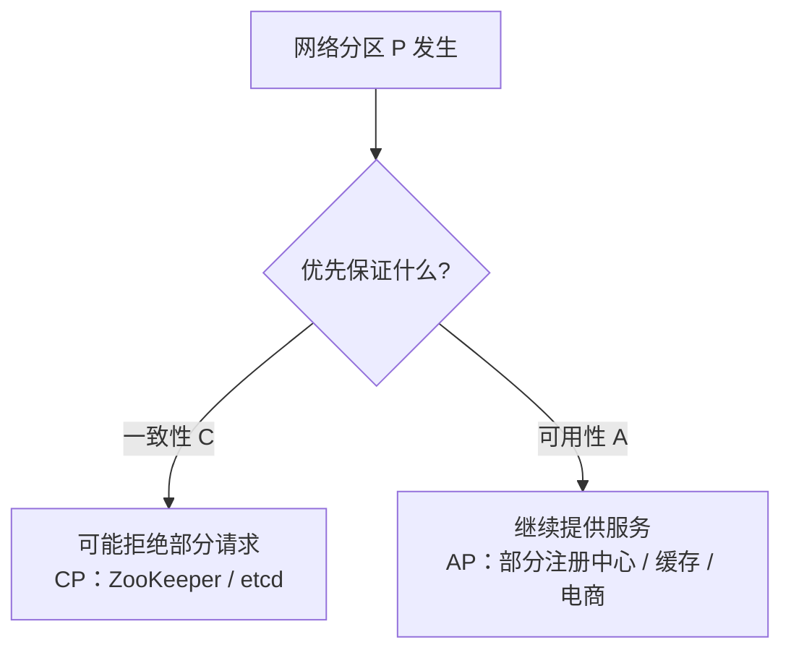
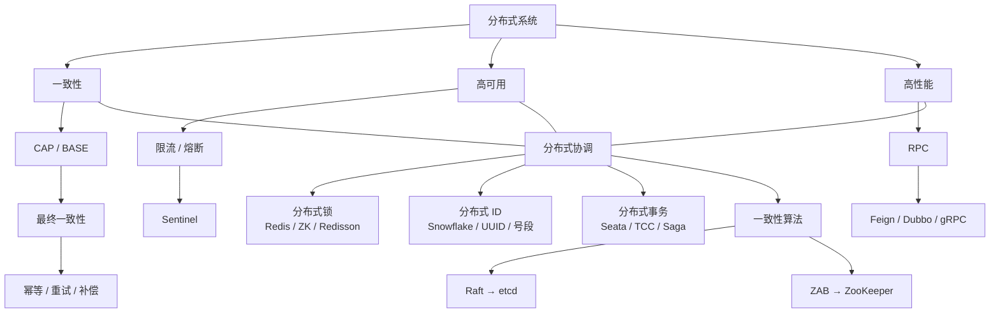

# 分布式

适合高级 Java 开发。重点：**CAP / BASE、最终一致性、分布式锁、分布式 ID、分布式事务、RPC、限流、分布式一致性**。

面试目标：能按「是什么 → 为什么 → 怎么做 → 有什么问题」完整回答。

---

## 一、CAP 与 BASE

### 1. 什么是 CAP？

分布式系统的三个基本特性：

| 字母 | 含义 | 说明 |
|------|------|------|
| **C** | Consistency，一致性 | 所有节点同一时刻看到的数据一致 |
| **A** | Availability，可用性 | 每次请求都能得到响应，不保证最新 |
| **P** | Partition Tolerance，分区容错性 | 出现网络分区时系统仍能继续运行 |

**一致性 C**：改完之后，访问哪个节点都应看到新值。例如余额 `100 → 80`，A / B / C 都应是 80。

**可用性 A**：即使部分节点异常，系统仍能对外提供服务，返回值可能不是最新。

**分区容错 P**：节点之间网络断开时，系统仍需继续工作。网络故障无法完全避免，**P 通常必须保证**。

### 2. CAP 为什么不能同时满足？

发生网络分区时，C 和 A 不能同时保证：要么保证一致（可能拒绝请求），要么保证可用（数据可能暂时不一致）。

> CAP 的核心不是「三选二」，而是 **发生分区 P 时，在 C 和 A 之间取舍**。



### 3. CP 和 AP

| 模型 | 保证 | 分区时 | 典型 | 场景 |
|------|------|--------|------|------|
| **CP** | Consistency + Partition Tolerance | 为一致可能拒绝请求 | ZooKeeper、etcd | 配置、Leader 选举、分布式协调 |
| **AP** | Availability + Partition Tolerance | 继续服务，数据可能暂时不一致 | 部分注册中心 / 缓存 / 电商 | 最终靠同步、重试、补偿达成一致 |

### 4. 什么是 BASE？

对传统强一致模型的工程实践：

- **Basically Available**：基本可用
- **Soft State**：软状态
- **Eventually Consistent**：最终一致性

> 允许系统暂时不一致，通过异步同步、重试、补偿等，最终达到一致。

---

## 二、一致性模型与最终一致性

### 1. 什么是强一致性？

一个节点数据变化后，其他节点 **立即** 看到最新数据。适合金融核心、库存扣减、账户余额。

### 2. 什么是最终一致性？

允许短时间不一致，经过一段时间后最终一致。例如库里订单已是 `PAID`，缓存仍是 `UNPAID`，经异步消息 / 重试 / 延迟处理后缓存也变成 `PAID`。

### 3. 最终一致性如何实现？

生产里通常组合使用，而不是单靠一种方案：

```text
消息队列 → 重试 → 幂等 → 补偿 → 定时任务 → 对账
```

---

## 三、幂等、重试、补偿、消息可靠性

### 1. 什么是幂等？

同一请求执行一次和执行多次，**最终结果一致**。例如支付成功回调两次：第一次订单变为 `PAID`，第二次发现已是 `PAID`，不重复扣款。

### 2. 如何实现幂等？

**唯一业务 ID**：`requestId` / `orderId` / `paymentId`，数据库唯一索引：

```sql
UNIQUE(order_id)
```

**Redis SET NX**：

```text
SET requestId value NX EX 60
```

第一次成功，后续失败。

**状态机**：`CREATED → PAYING → PAID`。只允许 `PAYING → PAID`。已经 `PAID` 时，再来支付成功回调不会重复执行。

### 3. 什么是重试？

调用失败后重新执行。RPC 超时后 Retry，直到成功。

> **重试一定要和幂等一起考虑。**

否则可能：第一次其实已成功，响应丢失，客户端以为失败再请求，导致重复扣款。

### 4. 什么是补偿？

分布式操作部分成功、部分失败时，用后续操作把系统拉回正确状态。例如订单创建成功、库存扣减失败 → 取消订单 / 恢复库存。

### 5. 消息可靠性

看整条链路：`生产者 → MQ → 消费者`。

| 阶段 | 目标 | 常见手段 |
|------|------|----------|
| 生产者 | 消息成功发出 | Confirm、重试、本地消息表、Outbox |
| MQ | Broker 故障不丢消息 | 持久化、副本、ACK、高可用集群 |
| 消费者 | 失败可重新消费 | ACK、重试队列、死信队列、幂等消费 |

---

## 四、Redis 分布式锁

更细的实现要点也可对照 [Redis 分布式锁](/redis/distributed-lock)。

### 1. 为什么需要分布式锁？

`synchronized` / `ReentrantLock` 只能保证 **同一个 JVM 内** 互斥。多个服务实例是多个 JVM，需要 Redis / ZooKeeper 等外部协调。

### 2. 基本实现：SET NX

```text
SET lock_key unique_value NX EX 30
```

- **NX**：不存在才设置（互斥）
- **EX**：过期时间（防死锁）

成功即获锁，失败说明别人已持有。

锁必须设过期时间。否则线程拿到锁后服务宕机，锁永久存在，其他请求永远拿不到。

### 3. 为什么 value 必须唯一？

释放时必须确认「这把锁是自己的」。否则：

```text
A 获锁 → A 执行过久 → 锁过期 → B 获锁 → A 执行完 DEL lock → 把 B 的锁删了
```

不能直接 `DEL lock`，要先判断 value 属于自己再删。**判断 + 删除必须原子**，通常用 Lua：

```lua
if redis.call('get', KEYS[1]) == ARGV[1] then
    return redis.call('del', KEYS[1])
end
return 0
```

### 4. WatchDog

业务执行时间可能超过锁 TTL。例如 TTL 30 秒、业务 60 秒：30 秒时锁过期，别人拿到锁，原线程还在跑。

Redisson 的 WatchDog 会定期给锁续期，业务完成后再释放。

### 5. Redisson

Redis 的 Java 客户端，提供 `RLock`、`RReadWriteLock`、`RSemaphore`、`RCountDownLatch` 等。常用：

```java
RLock lock = redisson.getLock("order:lock");
lock.lock();
try {
    // 业务
} finally {
    lock.unlock();
}
```

### 6. 主从切换导致锁丢失

这是高级面试高频题。

Master 上 `SET lock NX` 成功，数据还没同步到 Slave，Master 宕机，Slave 升主后没有这把锁。另一个客户端再 `SET lock NX` 也能成功。于是 A、B 都认为自己持有锁。

> Redis 主从 **异步复制**，可能导致分布式锁丢失。

### 7. RedLock

官方提出的多实例算法。假设 5 个 Redis，客户端需在 **多数节点（至少 3 个）** 成功获锁，且获锁耗时没有超过锁有效时间，才算成功。

面试不要简单说「RedLock 更可靠」。更准确：

> RedLock 降低单节点故障导致锁失效的概率，但实现更复杂。严格一致性场景下，Redis 不是最理想的协调组件，通常考虑 ZooKeeper、etcd 等 CP 系统。

---

## 五、分布式 ID

### 1. 为什么需要？

单库 `AUTO_INCREMENT` 即可。多服务多库需要 **全局唯一** ID。

### 2. UUID

优点：实现简单、全局唯一概率极高、不依赖中心服务。

缺点：128 bit，字符串较长；**无序**，对 B+Tree 索引不友好。数据库主键通常不优先用随机 UUID。

### 3. Redis INCR

```text
INCR order:id   →  100001, 100002, 100003
```

优点：简单、高性能、全局递增。问题：依赖 Redis；宕机影响发号；跨业务要不同 key；纯递增可能暴露业务量。

### 4. 数据库号段

一次向库申请一段（如 `100000 ~ 109999`），在本地内存生成 ID，用完再申请下一段。库只负责分配号段，访问次数少、性能高。

### 5. Snowflake 雪花算法

核心：`时间戳 + 机器 ID + 序列号`。特点：全局唯一、趋势递增、高性能、不依赖数据库。

**时钟回拨**：Snowflake 强依赖系统时间。当前时间 1000，突然回到 900，可能产生重复 ID 或乱序。

| 做法 | 说明 |
|------|------|
| 小幅回拨 | 等待时间追上 |
| 记录上次时间戳 | `current < lastTimestamp` 时等待或抛异常 |
| 逻辑时钟 | 避免直接依赖物理时间 |

---

## 六、分布式事务

### 1. 为什么需要？

单库 `BEGIN / UPDATE A / UPDATE B / COMMIT` 由数据库保证。订单、库存、支付分属不同库时，一个业务跨多个数据库，就需要分布式事务。

### 2. 2PC

Two-Phase Commit。

1. **Prepare**：协调者问参与者「能否提交」。参与者执行事务但不提交。
2. **Commit**：全部成功则 `COMMIT`，任一失败则 `ROLLBACK`。

问题：同步阻塞（参与者等协调者）；协调者单点；Prepare 后资源长期锁定；网络故障下参与者状态可能不一致。

### 3. 3PC

在 2PC 上多一个阶段：`CanCommit → PreCommit → DoCommit`，目的是减少阻塞、改善故障处理。

> 3PC 仍无法彻底解决网络故障和一致性问题，实际业务很少用。

### 4. TCC

`Try / Confirm / Cancel`，把业务拆成三阶段。转账例子：

| 阶段 | 做什么 |
|------|--------|
| Try | 冻结 A 账户 100 元 |
| Confirm | A 扣款、B 入账 |
| Cancel | 释放 A 的冻结金额 |

优点：一致性相对强、业务可控、不必长期锁库资源。缺点：开发成本高、侵入性强，要自己设计三个阶段。

### 5. Saga

长事务拆成多个本地事务：`T1 → T2 → T3`。T3 失败则执行补偿 `C2 → C1`。

例如：创建订单 → 扣库存 → 扣余额 → 发货。发货失败则补偿余额、恢复库存、取消订单。适合长事务、流程型业务。

### 6. Seata AT

基于数据库本地事务 + 全局协调。组件：

| 组件 | 角色 |
|------|------|
| TC | Transaction Coordinator |
| TM | Transaction Manager |
| RM | Resource Manager |

流程：TM 开全局事务 → RM 执行本地事务并记 `undo_log` → TC 协调全局提交或回滚。回滚依赖 `undo_log`。

### 7. TCC 与 AT 怎么选？

| | AT | TCC |
|--|----|-----|
| 适合 | 已有库事务、改造少、常规 CRUD | 流程复杂、一致性要求高、能改业务代码 |
| 优点 | 侵入低、开发简单 | 业务高度可控 |
| 成本 | 相对低 | 明显更高 |

### 8. 幂等、空回滚、悬挂

TCC 高频题。

**幂等**：Confirm / Cancel 可能因网络重试执行多次，必须多次结果一样。常用事务 ID + 分支事务 ID 做幂等记录。

**空回滚**：Try 实际没成功（网络异常），Cancel 却执行了。Cancel 必须识别 Try 是否成功，没执行过就不能乱改数据。

**悬挂**：Cancel 先完成，延迟的 Try 才到达，Try 又执行一遍。解决：Cancel 时记下事务状态，后续 Try 若发现已 Cancel 则拒绝。

---

## 七、RPC

### 1. 什么是 RPC？

Remote Procedure Call：像调本地方法一样调远程服务。`userService.getUser(100)` 实际是跨网络打到另一个服务。

### 2. Feign

声明式 HTTP 客户端。业务只写 `userClient.getUser(id)`，底层负责 HTTP、序列化、服务发现、负载均衡、反序列化。

```java
@FeignClient("user-service")
public interface UserClient {
    @GetMapping("/user/{id}")
    User getUser(@PathVariable Long id);
}
```

### 3. Dubbo

典型 Java RPC：Consumer → Proxy → 序列化 → 网络 → Provider。相比普通 HTTP，更偏向高性能 RPC：协议、序列化、连接管理都按 RPC 设计。

### 4. gRPC

基于 HTTP/2，通常用 Protocol Buffers，`.proto` 生成两端代码。优势：性能较高、强类型、HTTP/2、跨语言。

### 5. 序列化

对象 ↔ `byte[]`。常见：JSON、Protobuf、Hessian、Kryo、Java Serializable。

### 6. 网络协议

不必死记，理解链路：应用层协议 → 序列化 → TCP → 连接。

| 框架 | 常见协议 |
|------|----------|
| Feign | HTTP |
| gRPC | HTTP/2 |
| Dubbo | Dubbo Protocol / TCP |

### 7. 连接池

每次「建连 → 发送 → 关闭」成本高，用连接池复用 TCP：少建连、少 TLS 握手、提高吞吐、降低延迟。

### 8. 超时

必须设 Connect / Read / Request Timeout。下游卡死时线程一直等，线程池耗尽，上游雪崩。

> 超时是防止级联故障的重要手段。

### 9. 重试

适用：网络抖动、连接失败、临时异常。不能无脑重试。扣款接口若服务端已扣、响应丢失，客户端再试会重复扣款。

> RPC 重试必须结合幂等。

### 10. 负载均衡

多实例时客户端选一个：随机、轮询、加权轮询、最少连接、一致性 Hash（缓存、同一 Key 固定路由）。

---

## 八、限流

请求超过处理能力时保护系统。例如系统 1000 QPS、实际 5000 QPS，必须拦。

### 1. 固定窗口

例如 1 秒最多 1000。每秒重新计数。问题是 **临界突刺**：0.999s 来 1000，1.001s 再来 1000，短时间实际 2000。

### 2. 滑动窗口

把 1 秒切成多个小窗（如 100ms × 10），统计最近一段时间。比固定窗口更平滑。

### 3. 漏桶

请求进桶，出口固定速率（如每秒 100）。输出稳定，突发处理能力弱。

### 4. 令牌桶

按固定速度往桶里放 Token。有 Token 放行，没有则拒绝或等待。

> 既能限制平均速率，又允许一定突发。互联网系统里很常见。

### 5. Sentinel

阿里开源流量控制：限流、熔断降级、系统保护、热点参数限流。可按 QPS、并发线程数、调用关系、来源、热点参数配规则。

---

## 九、分布式协调与共识

### 1. Raft

分布式一致性共识算法：多节点投票选出 Leader，保证日志复制一致。角色：Leader、Follower、Candidate。

Leader 正常复制日志给 Follower。Leader 宕机后，Follower 选举超时变成 Candidate，拉票后成为新 Leader。

客户端写请求到 Leader，Leader 追加日志并复制给 Follower。复制到 **多数派** 后，Leader 认为已提交。

### 2. ZAB

ZooKeeper Atomic Broadcast。用于 Leader 选举 + 事务日志广播。Leader 接收写请求再广播事务。

### 3. Raft 与 ZAB

相似处：Leader、多数派、日志复制、选举。区别：Raft 是相对独立、通用的共识算法；ZAB 是 ZooKeeper 面向数据复制和原子广播设计的协议。岗位没有明确要求时，不必深挖协议细节。

### 4. ZooKeeper

分布式协调服务：服务发现、配置管理、分布式锁、Leader 选举。核心结构是 **ZNode**。

**临时节点（Ephemeral）**：客户端 Session 失效后自动删除，适合服务注册、分布式锁。

### 5. Nacos

Spring Cloud Alibaba 里常见，做服务发现和配置管理。Provider 注册，Consumer 查询；实例变化时 Nacos 感知，Consumer 更新列表。

注册发现流程：启动注册 → Nacos 保存实例 → 消费者拉列表 → 负载均衡 → RPC。心跳异常则标记下线，消费者更新实例列表。

---

## 十、面试串联

高级岗位很少只问「什么是 Redis 分布式锁」，更常给场景。

### 场景一：接口防重复提交

```text
请求唯一 ID → Redis SET NX → TTL → 业务执行 → 幂等校验 → 释放锁
```

业务耗时不确定时：Redisson + WatchDog。

### 场景二：Redis 做分布式锁有什么问题？

1. 必须设过期时间，防止死锁
2. value 必须唯一，释放时校验持有者
3. 判断 + 删除用 Lua 保证原子
4. 业务超过 TTL 会导致锁提前失效
5. Redisson 可用 WatchDog 自动续期
6. 主从异步复制，主挂后锁可能丢失
7. 强一致协调考虑 ZooKeeper / etcd

### 场景三：分布式事务怎么解决？

不要开口就「我用 Seata」。先判断业务：

```text
允许最终一致？ → 是 → MQ + 幂等 + 重试 + 补偿
必须协调多个本地事务 → 2PC / Seata AT
业务流程长 → Saga
需要业务高度可控 → TCC
```

### 场景四：RPC 超时了怎么办？

```text
Timeout → 是否可重试、是否幂等
  → 是：有限次数重试
  → 仍失败：熔断 / 降级 / fallback
```

> 不能为了成功率无限重试，否则重试风暴和雪崩。

---

## 十一、知识架构与掌握优先级



### 第一梯队：必须熟练

能口述，并能结合项目：CAP / BASE、最终一致性、幂等 / 重试 / 补偿；Redis 锁（SET NX、Lua、过期、Redisson、WatchDog、主从问题）；分布式 ID（Snowflake、时钟回拨）；分布式事务（Seata AT、TCC、Saga、幂等、空回滚、悬挂）；RPC（Feign、超时、重试、负载均衡、序列化、连接池）；限流（令牌桶、漏桶、滑动窗口、Sentinel）。

### 第二梯队：理解原理

能讲原理、优缺点和适用场景：2PC / 3PC、RedLock、UUID、Redis ID、号段、Dubbo、gRPC、Raft、ZAB、ZooKeeper、Nacos。

### 第三梯队：了解即可

3PC 协议细节、ZAB 底层、Raft 极端故障、RedLock 争议、各序列化框架底层。普通高级岗不必在这些上堆时间。

---

## 十二、回答模板

统一结构：

```text
① 是什么  ② 为什么需要  ③ 核心原理  ④ 怎么实现
⑤ 有什么问题  ⑥ 如何解决  ⑦ 生产中怎么用
```

例如「Redis 分布式锁怎么实现？」：

> Redis 分布式锁用于多个服务实例之间的互斥。基础实现是 `SET lockKey uniqueValue NX EX 30`：NX 保证只有一个客户端拿到锁，EX 防止宕机后锁永久存在。
>
> 释放不能直接 DEL，锁可能已过期并被别人拿到。要用唯一 value 标识持有者，再用 Lua 保证「判断 value + 删除」原子。
>
> 业务超过过期时间会导致锁提前释放，项目里常用 Redisson + WatchDog 自动续期。主从复制是异步的，主挂后锁可能还没到新主，强一致协调应考虑 ZooKeeper、etcd。

---

## 十三、最重要的一条

不要把这些理解成彼此孤立的知识点。真正要建立的是：

```text
分布式为什么会出问题？
    → 网络不可靠、机器会宕机、请求会重复
      消息会丢失、服务会超时、数据会不一致
    → 怎么办？
    → 一致性、幂等、重试、补偿、锁、事务
      限流、熔断、RPC 超时、服务发现、共识算法
    → 做成高可用、高性能、最终一致的系统
```

这才是高级 Java 面试官真正想考察的能力。
