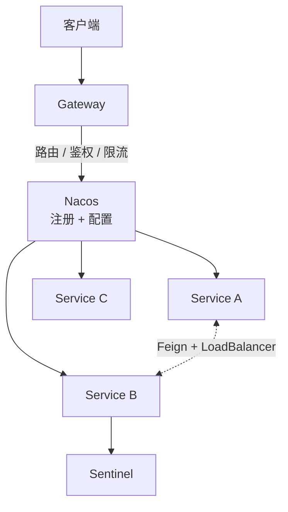
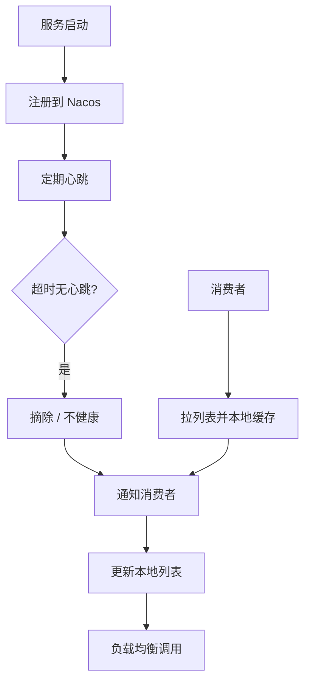
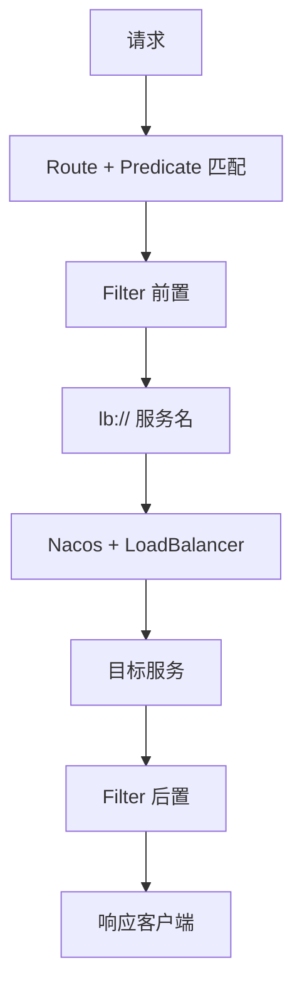
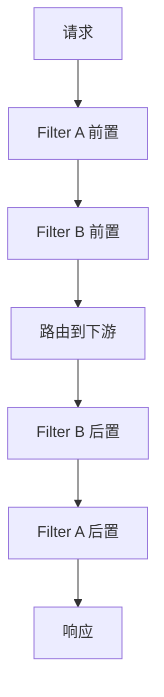
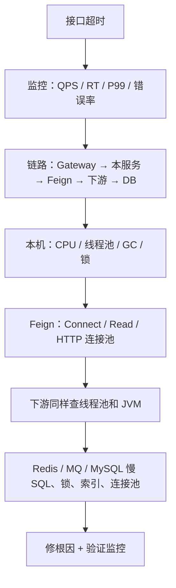

# Spring Cloud Alibaba

面向高级 Java。按调用链记：**拆分 → Nacos → Gateway → Feign + LoadBalancer → Sentinel → 故障排查**。

幂等、CAP、限流算法、RPC 超时等通用原理见 [分布式](./distributed)。


---

## 一、为什么拆微服务？

单体后期会同时踩这几类问题：

| 问题 | 表现 |
|------|------|
| 复杂度 | 模块互相依赖，改一处怕牵全身，新人上手慢 |
| 部署 | 小改动也要整包构建发布，周期长、风险大 |
| 扩容 | 热点模块只能跟着整应用扩，资源浪费 |
| 故障 | 一个模块拖垮整个进程 |
| 协作 | 多团队挤在同一仓库，无法独立迭代 |

微服务对应解法：服务独立开发 / 测试 / 部署；按流量独立扩缩容；用隔离、限流、熔断、降级缩小故障面。

> 记忆：复杂度 → 独立部署 → 独立扩缩容 → 故障隔离 → 团队并行。

拆分也有代价：分布式事务、网络超时、运维复杂度。不是越碎越好，按业务边界拆，能独立演进再拆。

---

## 二、Spring Cloud Alibaba 整体架构

在 Spring Cloud 之上补齐阿里系组件，覆盖注册发现、配置、调用、负载均衡、网关、限流熔断、分布式事务。

| 组件 | 职责                                     |
|------|------------------------------------------|
| **Nacos** | 注册中心 + 配置中心                      |
| **OpenFeign** | 声明式远程调用                           |
| **LoadBalancer** | 从多实例里选一个（老项目常见 Ribbon）    |
| **Gateway** | 统一入口：路由、鉴权、跨域、限流、过滤   |
| **Sentinel** | 限流、熔断、降级、系统保护               |
| **Seata** | 分布式事务（见 [分布式](./distributed)） |



调用链一句话：客户端进 Gateway → 按路径匹配服务名 → Nacos 拿实例 → LoadBalancer 选节点 → Feign 发 HTTP → Sentinel 护住本服务和下游。

---

## 三、Nacos

### 1. 服务注册发现

四步，不要拆成四道题背：

1. **注册**：启动后 Client 上报 `serviceName / IP / port / cluster / metadata`，Server 落实例并在集群间同步。
2. **心跳**：临时实例定期报活；超时则标不健康并摘除，避免把流量打到死节点。
3. **发现**：消费者拉实例列表后 **缓存在本地**，调用走缓存，不是每次打 Nacos。
4. **变更通知**：上下线、端口变化、健康变化，Server 推送或长轮询，Client 更新本地列表，再交给 Feign / LoadBalancer。



### 2. 心跳机制

本质：**Client 定期说「我还活着」，Server 用最后心跳时间判断存活。**

正常：心跳到达 → 刷新时间 → 实例健康。  
超时：无心跳 → 不健康 → 从可用列表摘除。  
恢复：进程重启后重新注册即可。

生产要核对心跳间隔和超时倍数，间隔过大故障摘除慢，过小会打爆注册中心。

### 3. 临时实例 vs 持久实例

| | 临时实例 Ephemeral | 持久实例 Persistent |
|--|-------------------|---------------------|
| 生命周期 | 跟 Client 存活走 | Server 持久化管理 |
| 健康检查 | 必须心跳 | 不靠心跳决定删除 |
| 故障 | 超时自动摘除 | 不会因没心跳立刻删掉 |
| 场景 | **普通微服务** | 需要长期挂着的地址（网关、DNS 类） |
| 一致性 | 默认 **AP** | 通常 **CP** |

> 临时 = 心跳维持、故障自动摘；持久 = 服务端管生命周期。

### 4. AP / CP

Nacos **不是整集群只能选一种**，按数据类型走不同协议：

| 数据 | 协议倾向 | 含义 |
|------|----------|------|
| 临时实例（服务发现） | Distro，**AP** | 节点挂了还能注册发现，允许短暂不一致 |
| 持久实例、配置 | Raft，**CP** | 变更要多数派同意，分区时可能写失败 |

微服务发现更在意「还能不能找到人」，所以临时实例走 AP。配置改错了全集群要一致，所以配置走 CP。

### 5. 集群如何高可用？

四件套，缺一不可：

1. **多节点**：Client 配多个 Server 地址，单节点挂了换别的。
2. **集群同步**：实例和配置在节点间同步（临时走 Distro，持久/配置走 Raft）。
3. **本地缓存 + 快照**：Nacos 短暂不可用时，仍可用上次实例列表继续调。
4. **前面挂负载均衡**：避免 Client 写死某一个 Nacos。

> 多节点 + 同步 + 本地缓存 + 故障转移。

### 6. 配置中心（常被漏问）

配置发布到 Nacos 后，Client **长轮询**拿变更，更新 `@Value` / `@ConfigurationProperties` / `@RefreshScope` 刷新的 Bean。本地有 snapshot，Server 短暂不可用时仍能用上一份配置启动。敏感配置走加密和权限，不要和代码里的环境变量两套打架。

---

## 四、Gateway

### 1. 请求处理流程

Spring Cloud Gateway 基于 **WebFlux**（Netty，异步非阻塞），按 6 步答：

1. 请求进入 Gateway（如 `GET /api/order/123`）
2. `RoutePredicateHandlerMapping` 用 Predicate 匹配 Route（Path / Method / Host / Header 等）
3. 进入 Filter 链：鉴权、日志、限流、改 Header
4. `uri: lb://order-service` 时：Nacos 拿实例 → LoadBalancer 选一个 → HTTP 转发
5. 下游处理
6. 响应沿 Filter **后置**处理，回到客户端



口述：先进 WebFlux，再按 Predicate 找 Route，匹配后走 Filter；`lb://` 结合服务发现选实例转发，回来再走后置 Filter。

### 2. Filter 原理

两类：

| 类型 | 范围 | 用途 |
|------|------|------|
| **GatewayFilter** | 某条 Route | 给订单服务加 Header |
| **GlobalFilter** | 全部请求 | 统一鉴权、TraceId、黑名单 |

多个 Filter 按 `Order` 组成链。`Order` 越小越先执行前置；后置顺序相反，像洋葱。

一个 Filter 同时管前后两段，靠 `chain.filter(exchange).then(...)`：`then` 之前是前置，下游返回后再跑 `then`。

```java
return chain.filter(exchange).then(Mono.fromRunnable(() -> {
    // 后置：改响应、打日志
}));
```



> Filter Chain + 前置/后置 + GatewayFilter/GlobalFilter + Order。

---

## 五、Feign 与负载均衡

### 1. 动态代理

`@FeignClient` 接口没有手写实现类。启动时扫描注解，用 **JDK 动态代理** 做成 Bean。业务调 `userClient.getUser(1L)` 实际进 `InvocationHandler`：解析 `@GetMapping` 和参数 → 拼 HTTP → LoadBalancer 选实例 → HTTP Client 发出 → Decoder 把 JSON 转成 `User`。

```text
@FeignClient → 动态代理 → 解析注解 → HTTP → LoadBalancer → Decoder
```

### 2. Feign + Nacos + LoadBalancer

把注册和调用拼成一条线即可，不要再背三遍。

**注册**：`user-service` 两个实例上报 Nacos。  
**调用**：代理构造 `GET /user/1` → 按服务名取本地实例列表 → LoadBalancer 选 `192.168.1.11:8080` → 真正请求 `http://192.168.1.11:8080/user/1` → Decoder 回对象。

老项目 Ribbon 做客户端负载均衡，新栈用 Spring Cloud LoadBalancer，职责一样：**从发现来的列表里挑一个**。

### 3. 超时、重试、幂等

| 点 | 含义 | 注意 |
|----|------|------|
| ConnectTimeout | 建连过久 | 按 RT 设上限，避免占满线程 |
| ReadTimeout | 连上后等响应过久 | 同上 |
| 重试 | 应对抖动、实例重启 | 会放大流量；写操作可能重复执行 |
| 幂等 | 同一业务执行一次和多次结果相同 | 重试的前提 |

GET 查询通常可重试；扣款、下单必须带 `orderId` / `requestId`，服务端用唯一索引、状态机或 Redis SET NX 去重。细节见 [分布式 · 幂等](./distributed#三幂等重试补偿消息可靠性)。

> 超时控等待，重试救临时故障，幂等挡重复执行。

---

## 六、Sentinel：限流、熔断、降级

三者别混：

| | 解决什么 | 典型 |
|--|----------|------|
| **限流** | 自己流量太大 | QPS 暴涨，按 QPS 或并发线程数掐 |
| **熔断** | 下游已经坏了 | 持续超时/异常，先别再打它 |
| **降级** | 异常时保核心 | 推荐挂了，详情仍返回，推荐给空列表 |

> 限流防流量，熔断防扩散，降级保核心。

熔断策略：慢调用比例、异常比例、异常数。熔断不是永久关：

```text
CLOSED（正常）→ 达阈值 → OPEN（暂停）→ 过一段时间 HALF-OPEN（放少量试探）
成功回 CLOSED，失败回 OPEN
```

请求先进 Sentinel：超限流直接拒；放行后若下游持续失败则熔断并走降级。算法（令牌桶、滑动窗口等）见 [分布式面试题 · 限流](./distributed#八限流)。

---

## 七、雪崩怎么扛？

一个下游变慢 → 上游线程/连接被占满 → Gateway 堆积 → 全站不可用。

按层次答，不要只报组件名：

1. **限流**：进系统的量先掐住  
2. **超时**：Feign / Gateway / DB 都要有上限，禁止无限等  
3. **熔断**：下游持续失败就停打  
4. **降级**：非核心给兜底  
5. **隔离**：核心订单和推荐分线程池 / 连接池（舱壁），推荐打满不影响下单  
6. **重试谨慎**：失败再打三次等于把流量乘三，只会加重雪崩

> 限流、超时、熔断、降级、隔离；重试要限额且必须幂等。

---

## 八、线上调用超时怎么查？

先定位 **哪一段慢**，再下钻，不要开口就「看日志 / 调大 Feign 超时」。



经验：CPU、QPS 都正常但 P99 从 100ms 飙到 5s，优先查下游和 DB。链路里 Feign 4.8s、MySQL 4.6s，Feign 超时只是表象。连接池打满不要只调大，要查连接为什么不释放。Full GC 导致 STW 也会让整段 RT 一起炸。

> 先监控后链路；先找到慢点，再看线程池、连接池、JVM、Redis、MySQL。

---

## 九、口述模板

| 问题 | 骨架 |
|------|------|
| 为何拆服务 | 复杂、部署、扩容、故障、协作 → 对应独立演进和隔离 |
| SCA 架构 | Gateway 入口，Nacos 注册配置，Feign 调用，LB 选实例，Sentinel 防护 |
| Nacos | 注册 / 心跳 / 本地缓存 / 变更通知；临时 AP，持久和配置 CP |
| Gateway | Predicate 匹配 → Filter 洋葱圈 → `lb://` 转发 |
| Feign | 接口代理成 HTTP；超时 + 有限重试 + 服务端幂等 |
| Sentinel | 限流管自己，熔断管下游，降级保核心；OPEN / HALF-OPEN / CLOSED |
| 雪崩 | 限流超时熔断降级隔离，重试别放大流量 |
| 超时排查 | 监控 → 链路分段 → 线程/连接/GC → 下游 → 存储 |
