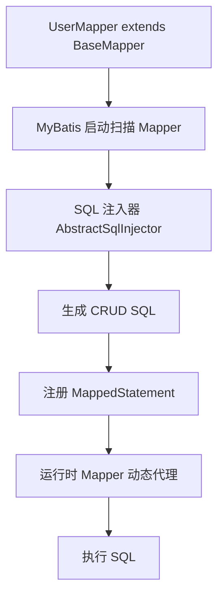

# MyBatis-Plus

## 一、MP 和 MyBatis 区别

一句话总结：

> **MyBatis** 是一个半自动 ORM 框架，需要自己写 SQL；**MyBatis-Plus** 是 MyBatis 的增强工具，在 MyBatis 基础上提供 CRUD、分页、条件构造器、代码生成等能力，让开发更快。

```
MyBatis
    ↓
自己写 Mapper + XML + SQL

MyBatis-Plus
    ↓
MyBatis + 通用 CRUD + 条件构造器 + 分页 + 自动填充 + 乐观锁等
```

### 1. 核心区别

| 对比 | MyBatis | MyBatis-Plus |
|------|---------|--------------|
| 定位 | ORM 框架 | MyBatis 增强工具 |
| SQL | 大量手写 | 简单 CRUD 自动生成 |
| Mapper | 自己定义接口方法 | 继承 `BaseMapper` |
| XML | 常用 | 简单业务可不用 |
| 条件查询 | 手写 SQL | Wrapper |
| 分页 | 自己实现 | 内置分页插件 |
| CRUD | 自己写 | 自动提供 |
| 代码量 | 多 | 少 |
| 灵活性 | 高 | 基于 MyBatis，同样高 |

### 2. Mapper 的区别

**MyBatis：**

```java
@Mapper
public interface UserMapper {
    User findById(Long id);
    List<User> findList(User user);
}
```

```xml
<select id="findById" resultType="User">
    select * from user where id = #{id}
</select>
```

**MyBatis-Plus：**

```java
@Mapper
public interface UserMapper extends BaseMapper<User> {
}
```

直接拥有：`insert()`、`deleteById()`、`updateById()`、`selectById()`、`selectList()`、`selectPage()` 等，简单 CRUD 不用写 XML。

```java
User user = userMapper.selectById(1L);
```

### 3. CRUD 对比（以插入为例）

| | MyBatis | MyBatis-Plus |
|--|---------|--------------|
| 调用 | `userMapper.insert(user)` | `userMapper.insert(user)` |
| SQL | 需手写 `<insert>` | 自动生成 `INSERT INTO user(...) VALUES(...)` |

### 4. 条件查询区别

**MyBatis：** 通常手写方法 + XML 动态 SQL（`<if>` 等）。

**MyBatis-Plus：** 使用 Wrapper：

```java
LambdaQueryWrapper<User> wrapper = new LambdaQueryWrapper<>();
wrapper.eq(User::getAge, 18)
       .like(User::getName, "张");

List<User> list = userMapper.selectList(wrapper);
```

生成：`select * from user where age=18 and name like '%张%'`

### 5. BaseMapper 原理（简要）

MP 本质还是 MyBatis。`UserMapper extends BaseMapper<User>` 启动时扫描 Mapper，发现继承 BaseMapper 后注入通用方法（`selectById`、`insert` 等），由 `AbstractMethod` 生成 SQL，运行时仍走 MyBatis 动态代理 → `MapperProxy` → `SqlSession`。详见下文「BaseMapper 原理」。

### 6. 分页区别

| | MyBatis | MyBatis-Plus |
|--|---------|--------------|
| 实现 | 手写 `limit` + `count`，自己封装 Page | 配置 `PaginationInnerInterceptor` 后调用 `selectPage` |

```java
Page<User> page = new Page<>(1, 10);
userMapper.selectPage(page, wrapper);
// page.getRecords() / page.getTotal()
```

MP 自动执行 count SQL + 分页 SQL。

### 7. 常用注解（简要）

```java
@TableName("user")
public class User {
    @TableId(type = IdType.ASSIGN_ID)
    private Long id;

    @TableField("user_name")
    private String userName;
}
```

更多注解见下文「常用注解」。

### 8. 常用高级功能

| 功能 | 关键用法 |
|------|---------|
| **自动填充** | `@TableField(fill = FieldFill.INSERT)` + `MetaObjectHandler` |
| **逻辑删除** | `@TableLogic`，`removeById` 实际变 UPDATE |
| **乐观锁** | `@Version` + `OptimisticLockerInnerInterceptor` |

### 面试回答模板

MyBatis 是一个持久层框架，通过 Mapper 接口和 XML 编写 SQL，实现数据库操作，灵活性高，但 CRUD 代码量较多。MyBatis-Plus 是基于 MyBatis 的增强框架，在不改变 MyBatis 原有能力的基础上，提供 BaseMapper、条件构造器、分页插件、自动填充、逻辑删除、乐观锁等功能，减少大量重复 SQL 编写。复杂 SQL 仍可用 MyBatis 的 XML；普通 CRUD 使用 MP 通用方法即可。

---

## 二、MyBatis-Plus BaseMapper 原理

核心答案：

> BaseMapper 本质还是 MyBatis 的 Mapper 接口机制。MyBatis-Plus 在启动时通过**动态代理 + SQL 注入器**，将 BaseMapper 中的通用方法转换成 SQL，并注册到 MyBatis 的 `MappedStatement` 中，运行时由 `MapperProxy` 执行。



### 1. BaseMapper 是什么？

```java
@Mapper
public interface UserMapper extends BaseMapper<User> {
}
```

`BaseMapper` 已定义好通用方法：

```java
public interface BaseMapper<T> {
    int insert(T entity);
    int deleteById(Serializable id);
    T selectById(Serializable id);
    int updateById(T entity);
    // ...
}
```

接口只有方法声明，没有实现；之所以能调用，依赖 MyBatis 代理 + MP 注入 SQL。

### 2. MyBatis Mapper 为何可以没有实现类？

```java
UserMapper mapper = sqlSession.getMapper(UserMapper.class);
// 实际是 MapperProxy 代理对象
mapper.selectById(1);
```

调用进入 `MapperProxy.invoke()` → 找到方法对应 SQL → `SqlSession` 执行。这是 MyBatis 原生能力。

### 3. MyBatis-Plus 做了什么？

MyBatis 只知道方法名，不知道 SQL。普通写法需要：

```xml
<select id="selectById">select * from user where id=#{id}</select>
```

MP 在**启动时自动生成**这些 SQL。

### 4. SQL 注入器

核心：`ISqlInjector` → `AbstractSqlInjector` → 默认 `DefaultSqlInjector`。

启动时：扫描 Mapper → 发现 `extends BaseMapper` → 解析实体/`@TableName`/字段 → 生成 `insert`、`deleteById`、`selectById`、`updateById` 等 SQL → 注册为 `MappedStatement`。

例如实体：

```java
@TableName("user")
public class User {
    @TableId
    private Long id;
    private String name;
}
```

生成类似：

```sql
-- selectById
SELECT id, name FROM user WHERE id=#{id}

-- insert
INSERT INTO user (id, name) VALUES (#{id}, #{name})
```

### 5. 完整执行流程

```
userMapper.selectById(100)
  → Mapper 代理对象
  → MapperProxy.invoke()
  → MapperMethod
  → SqlSession.selectOne()
  → Configuration 找到 MappedStatement
  → Executor → JDBC → 数据库
```

### 6. 与普通 Mapper 的区别

| | 普通 MyBatis | MyBatis-Plus |
|--|-------------|--------------|
| 接口 | 自己定义 `getById` | `extends BaseMapper` |
| SQL | 手写 XML | 启动时由 SQL 注入器自动生成 |

### 7. 自定义方法怎么办？

BaseMapper 没有的方法，仍可写自定义方法 + XML，MP **不限制** MyBatis 能力：

```java
User findUserWithOrder();
```

```xml
<select id="findUserWithOrder">
    select * from user u join orders o on u.id=o.user_id
</select>
```

### 面试高分回答

MyBatis-Plus 的 BaseMapper 原理基于 MyBatis Mapper 动态代理机制。BaseMapper 提供通用 CRUD 方法；启动时 MP 通过 SQL 注入器扫描继承 BaseMapper 的 Mapper，根据实体类元数据生成对应 SQL，并注册到 MappedStatement。运行时调用的是 MyBatis 代理对象，由 MapperProxy 根据方法找到 MappedStatement，最终通过 Executor 执行 SQL。

---

## 三、MyBatis-Plus 分页原理

核心回答：

> MP 分页通过 **MyBatis 插件机制**拦截 SQL，在执行前改写原 SQL（追加 `limit`/`offset`），并按需执行 count 查询获取总记录数，最后封装成 `Page` 对象返回。

### 1. 使用示例

```java
@Bean
public MybatisPlusInterceptor mybatisPlusInterceptor() {
    MybatisPlusInterceptor interceptor = new MybatisPlusInterceptor();
    interceptor.addInnerInterceptor(
        new PaginationInnerInterceptor(DbType.MYSQL)
    );
    return interceptor;
}
```

```java
Page<User> page = new Page<>(1, 10);
Page<User> result = userMapper.selectPage(page, null);

result.getRecords(); // 当前页数据
result.getTotal();   // 总数量
result.getPages();   // 总页数
```

### 2. 执行流程

```
selectPage(page, wrapper)
  → Mapper 代理 → MyBatis 执行
  → PaginationInnerInterceptor 拦截
  → 生成 count SQL → 改写分页 SQL → 封装 Page
```

**第一步：拦截原 SQL**

```sql
SELECT * FROM user WHERE age > 18 ORDER BY id DESC
```

**第二步：生成 count SQL**

```sql
SELECT COUNT(*) FROM user WHERE age > 18
```

得到 `total`，再算总页数。

**第三步：改写分页 SQL（MySQL）**

```sql
SELECT * FROM user WHERE age > 18 ORDER BY id DESC LIMIT 0,10
```

**第四步：封装 Page**（records、total、current、size）。

### 3. 插件如何拦截？

MyBatis 执行经过：`Executor` → `InterceptorChain` → `PaginationInnerInterceptor` → `StatementHandler`。

本质拦截 `Executor.query()`，拿到 `BoundSql.sql` 进行改写。

### 4. count 优化

复杂 SQL 时 count 可能较慢。可关闭自动 count：

```java
Page<User> page = new Page<>(1, 10, false);
// 或 page.setSearchCount(false);
```

### 5. 深分页问题（面试加分）

`LIMIT 1000000,10` 需先扫描大量行再丢弃，性能差。可改用游标分页：

```sql
SELECT * FROM user WHERE id > 1000000 LIMIT 10;
```

利用索引提升性能。

### 面试回答版本

MyBatis-Plus 分页基于 MyBatis 插件机制。分页插件拦截 Executor 的查询操作，根据 Page 参数改写原 SQL：先生成 count SQL 查总数，再按数据库类型拼接分页语句（如 MySQL 的 limit），执行后将结果、总数、页码等封装到 Page 对象中。

---

## 四、LambdaQueryWrapper 和 QueryWrapper 的区别

二者都是 MyBatis-Plus **条件构造器**，用于动态拼接 SQL。

```java
// QueryWrapper：字段用字符串，改字段名运行时才报错
QueryWrapper<User> wrapper = new QueryWrapper<>();
wrapper.eq("name", "张三").gt("age", 18);

// LambdaQueryWrapper：方法引用，编译期发现错误
LambdaQueryWrapper<User> wrapper = new LambdaQueryWrapper<>();
wrapper.eq(User::getName, "张三").gt(User::getAge, 18);
```

| 对比项 | QueryWrapper | LambdaQueryWrapper |
|-------|--------------|-------------------|
| 字段写法 | 字符串 | Lambda 方法引用 |
| 类型安全 | 低 | 高 |
| 字段修改 | 容易出错 | 编译期发现 |
| 代码可读性 | 一般 | 更好 |
| 性能 | 基本一样 | 基本一样 |

**推荐使用 `LambdaQueryWrapper`。**

---

## 五、乐观锁、逻辑删除、自动填充如何实现？

### 1. 乐观锁

思想：更新时不加锁，真正更新时检查版本号是否变化。典型场景：库存扣减、订单状态更新。

```
A、B 都读到 version=1
A 更新：WHERE id=1 AND version=1 → 成功，version=2
B 更新：WHERE id=1 AND version=1 → 影响 0 行，失败
```

```java
@Data
public class Product {
    private Long id;
    private Integer stock;
    @Version
    private Integer version;
}
```

```java
@Bean
public MybatisPlusInterceptor interceptor() {
    MybatisPlusInterceptor interceptor = new MybatisPlusInterceptor();
    interceptor.addInnerInterceptor(new OptimisticLockerInnerInterceptor());
    return interceptor;
}
```

调用 `updateById` 时 MP 自动生成：

```sql
UPDATE product SET stock=?, version=version+1 WHERE id=? AND version=?
```

### 2. 逻辑删除

不是物理 `DELETE`，而是打删除标记：

```java
@Data
public class User {
    private Long id;
    private String name;
    @TableLogic
    private Integer deleted;
}
```

```yaml
mybatis-plus:
  global-config:
    db-config:
      logic-delete-field: deleted
      logic-not-delete-value: 0
      logic-delete-value: 1
```

- `deleteById(1)` → `UPDATE user SET deleted=1 WHERE id=1`
- `selectList` → 自动追加 `WHERE deleted=0`

### 3. 自动填充

常见字段：`create_time`、`update_time`、`create_by` 等。

```java
@Data
public class User {
    @TableField(fill = FieldFill.INSERT)
    private LocalDateTime createTime;

    @TableField(fill = FieldFill.INSERT_UPDATE)
    private LocalDateTime updateTime;
}
```

```java
@Component
public class MyMetaObjectHandler implements MetaObjectHandler {

    @Override
    public void insertFill(MetaObject metaObject) {
        this.strictInsertFill(metaObject, "createTime",
                LocalDateTime.class, LocalDateTime.now());
    }

    @Override
    public void updateFill(MetaObject metaObject) {
        this.strictUpdateFill(metaObject, "updateTime",
                LocalDateTime.class, LocalDateTime.now());
    }
}
```

插入时自动填充创建时间，更新时自动填充更新时间。

---

## 六、MyBatis-Plus 常用注解

MyBatis-Plus 注解主要用于：实体与表映射、字段映射、主键策略、逻辑删除、自动填充、乐观锁、字段查询控制等。

### 1. `@TableName` ⭐⭐⭐⭐⭐

指定实体对应的数据库表名：

```java
@TableName("user_info")
public class User {
    private Long id;
    private String name;
}
```

实体名与表名一致（如 `User` → `user`）时可以不写。

### 2. `@TableId` ⭐⭐⭐⭐⭐

标识主键，并指定生成策略：

```java
@TableId(type = IdType.AUTO)
private Long id;
```

| IdType | 说明 |
|--------|------|
| **AUTO** | 数据库自增 |
| **ASSIGN_ID**（默认） | 雪花算法 ID（时间戳 + 机器 ID + 序列号） |
| **ASSIGN_UUID** | 生成 UUID（字段多为 String） |

### 3. `@TableField` ⭐⭐⭐⭐⭐

字段映射与控制：

```java
@TableField("user_name")
private String userName;

@TableField(exist = false)   // 非表字段，查询忽略（常用于 VO）
private String token;

@TableField(fill = FieldFill.INSERT)
private Date createTime;

@TableField(select = false)  // 查询不返回（如密码）
private String password;

@TableField(condition = SqlCondition.LIKE)  // 默认查询条件改为 LIKE
private String name;
```

### 4. `@TableLogic` ⭐⭐⭐⭐⭐

逻辑删除：`deleteById` 变为 `UPDATE ... SET deleted=1`，查询自动加 `WHERE deleted=0`。

### 5. `@Version` ⭐⭐⭐⭐⭐

乐观锁版本号字段，更新时自动带 `AND version=?` 并 `version = version + 1`。

### 6. `@EnumValue`

枚举存库值映射：

```java
public enum Status {
    @EnumValue
    ENABLE(1),
    DISABLE(0);
}
```

### 7. `@InterceptorIgnore`

忽略某项 MP 能力，例如忽略逻辑删除：

```java
@InterceptorIgnore(logicDelete = "1")
List<User> getAll();
```

### 8. `@KeySequence`

Oracle / PostgreSQL 等序列主键：

```java
@KeySequence("SEQ_USER")
public class User {
}
```

### 面试高频注解总结

| 注解 | 作用 | 频率 |
|------|------|------|
| `@TableName` | 表名映射 | ⭐⭐⭐⭐ |
| `@TableId` | 主键映射 | ⭐⭐⭐⭐⭐ |
| `@TableField` | 字段映射 | ⭐⭐⭐⭐⭐ |
| `@TableLogic` | 逻辑删除 | ⭐⭐⭐⭐⭐ |
| `@Version` | 乐观锁 | ⭐⭐⭐⭐⭐ |
| `@TableField(fill)` | 自动填充 | ⭐⭐⭐⭐⭐ |
| `@TableField(exist=false)` | 非数据库字段 | ⭐⭐⭐⭐ |
| `@TableField(select=false)` | 隐藏字段 | ⭐⭐⭐ |
| `@EnumValue` | 枚举映射 | ⭐⭐⭐ |
| `@KeySequence` | 序列主键 | ⭐⭐ |
