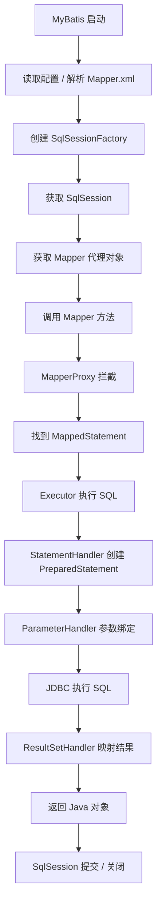

# MyBatis

## 一、什么是 MyBatis？相比 JDBC 有什么优势？

### 1. 什么是 MyBatis？

MyBatis 是一个优秀的持久层（ORM）框架，它对 JDBC 进行了封装，使开发者只需要编写 SQL 和映射关系，就能完成数据库操作，而不用编写大量重复的 JDBC 代码。

**核心思想：SQL 与 Java 代码分离。**

开发者负责写 SQL，MyBatis 负责：

- 创建数据库连接
- 执行 SQL
- 参数绑定
- 结果集封装
- 资源释放
- 事务配合 Spring 管理

因此，它属于**半自动 ORM** 框架。

### 2. JDBC 存在的问题

使用 JDBC 时，一个查询通常要写很多重复代码：

```java
Connection conn = DriverManager.getConnection(...);
PreparedStatement ps = conn.prepareStatement("select * from user where id=?");
ps.setInt(1, 1);
ResultSet rs = ps.executeQuery();
while (rs.next()) {
    User user = new User();
    user.setId(rs.getInt("id"));
    user.setName(rs.getString("name"));
}
rs.close();
ps.close();
conn.close();
```

重复工作包括：获取连接、创建 Statement、设置参数、遍历 ResultSet、封装对象、finally 关闭资源、SQLException 处理。每个查询几乎都要写一遍。

### 3. MyBatis 如何解决这些问题？

```java
// Mapper
User selectById(Long id);
```

```xml
<select id="selectById" resultType="User">
    select * from user where id=#{id}
</select>
```

```java
User user = mapper.selectById(1L);
```

MyBatis 已完成：获取连接、创建 PreparedStatement、参数设置、SQL 执行、ResultSet 映射、关闭资源。开发者只关心 SQL。

### 4. MyBatis 相比 JDBC 的优势

| 优势 | 说明 |
|------|------|
| **消除模板代码** | JDBC 需手写 Connection/PreparedStatement/ResultSet/close；MyBatis 一句 `mapper.selectById(id)` |
| **自动封装 ResultSet** | `resultType="User"` 自动映射，复杂场景可用 `<resultMap>` |
| **自动参数绑定** | `#{id}` 自动绑定，无需 `ps.setInt()` |
| **SQL 与 Java 解耦** | SQL 写在 Mapper.xml，修改 SQL 无需重新编译 Java |
| **动态 SQL** | `<if>`、`<where>`、`<foreach>` 等，避免字符串拼接 |
| **一级/二级缓存** | 减少重复查询对数据库的压力 |
| **插件机制** | 便于扩展分页、日志、多租户、数据权限等 |
| **与 Spring 集成简单** | `@Mapper` + 注入即可，无需自己管理连接 |

### 5. JDBC 与 MyBatis 对比

| 对比项 | JDBC | MyBatis |
|-------|------|---------|
| SQL 编写 | Java 中拼接 | XML/注解中编写 |
| 参数绑定 | 手动 `setXXX()` | 自动 `#{}` |
| ResultSet 映射 | 手动封装对象 | 自动映射 |
| 资源释放 | 手动 `close()` | 自动管理 |
| 动态 SQL | 字符串拼接 | `<if>`、`<where>`、`<foreach>` |
| 缓存 | 无 | 一级、二级缓存 |
| 开发效率 | 较低 | 较高 |
| SQL 控制能力 | 高 | 同样高（SQL 由开发者编写） |

### 面试回答（2 分钟版）

MyBatis 是一个优秀的持久层框架，它对 JDBC 做了封装，开发者只需要编写 SQL 和映射关系，无需处理获取连接、参数绑定、结果集封装和资源释放等重复工作。相比 JDBC，优势主要有：减少大量模板代码；支持自动参数绑定和结果集映射；提供动态 SQL；内置一级缓存和可选二级缓存；支持插件机制，并能很好地与 Spring、Spring Boot 集成。由于 MyBatis 不屏蔽 SQL，因此既保留了 SQL 的灵活性，又提升了开发效率，在互联网项目中应用非常广泛。

---

## 二、XML 映射文件中还有哪些标签？有什么作用？

除了常见的 `<select>`、`<insert>`、`<update>`、`<delete>`，MyBatis XML 还有很多重要标签。

### 1. SQL 标签（CRUD）

| 标签 | 作用 |
|------|------|
| `<select>` | 查询 |
| `<insert>` | 新增 |
| `<update>` | 修改 |
| `<delete>` | 删除 |

### 2. 动态 SQL 标签（核心）

#### `<if>` — 条件判断

```xml
<select id="list">
    select * from user
    where 1=1
    <if test="name != null">
        and name=#{name}
    </if>
    <if test="age != null">
        and age=#{age}
    </if>
</select>
```

#### `<where>` — 自动生成 WHERE，去掉多余 AND/OR

```xml
<select id="list">
    select * from user
    <where>
        <if test="name != null">and name=#{name}</if>
        <if test="age != null">and age=#{age}</if>
    </where>
</select>
```

#### `<set>` — 用于 update，自动去掉末尾逗号

```xml
<update id="update">
    update user
    <set>
        <if test="name != null">name=#{name},</if>
        <if test="age != null">age=#{age},</if>
    </set>
    where id=#{id}
</update>
```

#### `<trim>` — 万能版 where/set

```xml
<trim prefix="where" prefixOverrides="and|or">
    <if test="name != null">and name=#{name}</if>
</trim>
```

`<where>`、`<set>` 本质都基于 `<trim>` 实现。

#### `<choose>` — 类似 switch，只进一个分支

```xml
<choose>
    <when test="name != null">name=#{name}</when>
    <when test="age != null">age=#{age}</when>
    <otherwise>status=1</otherwise>
</choose>
```

#### `<foreach>` — 循环，常用于 IN / 批量插入

```xml
<select id="list">
    select * from user
    where id in
    <foreach collection="ids" item="id" open="(" separator="," close=")">
        #{id}
    </foreach>
</select>
```

生成：`where id in (1,2,3,4)`

#### `<bind>` — 定义变量，常用于模糊查询

```xml
<bind name="keyword" value="'%' + name + '%'" />
like #{keyword}
```

### 3. SQL 复用标签

```xml
<sql id="Base_Column_List">
    id, name, age
</sql>

<select id="list">
    select
    <include refid="Base_Column_List"/>
    from user
</select>
```

### 4. 结果映射标签

| 标签 | 作用 |
|------|------|
| `<resultMap>` | 复杂对象映射 |
| `<id>` | 映射主键 |
| `<result>` | 映射普通字段 |
| `<association>` | 一对一 |
| `<collection>` | 一对多 |
| `<discriminator>` | 根据字段值决定映射类型（较少用） |

```xml
<resultMap id="userMap" type="User">
    <id property="id" column="id"/>
    <result property="userName" column="user_name"/>
</resultMap>
```

### 5. 缓存标签

```xml
<cache/>                          <!-- 开启 Mapper 二级缓存 -->
<cache-ref namespace="UserMapper"/> <!-- 共享其他 Mapper 缓存 -->
```

### 6. 完整分类总结

| 分类 | 标签 | 作用 |
|------|------|------|
| CRUD | `<select>` / `<insert>` / `<update>` / `<delete>` | 增删改查 |
| 动态 SQL | `<if>` / `<where>` / `<set>` / `<trim>` / `<choose>` / `<when>` / `<otherwise>` / `<foreach>` / `<bind>` | 动态拼接 SQL |
| SQL 复用 | `<sql>` / `<include>` | 公共片段 |
| 结果映射 | `<resultMap>` / `<id>` / `<result>` / `<association>` / `<collection>` / `<discriminator>` | 对象映射 |
| 缓存 | `<cache>` / `<cache-ref>` | 二级缓存 |
| 根节点 | `<mapper>` | 指定 namespace |

### 面试回答（推荐）

MyBatis XML 除了常见的 `<select>`、`<insert>`、`<update>`、`<delete>` 外，还提供了丰富的动态 SQL 和映射能力。最常用的是 `<if>`、`<where>`、`<set>`、`<trim>`、`<choose>`、`<foreach>`、`<bind>`；SQL 复用用 `<sql>` 和 `<include>`；复杂映射用 `<resultMap>` 配合 `<association>`、`<collection>`；还支持 `<cache>` / `<cache-ref>` 配置二级缓存。

---

## 三、介绍一下 MyBatis 的缓存？

MyBatis 提供**一级缓存**和**二级缓存**，用来减少数据库查询次数。一级缓存默认开启，二级缓存需手动开启。

### 1. 为什么需要缓存？

```
第一次：mapper.selectById(1) → 查数据库 → 放入缓存
第二次：mapper.selectById(1) → 直接从缓存返回
```

### 2. 一级缓存（Local Cache）

一级缓存是 **SqlSession 级别**缓存，默认开启，无需配置。

```
SqlSession
    └── 一级缓存
```

同一 SqlSession 内两次相同查询，第二次不会访问数据库。

**一级缓存何时失效（面试重点）：**

1. SqlSession 关闭
2. 执行增删改（会清空缓存，防止脏数据）
3. 手动 `sqlSession.clearCache()`
4. 不同 SqlSession 互不影响

**原理：** Executor 内部使用 `PerpetualCache`（HashMap），缓存 key 大致为：MappedStatementId + SQL + 参数 + 分页 + 环境。

### 3. 二级缓存

二级缓存是 **Mapper 级别**缓存，多个 SqlSession 可共享。

```
SqlSession1 ──┐
              ├── Mapper 二级缓存
SqlSession2 ──┘
```

**开启步骤：**

1. Mapper.xml 添加 `<cache/>`
2. 实体类实现 `Serializable`
3. `cache-enabled: true`（默认 true）

```xml
<cache
    eviction="LRU"
    flushInterval="60000"
    size="512"
    readOnly="false"/>
```

| 配置项 | 说明 |
|-------|------|
| `eviction` | 淘汰策略：LRU（默认）/ FIFO / SOFT / WEAK |
| `flushInterval` | 刷新间隔（毫秒） |
| `size` | 最大缓存对象数 |
| `readOnly` | true 返回同一对象（性能高）；false 返回副本（更安全） |

执行 insert / update / delete 会清空当前 Mapper 的二级缓存。

### 4. 缓存执行顺序

```
查询请求 → 二级缓存 → 一级缓存 → 数据库
         ← 回填一级 ← 回填二级 ←
```

### 5. MyBatis 缓存 vs Redis

| 对比项 | MyBatis 缓存 | Redis |
|-------|-------------|-------|
| 范围 | 单应用 | 分布式 |
| 存储位置 | JVM 内存 | 独立服务 |
| 共享 | 弱 | 强 |
| 过期策略 | 简单 | 丰富 |
| 适合 | 数据库访问优化 | 业务缓存 |

### 6. 实际项目建议

- **一级缓存**：推荐使用（默认开启、生命周期短、风险低）
- **二级缓存**：谨慎使用（分布式数据不同步、一致性风险）
- 更多采用：**MyBatis + Redis** 做业务缓存

### 面试回答版

MyBatis 缓存分为一级缓存和二级缓存。一级缓存是 SqlSession 级别，默认开启，同一 SqlSession 中相同 SQL 直接从缓存获取；会在 SqlSession 关闭、执行增删改或手动 clearCache 时失效。二级缓存是 Mapper 级别，需通过 `<cache>` 开启，多个 SqlSession 可共享，支持淘汰策略、刷新时间等配置；增删改会清空对应 Mapper 的二级缓存。实际项目中一级缓存使用较多，二级缓存因分布式一致性问题通常较少使用，更多采用 Redis 作为业务缓存。

---

## 四、MyBatis 的整体执行流程

### 1. 流程概览

```
读取配置 → 创建 SqlSessionFactory → 获取 SqlSession
  → 获取 Mapper 代理 → 执行 Mapper 方法 → 执行 SQL
  → 映射结果 → 返回对象 → 关闭 SqlSession
```



### 2. 详细步骤

| 步骤 | 说明 |
|------|------|
| ① 读取配置 | 解析数据源、Mapper.xml、插件、别名、缓存等，生成 `Configuration` |
| ② 创建 SqlSessionFactory | 项目通常只创建一个，线程安全 |
| ③ 获取 SqlSession | 一次数据库会话：连接、事务、一级缓存、执行 SQL |
| ④ 获取 Mapper 代理 | JDK 动态代理生成 `MapperProxy`，并非真正实现类 |
| ⑤ 找到对应 SQL | 接口全限定名 + 方法名 → `MappedStatement` |
| ⑥ Executor 执行 | 负责一级缓存、调用 StatementHandler |
| ⑦ StatementHandler | 创建 PreparedStatement |
| ⑧ ParameterHandler | 将 `#{id}` 绑定为 `setLong(1, id)` |
| ⑨ JDBC 执行 | `executeQuery()` 等，本质仍是 JDBC |
| ⑩ ResultSetHandler | 按 resultType / resultMap 映射为 Java 对象 |
| ⑪ 返回对象 | 开发者无需处理 ResultSet |
| ⑫ 关闭 SqlSession | Spring Boot 中通常由 Spring 自动管理 |

### 3. 核心组件

| 组件 | 作用 |
|------|------|
| Configuration | 保存所有配置信息 |
| SqlSessionFactory | 创建 SqlSession |
| SqlSession | 一次数据库会话，执行 SQL 的入口 |
| MapperProxy | Mapper 接口的 JDK 动态代理 |
| MappedStatement | 一条 SQL 的完整描述 |
| Executor | SQL 执行器，负责缓存和执行 |
| StatementHandler | 创建并执行 PreparedStatement |
| ParameterHandler | 参数绑定 |
| ResultSetHandler | 结果集映射 |

### 面试回答（3 分钟版）

MyBatis 的整体执行流程：首先读取配置并解析 Mapper，生成 Configuration；再通过 SqlSessionFactoryBuilder 创建 SqlSessionFactory。业务执行时获取 SqlSession，再通过 JDK 动态代理拿到 Mapper 代理对象。调用 Mapper 方法时，代理根据接口名和方法名找到 MappedStatement，由 Executor 执行 SQL；StatementHandler 创建 PreparedStatement，ParameterHandler 完成参数绑定，底层通过 JDBC 执行，结果由 ResultSetHandler 映射为 Java 对象返回。Spring Boot 中 SqlSession 生命周期通常由 Spring 管理，开发者只需调用 Mapper 方法。

---

## 五、SqlSession、Executor、MappedStatement 分别是什么？

这三个是 MyBatis 执行流程中的核心对象，可从**定位 + 作用 + 生命周期 + 关系**理解。

### 1. SqlSession

SqlSession 是操作数据库的核心接口，可理解为**一次数据库会话**，类似 JDBC 的 Connection，但还提供：执行 SQL、获取 Mapper、管理事务、一级缓存。

```java
SqlSession sqlSession = sqlSessionFactory.openSession();
UserMapper mapper = sqlSession.getMapper(UserMapper.class);
User user = mapper.selectById(1);
sqlSession.close();
```

**主要职责：** 获取 Mapper（返回 MapperProxy）、执行 SQL、`commit`/`rollback`、管理一级缓存。

生命周期：创建 → 执行 SQL → 提交 → 关闭。Spring 中通过 `SqlSessionTemplate` 管理，通常不手动创建。

### 2. Executor

Executor 是底层 **SQL 执行器**，SqlSession 不直接执行 SQL，而是调用 Executor。

```
SqlSession → Executor → StatementHandler → JDBC
```

**职责：** 执行 SQL、管理一级缓存、创建 StatementHandler。

| 类型 | 说明 |
|------|------|
| **SimpleExecutor**（默认） | 每次 SQL 都创建新 Statement |
| **ReuseExecutor** | 复用 Statement |
| **BatchExecutor** | 批量执行，适合批量新增/更新 |

### 3. MappedStatement

MappedStatement 是对 **Mapper.xml 中一条 SQL** 的封装对象，保存：SQL 语句、SQL 类型、参数类型、返回类型、ResultMap、缓存配置等。

```
id: com.demo.UserMapper.selectById
sql: select * from user where id=?
parameterType: Long
resultType: User
sqlCommandType: SELECT
```

### 4. 三者关系

```
mapper.selectById(1)
  → MapperProxy
  → SqlSession
  → Executor
  → MappedStatement（找到对应 SQL）
  → StatementHandler → ParameterHandler → JDBC → ResultSetHandler
  → User 对象
```

| 对象 | 作用 | 类比 |
|------|------|------|
| SqlSession | MyBatis 对外操作入口 | JDBC Connection |
| Executor | SQL 执行调度器 | 数据库操作执行者 |
| MappedStatement | SQL 描述信息 | SQL 配置对象 |

### 面试简答版

SqlSession 是操作数据库的核心接口，代表一次数据库会话，负责获取 Mapper、执行 SQL、管理事务和一级缓存。Executor 是底层 SQL 执行器，负责真正调度 SQL 执行并管理一级缓存。MappedStatement 是对 Mapper 中一条 SQL 的封装，保存 SQL、参数类型、返回类型等信息。关系：SqlSession 调用 Executor，Executor 根据 MappedStatement 找到对应 SQL 并完成执行与结果映射。

---

## 六、`#{}` 和 `${}` 的区别及 SQL 注入风险

| 对比项 | `#{}` | `${}` |
|-------|------|------|
| 实现方式 | 预编译，转成 JDBC `?` | 字符串直接拼接 |
| 参数设置 | `PreparedStatement` 设参 | 拼进 SQL |
| SQL 注入 | **可有效防止** | **存在风险** |
| 使用建议 | **日常推荐** | 仅用于动态表名、字段名、排序字段等，且必须白名单校验 |

---

## 七、SQL 结果如何封装为目标对象？有哪些映射形式？

MyBatis 执行 SQL 后，通过 JDBC 获取 `ResultSet`，由 **ResultSetHandler** 负责映射。根据 `resultType` 或 `resultMap`，将数据库字段转为 Java 属性，通过反射创建对象并调用 Setter 完成封装。

两种主要映射方式：

1. **resultType**：自动映射
2. **resultMap**：手动映射

---

## 八、resultType 和 resultMap 区别？

| 对比项 | resultType | resultMap |
|-------|------------|-----------|
| 映射方式 | 自动映射 | 手动映射 |
| 适用条件 | 字段名与属性名基本一致 | 字段不一致、多表关联、一对一/一对多 |
| 典型场景 | 简单查询、单表操作 | 复杂业务映射 |

实际项目：简单查询用 resultType，复杂业务用 resultMap。

---

## 九、不同 XML 映射文件中 id 是否可以重复？

要看 **namespace**：

- **不同 Mapper.xml**：id 可以重复（最终标识是 `namespace + id`）
- **同一 namespace**：id **不能**重复，否则启动报错：`Mapped Statements collection already contains value`

Mapper 接口方法名也不宜重复，因为默认通过接口全限定名 + 方法名绑定。

---

## 十、为什么 Mapper 接口没有实现类，MyBatis 还能调用？

因为 MyBatis 使用 **JDK 动态代理** 为 Mapper 接口生成代理对象。调用方法时由代理拦截，根据接口全限定名 + 方法名找到 MappedStatement，再通过 SqlSession 执行 SQL。

### 1. 创建代理流程

```
sqlSession.getMapper(UserMapper.class)
  → MapperRegistry
  → MapperProxyFactory
  → MapperProxy
  → Proxy.newProxyInstance()  // $Proxy0 implements UserMapper
```

### 2. 调用流程

```
userMapper.selectById(1L)
  → MapperProxy.invoke()
  → MapperMethod.execute()
  → SqlSession.selectOne()
  → Executor 执行 SQL
```

### 3. 如何找到 SQL？

```
接口：com.demo.mapper.UserMapper.selectById
XML：namespace="com.demo.mapper.UserMapper" + id="selectById"
→ MappedStatement key：com.demo.mapper.UserMapper.selectById
```

### 4. Spring 为何能 @Autowired？

`@Mapper` / `@MapperScan` 扫描后注册 `MapperFactoryBean`，内部调用 `SqlSession.getMapper()` 获取代理对象放入容器。

### 5. 为什么用动态代理？

Mapper 方法固定、SQL 外部配置、无需业务实现类，适合代理。优势：不用写 Impl、SQL 与代码分离、可统一做参数处理/缓存/事务/插件拦截。

### 面试回答（2 分钟）

Mapper 接口没有实现类还能调用，是因为 MyBatis 使用动态代理生成接口代理对象。调用 `getMapper()` 时通过 JDK 动态代理生成实现了该接口的代理；调用方法时进入 `MapperProxy.invoke`，根据 `namespace + id` 找到 MappedStatement，再调用 SqlSession 执行 SQL 并完成结果映射。因此只需定义接口和 SQL，无需手写实现类。

---

## 十一、MyBatis 插件机制及四大核心对象

### 1. 什么是插件？

MyBatis 插件（Interceptor）是基于**动态代理**的拦截机制，可在核心对象执行关键方法时拦截，实现 SQL 增强，例如：分页、SQL 性能分析、数据权限、SQL 日志、多租户、数据脱敏。

本质：**责任链 + 动态代理**。创建核心对象时通过 `Plugin.wrap()` 判断是否拦截，需要则返回代理对象。

### 2. 四大核心对象

| 对象 | 作用 | 常见拦截场景 |
|------|------|-------------|
| **Executor** | 执行 SQL、管理一/二级缓存 | 分页、缓存、SQL 改写 |
| **StatementHandler** | 创建并执行 Statement | SQL 日志、SQL 改写、多租户 |
| **ParameterHandler** | 参数绑定到 JDBC | 参数加密、自动填充 |
| **ResultSetHandler** | ResultSet → Java 对象 | 数据脱敏 |

```
SqlSession → Executor → StatementHandler → JDBC
```

### 3. 插件开发示例

```java
@Intercepts({
    @Signature(
        type = Executor.class,
        method = "query",
        args = {MappedStatement.class, Object.class, RowBounds.class, ResultHandler.class}
    )
})
public class MyPlugin implements Interceptor {

    @Override
    public Object intercept(Invocation invocation) throws Throwable {
        System.out.println("执行前");
        Object result = invocation.proceed();
        System.out.println("执行后");
        return result;
    }
}
```

注册：XML `<plugins>` 或 Spring Boot `@Bean`。

### 4. 多个插件执行顺序

```
进入：Plugin1 → Plugin2 → Plugin3 → Executor
退出：Plugin3 → Plugin2 → Plugin1
```

类似 Spring AOP 责任链。

### 5. MyBatis 插件 vs Spring AOP

| 对比项 | MyBatis 插件 | Spring AOP |
|-------|-------------|------------|
| 拦截对象 | MyBatis 核心对象 | Spring Bean |
| 原理 | 动态代理 | 动态代理 / CGLIB |
| 作用范围 | 数据库操作层 | 业务层 |
| 典型用途 | 分页、SQL 改写 | 事务、日志、权限 |

### 面试回答（3 分钟）

MyBatis 插件是基于动态代理的扩展机制，通过 Interceptor 拦截四大核心对象：Executor（分页等）、StatementHandler（SQL 日志/改写）、ParameterHandler（参数加密/填充）、ResultSetHandler（脱敏）。底层通过 `Plugin.wrap` 创建代理，形成责任链，在目标方法前后插入自定义逻辑。
