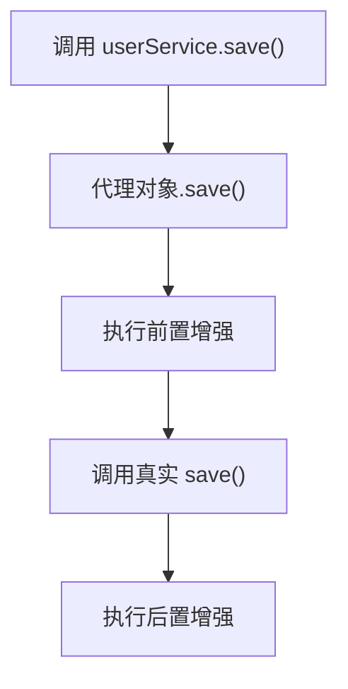
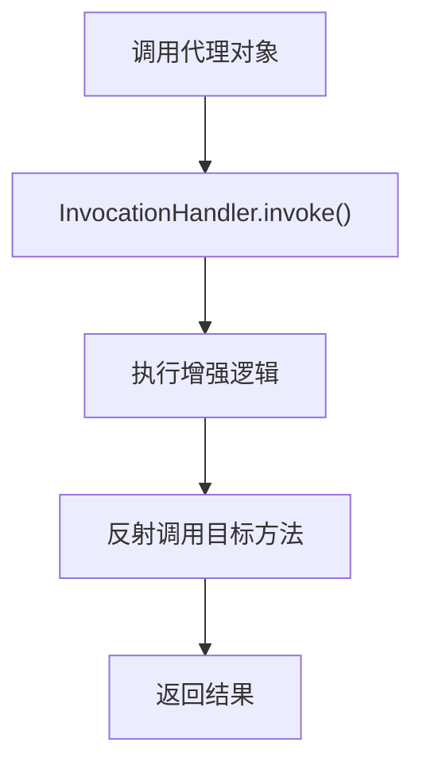
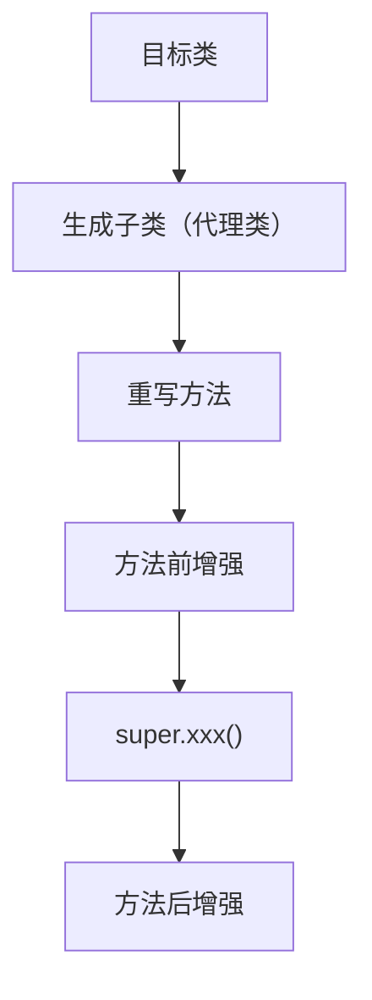

# Spring AOP

## 一、什么是 AOP？说说你对 Spring AOP 的理解

### 1. 什么是 AOP？

**AOP（Aspect Oriented Programming，面向切面编程）** 是 Spring 的核心思想之一，主要用于将系统中的**横切关注点（Cross-Cutting Concerns）**从业务代码中分离出来，提高代码复用性和可维护性。

**没有 AOP 的问题**：业务代码本应只关注业务逻辑，但实际还需要日志、权限、事务、参数校验、性能统计、异常处理等。若全部写在业务方法里，会导致代码重复、业务臃肿、维护困难。

**AOP 的解决思路**：把公共逻辑抽离出来，在**运行时动态织入**业务方法。

```
              日志
               |
权限校验  ---- 业务方法 ---- 事务
               |
             监控
```

业务代码只关注业务，公共逻辑交给 AOP 管理。

---

### 2. Spring AOP 是什么？

**Spring AOP** 是 Spring 对 AOP 思想的一种实现，通过**动态代理**技术在目标方法执行前后动态添加额外逻辑。

```
目标对象 → 动态代理 → 增强后的对象
```

调用 `userService.save()` 时，实际执行的是代理对象：



---

### 3. 核心概念

| 概念 | 英文 | 说明 |
|------|------|------|
| **切面** | Aspect | 对横切关注点进行封装的类，定义「何时执行」和「执行什么」 |
| **连接点** | Join Point | 可以被 AOP 增强的位置，Spring AOP 中通常是**方法执行** |
| **切点** | Pointcut | 定义哪些连接点需要被增强 |
| **通知** | Advice | 在切点位置具体执行的增强逻辑 |
| **织入** | Weaving | 将切面逻辑应用到目标对象的过程 |

```java
@Aspect
@Component
public class LogAspect {

    @Pointcut("execution(* com.xxx.service.*.*(..))")
    public void pointCut() { }

    @Before("pointCut()")
    public void before() { }  // 前置通知：权限校验等

    @Around("pointCut()")
    public Object around(ProceedingJoinPoint joinPoint) throws Throwable {
        // 环绕通知：事务控制、接口耗时统计等
        Object result = joinPoint.proceed();
        return result;
    }
}
```

**五种通知**：

| 通知类型 | 注解 | 执行时机 | 典型场景 |
|---------|------|---------|---------|
| 前置通知 | `@Before` | 方法执行之前 | 权限校验 |
| 后置通知 | `@After` | 方法执行之后（无论是否异常） | 资源释放 |
| 返回通知 | `@AfterReturning` | 方法正常返回后 | 记录返回结果 |
| 异常通知 | `@AfterThrowing` | 方法抛出异常时 | 异常日志 |
| 环绕通知 | `@Around` | 包围整个方法执行 | 事务控制、接口耗时统计 |

---

### 4. 底层原理

Spring AOP 底层依赖**动态代理**（JDK 动态代理 / CGLIB 动态代理）详情问题三动态代理。

---

### 5. 应用场景

| 场景 | 说明 |
|------|------|
| **事务管理** | `@Transactional` 底层就是 AOP：开启事务 → 执行业务 → 提交/回滚 |
| **日志记录** | 统一记录请求路径、参数、执行时间、返回结果 |
| **权限控制** | `@Permission("user:add")` 等注解，AOP 统一校验 |
| **接口限流** | 环绕通知在方法执行前进行限流判断 |
| **数据脱敏** | 返回结果自动脱敏，如 `138****8888` |

---

### 6. 面试回答版

> Spring AOP 是 Spring 提供的一种**面向切面编程**实现，主要用于解决系统中的横切关注点问题，比如日志、事务、权限、监控等。它通过**动态代理**技术，在不修改业务代码的情况下，将额外逻辑织入目标方法。
>
> 核心概念包括：**切面（Aspect）**、**连接点（Join Point）**、**切点（Pointcut）**、**通知（Advice）**。底层主要使用 **JDK 动态代理**和 **CGLIB 动态代理**。
>
> 实际项目中，`@Transactional`、权限控制、接口日志、性能监控等功能都大量使用了 AOP。

---

## 二、Spring AOP 和 AspectJ AOP 有什么区别？

> **一句话总结**：Spring AOP 基于**动态代理**；AspectJ 基于**字节码增强**，功能更强大。

### 1. 二者关系

```text
                 AOP（面向切面编程思想）
                        │
        ┌───────────────┴───────────────┐
        │                               │
   Spring AOP                      AspectJ
（Spring 实现）                  （完整 AOP 框架）
```

- **Spring AOP**：Spring 对 AOP 思想的一种实现
- **AspectJ**：Eclipse 基金会维护的完整 AOP 解决方案

Spring 借用了 AspectJ 的注解（`@Aspect`、`@Before` 等，来自 `org.aspectj.lang.annotation.*`），但：

> **Spring 使用 AspectJ 的注解，不代表 Spring 使用了 AspectJ 的织入技术。**

---

### 2. 实现原理对比

**Spring AOP** — 基于动态代理，增强的是**代理对象**：

| 代理方式 | 条件 | 底层实现 |
|---------|------|---------|
| JDK 动态代理 | 目标类实现接口 | `Proxy.newProxyInstance(...)` |
| CGLIB 动态代理 | 目标类没有接口 | `Enhancer.create(...)` |

**AspectJ** — 基于**字节码增强（Bytecode Weaving）**，直接修改 `.class` 文件，将切面代码织入方法内部，运行时无需代理对象。

**织入（Weaving）**：把切面代码插入目标类，程序员没改源码，但 class 已经变了。

| 织入方式 | 英文 | 时机 |
|---------|------|------|
| 编译期织入 | CTW | `.java` → ajc 编译器 → 已增强的 `.class` |
| 编译后织入 | PCW | 已有 `.class` → AspectJ Weaver → 增强后的 `.class` |
| 类加载期织入 | LTW | JVM 加载 class 时织入（Spring 支持 LTW） |

---

### 3. 核心区别

| 对比项 | Spring AOP | AspectJ AOP |
|--------|-----------|-------------|
| 实现原理 | 动态代理 | 字节码增强 |
| 是否需要代理对象 | 是 | 否 |
| 是否修改字节码 | 否 | 是 |
| 增强时机 | 运行时 | 编译期 / 类加载期 |
| 是否依赖 Spring | 是 | 否，可独立使用 |
| 性能 | 略低（代理有开销） | 略高 |
| 功能 | 较少 | 完整 |
| 学习成本 | 简单 | 较高 |

---

### 4. Join Point 区别（最大区别之一）

| | Spring AOP | AspectJ |
|---|-----------|---------|
| 支持范围 | 仅**方法执行** | 方法、构造器、字段访问/修改、异常处理、静态/类初始化等 |
| 不能增强 | 属性、构造方法、静态代码块、getter/setter | — |

---

### 5. 为什么 Spring 没有直接用 AspectJ？

| 原因 | 说明 |
|------|------|
| 更轻量 | 不需要修改 class、特殊编译器、javaagent |
| 满足绝大多数业务 | 95% 的 AOP 需求（日志、事务、权限、监控）都是方法执行 |
| 更容易维护 | 代理模式易理解调试；AspectJ 修改 class 后调试困难 |

---

### 6. 实际开发用哪个？

**99% 的 Spring Boot 项目使用 Spring AOP**：`@Transactional`、日志、权限、限流、性能统计等。

**AspectJ 一般用于**：性能要求极高、需增强构造方法/字段/private 方法/非 Spring Bean、框架开发、字节码增强工具等场景。

---

### 7. 面试回答版

> Spring AOP 和 AspectJ 都是 AOP 的实现方式，但原理不同。Spring AOP 基于**动态代理**，只能增强 Spring 容器中的 Bean，且只能拦截**方法执行**。AspectJ 基于**字节码织入**，可以增强方法、构造器、字段访问等几乎所有 Join Point，不依赖 Spring 容器。
>
> 实际开发中，大多数 Spring Boot 项目用 Spring AOP 就足够；AspectJ 更多用于需要更强 AOP 能力或框架开发的场景。

> **面试总结**：
>
> - **Spring AOP** = 动态代理（Proxy）— 简单、轻量、够用
> - **AspectJ** = 字节码织入（Weaving）— 功能更强、侵入更深

---

## 三、什么是动态代理？JDK 动态代理和 CGLIB 动态代理有什么区别？

### 1. 什么是动态代理？

**动态代理**是在程序**运行期间**动态生成代理对象，而不是像静态代理那样手写代理类。

代理对象可以在**不修改原始代码**的情况下，对目标方法进行增强，例如：日志、事务、权限控制、性能统计、缓存等。

> **Spring AOP 底层就是基于动态代理实现的。**

---

### 2. JDK 动态代理

**原理**：JDK 自带功能，核心类为 `Proxy` 和 `InvocationHandler`。代理对象是 JVM 在运行时生成的类。



**示例**：

```java
public interface UserService {
    void save();
}

public class UserServiceImpl implements UserService {
    public void save() {
        System.out.println("save");
    }
}

public class MyHandler implements InvocationHandler {
    private Object target;

    public MyHandler(Object target) {
        this.target = target;
    }

    @Override
    public Object invoke(Object proxy, Method method, Object[] args) throws Throwable {
        System.out.println("事务开始");
        Object result = method.invoke(target, args);
        System.out.println("事务提交");
        return result;
    }
}

// 生成代理
UserService proxy = (UserService) Proxy.newProxyInstance(
        target.getClass().getClassLoader(),
        target.getClass().getInterfaces(),
        new MyHandler(target)
);
```

| 优点 | 缺点 |
|------|------|
| JDK 自带，无需第三方库 | **必须有接口** |
| 实现简单 | 目标类没有接口则无法使用 |
| JDK 8+ 性能已很好 | |

---

### 3. CGLIB 动态代理

**原理**：不需要接口，通过**继承**目标类在运行时生成子类，重写方法并在前后加入增强逻辑。



**代理类大致结构**：

```java
class UserServiceProxy extends UserService {
    @Override
    public void save() {
        System.out.println("事务开始");
        super.save();
        System.out.println("事务提交");
    }
}
```

**真正实现**：

```java
Enhancer enhancer = new Enhancer();
enhancer.setSuperclass(UserService.class);
enhancer.setCallback((MethodInterceptor) (obj, method, args, proxy) -> {
    System.out.println("事务开始");
    Object result = proxy.invokeSuper(obj, args);
    System.out.println("事务提交");
    return result;
});
```

| 优点 | 缺点 |
|------|------|
| 不需要接口，普通类都可代理 | **final 类**不能代理 |
| | **final 方法**不能增强 |
| | **private 方法**不能重写，无法增强 |

---

### 4. JDK 动态代理 vs CGLIB 对比

| 对比项 | JDK 动态代理 | CGLIB 动态代理 |
|--------|-------------|---------------|
| 实现方式 | 基于接口 | 基于继承 |
| 是否需要接口 | 必须实现接口 | 不需要 |
| 底层实现 | `Proxy` + `InvocationHandler` | ASM 字节码生成子类 |
| 能否代理普通类 | 不可以 | 可以 |
| final 类 | 可以（接口代理） | 不可以 |
| final 方法 | 可调用，但不能通过继承增强 | 不可以增强 |
| private 方法 | 不增强 | 不增强 |
| 创建代理速度 | 较快 | 稍慢 |
| 方法调用效率 | JDK 8+ 差距很小 | 差距很小 |

---

### 5. Spring AOP 如何选择？

Spring 会**自动选择**代理方式：

| 场景 | 代理方式 |
|------|---------|
| 目标类**实现了接口** | 默认 **JDK 动态代理** |
| 目标类**没有实现接口** | 自动使用 **CGLIB** |
| 强制使用 CGLIB | `@EnableAspectJAutoProxy(proxyTargetClass = true)` 或 `spring.aop.proxy-target-class=true` |

> **Spring Boot 2.x+** 默认 `spring.aop.proxy-target-class=true`，即使实现了接口也使用 CGLIB。

**为什么 Spring 默认优先 JDK？**（在未强制 CGLIB 时）

- JDK 官方支持，更稳定
- 不需要额外生成子类
- 不存在继承限制（final 类/方法）带来的风险
- JDK 8+ 性能已与 CGLIB 非常接近

---

### 6. 面试回答版

> **动态代理**是在程序运行期间动态生成代理对象，不需要手写代理类，可以在不修改业务代码的情况下对方法进行统一增强，例如日志、事务、权限控制等。Spring AOP 底层就是基于动态代理实现的。
>
> Java 中主要有两种方式：**JDK 动态代理**和 **CGLIB 动态代理**。
>
> JDK 动态代理基于接口，底层使用 `Proxy` 和 `InvocationHandler`，所有方法调用转发到 `invoke()` 再通过反射调用目标方法，因此**要求目标类实现接口**。
>
> CGLIB 基于继承，利用 ASM 在运行时生成目标类的子类，通过重写方法织入增强逻辑，**不需要接口**。但由于采用继承，final 类、final 方法无法代理，private 方法也不能增强。
>
> Spring AOP 默认：有接口用 JDK 动态代理，无接口用 CGLIB；也可通过 `proxyTargetClass=true` 强制 CGLIB。JDK 8+ 两者性能差距很小，有接口时 Spring 优先选择更稳定的 JDK 动态代理。
