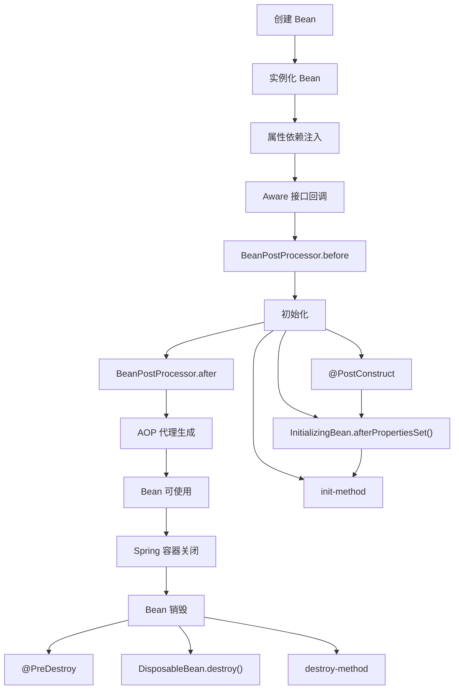
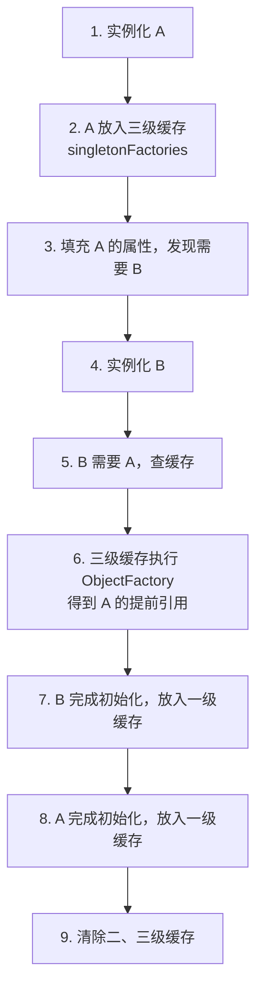
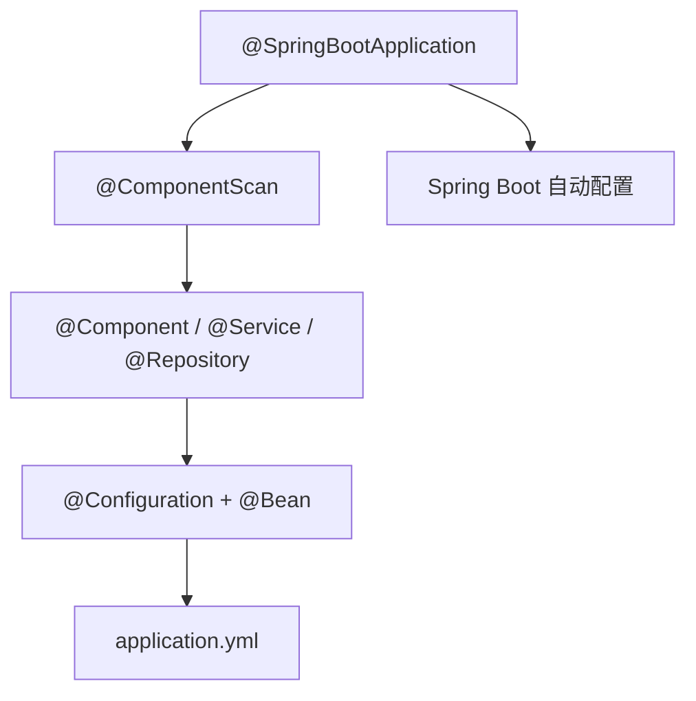

# Spring Bean

## 一、什么是 Spring Bean？

Spring 中，由 **Spring IOC 容器**管理的对象都是 **Bean**。Bean 由容器负责**实例化、装配和管理**。

容器通过 **BeanDefinition** 识别配置信息，主要包含：

| 配置项 | 说明 |
|--------|------|
| Bean 类名 | 要实例化的 Java 类 |
| 行为配置 | 作用域、自动绑定模式、生命周期回调等 |
| 其他 Bean 引用 | 依赖的其他 Bean |
| 属性配置 | Bean 的属性值 |

---

## 二、Bean 的生命周期

### 1. 五个阶段概览

| 阶段 | 说明 |
|------|------|
| **创建** | 通过反射实例化 Bean，此时属性为空 |
| **属性赋值** | 解析 `@Autowired`、`@Resource`、Setter 注入 |
| **初始化** | Aware 回调 → BPP 前置 → 初始化方法 → BPP 后置 |
| **使用** | Bean 就绪，供业务代码调用 |
| **销毁** | 容器关闭时执行销毁回调 |

### 2. 完整生命周期流程



### 3. 各阶段详解

**实例化**：通过反射创建对象，属性尚未赋值。

**属性填充**：`AutowiredAnnotationBeanPostProcessor` 等后置处理器解析 `@Autowired`、`@Resource`，完成依赖注入。

**Aware 接口回调**：如 `BeanNameAware`、`BeanFactoryAware`、`ApplicationContextAware`，让 Bean 感知容器信息。

**BeanPostProcessor 前置处理**：`postProcessBeforeInitialization()`，可在初始化前修改 Bean。

**初始化方法**（按顺序执行）：

1. `@PostConstruct`
2. `InitializingBean.afterPropertiesSet()`
3. 自定义 `init-method`

**BeanPostProcessor 后置处理**：`postProcessAfterInitialization()`，**AOP 动态代理在此阶段生成**。

**销毁方法**（按顺序执行）：

1. `@PreDestroy`
2. `DisposableBean.destroy()`
3. 自定义 `destroy-method`

> **记忆要点**：`BeanPostProcessor` 是 Spring 的核心扩展点，AOP 代理在**初始化后的后置处理**阶段完成。

---

## 三、BeanFactory 与 FactoryBean

两者名字相似，但职责完全不同。

| 对比项 | BeanFactory | FactoryBean |
|--------|------------|-------------|
| 定位 | Spring IOC 容器的**核心接口** | 创建复杂 Bean 的**特殊工厂接口** |
| 职责 | 创建、管理 Bean，依赖注入 | 通过 `getObject()` 返回复杂对象 |
| 获取方式 | 容器本身 | `getBean("name")` 返回工厂创建的对象 |
| 典型场景 | 容器基础设施 | `SqlSessionFactory`、AOP 代理对象 |

### BeanFactory

Spring IOC 的核心接口，负责：

- 创建 Bean
- 管理 Bean 生命周期
- 依赖注入
- 获取 Bean

`ApplicationContext`、`ClassPathXmlApplicationContext`、`AnnotationConfigApplicationContext` 等容器，底层都是基于 BeanFactory 扩展而来。

### FactoryBean

`FactoryBean` 本身也是一个 Bean。通过 `getObject()` 返回由它创建的复杂对象。

```java
// 默认获取 FactoryBean 创建的对象
MyObject obj = context.getBean("myFactoryBean");

// 获取 FactoryBean 本身，需要在 beanName 前加 &
FactoryBean factory = context.getBean("&myFactoryBean");
```

---

## 四、BeanFactory 与 ApplicationContext

两者都是 Spring IOC 容器，`ApplicationContext` **继承**了 `BeanFactory`。

| 对比项 | BeanFactory | ApplicationContext |
|--------|------------|---------------------|
| 定位 | 最基础的 IOC 容器 | BeanFactory 的增强版 |
| Bean 加载 | **懒加载**（用到才创建） | 默认**提前初始化**单例 Bean |
| 扩展功能 | 无 | 国际化、事件发布、资源加载、环境配置 |
| BPP 注册 | 需手动注册 | **自动注册** BeanPostProcessor |
| 使用场景 | 底层源码、特殊场景 | **实际开发主流**（Spring Boot 默认） |

---

## 五、Bean 的作用域

| 作用域 | 说明 | 使用场景 |
|--------|------|---------|
| **singleton** | 容器中只有一个实例（**默认**） | 无状态 Service、Dao |
| **prototype** | 每次获取都创建新实例 | 有状态对象 |
| **request** | 每个 HTTP 请求一个实例 | Web 层请求级数据 |
| **session** | 每个 HTTP Session 一个实例 | 用户会话数据 |
| **application** | 每个 ServletContext 一个实例 | 全局 Web 数据 |
| **websocket** | 每个 WebSocket 连接一个实例 | WebSocket 场景 |

```java
@Service
@Scope("prototype")
public class MyService { ... }
```

---

## 六、Bean 是线程安全的吗？

| 作用域 | 线程安全 | 原因 |
|--------|---------|------|
| **singleton（默认）** | 有状态 Bean **不安全** | 多线程共享同一实例 |
| **singleton（无状态）** | **安全** | 不保存请求相关数据 |
| **prototype** | **安全** | 每次请求新建实例，线程间隔离 |

**最佳实践**：

- 尽量设计**无状态** Bean（不保存成员变量中的请求数据）
- 线程相关数据用 **ThreadLocal** 保存
- Controller 中避免用成员变量存储请求数据

---

## 七、声明 Spring Bean 的注解

| 注解 | 说明 | 使用层级 |
|------|------|---------|
| `@Component` | 通用组件 | 任意层 |
| `@Service` | 业务逻辑层 | Service 层 |
| `@Repository` | 数据访问层 | Dao 层 |
| `@Controller` | 控制器层 | Web 层 |
| `@Configuration` + `@Bean` | 配置类中手动注册 Bean | 配置类 |

```java
@Configuration
public class AppConfig {
    @Bean
    public DataSource dataSource() {
        return new HikariDataSource();
    }
}
```

> `@Service`、`@Repository`、`@Controller` 本质上都是 `@Component` 的特化，便于语义区分。

---

## 八、@Autowired 的实现原理

`@Autowired` 本质上是 Spring 通过 **Bean 后置处理器**实现的。

### 核心流程

1. `AutowiredAnnotationBeanPostProcessor` 扫描 Bean 中的 `@Autowired`、`@Value` 注解
2. 在 Bean 生命周期的**属性填充**阶段，解析需要注入的字段或方法
3. 通过 `BeanFactory` 查找对应类型的 Bean
4. 若存在多个同类型 Bean，结合 `@Qualifier` 或 `@Primary` 选择
5. 通过**反射**将 Bean 设置到目标字段，完成依赖注入

### 构造器注入

构造器注入在**实例化阶段**完成：选择合适的构造方法，将依赖作为参数传入。

```java
@Service
public class UserService {
    private final UserDao userDao;

    @Autowired  // Spring 4.3+ 单构造器可省略
    public UserService(UserDao userDao) {
        this.userDao = userDao;
    }
}
```

---

## 九、@Resource 与 @Autowired 的区别

| 对比项 | `@Autowired` | `@Resource` |
|--------|-------------|-------------|
| 来源 | Spring 提供 | JDK 提供（JSR-250） |
| 注入策略 | **先按类型**，多个再按名称 | **先按名称**，找不到再按类型 |
| 指定名称 | 配合 `@Qualifier` | 直接指定 `name` 属性 |
| 必填控制 | `required = false` 可选 | 默认必须存在 |

```java
// @Autowired：按类型注入，多个同类型需 @Qualifier
@Autowired
@Qualifier("userDaoImpl")
private UserDao userDao;

// @Resource：按名称注入
@Resource(name = "userDaoImpl")
private UserDao userDao;
```

---

## 十、Spring 三级缓存与循环依赖

### 1. 什么是循环依赖？

两个或多个 Bean 相互依赖，形成闭环。

```java
@Service
public class A {
    @Autowired
    private B b;
}

@Service
public class B {
    @Autowired
    private A a;
}
```

依赖关系：`A → B → A`

### 2. 普通创建为什么会失败？

```
创建 A → 注入 B → 创建 B → 注入 A → A 尚未完成 → 失败
```

抛出 `BeanCurrentlyInCreationException`。

### 3. 三级缓存是什么？

Spring 维护三个 Map，存放不同阶段的 Bean：

```java
// 一级缓存：完整 Bean
private final Map<String, Object> singletonObjects;

// 二级缓存：提前暴露的半成品 Bean
private final Map<String, Object> earlySingletonObjects;

// 三级缓存：Bean 创建工厂
private final Map<String, ObjectFactory<?>> singletonFactories;
```

| 缓存 | 变量名 | 存放内容 |
|------|--------|---------|
| **一级** | `singletonObjects` | 已初始化完成的完整 Bean |
| **二级** | `earlySingletonObjects` | 提前暴露的半成品 Bean |
| **三级** | `singletonFactories` | 用于创建提前暴露对象的工厂 |

### 4. 为什么需要三级缓存？

核心原因：**解决 AOP 代理对象提前暴露的问题**。

假设 A 类有 `@Transactional`，容器中最终存的是 **A 的代理对象**，而非原始对象。

- 若只有二级缓存，只能提前暴露**原始对象**
- B 注入的是原始 A，容器最终返回代理 A
- 同一个 Bean 出现两个对象，产生不一致

三级缓存保存的是 `ObjectFactory`（Bean 创建工厂），需要时调用 `getObject()` 生成**最终的代理对象**，保证提前暴露的就是最终使用的对象。

### 5. 三级缓存解决循环依赖的流程

以 `A → B → A` 为例：



**详细步骤**：

1. **实例化 A**：对象创建完成，属性为空（`b = null`）
2. **A 放入三级缓存**：`singletonFactories.put("a", () -> getEarlyBeanReference("a"))`
3. **填充 A 的属性**：发现需要 B，开始创建 B
4. **实例化 B**：B 需要注入 A
5. **查缓存获取 A**：一级 → 无；二级 → 无；三级 → 找到 ObjectFactory，执行得到 A 的提前引用（有 AOP 则返回代理对象）
6. **B 完成初始化**：放入一级缓存
7. **A 完成初始化**：注入 B，放入一级缓存，清除二、三级缓存

### 6. 三级缓存的限制

| 场景 | 能否解决 | 原因 |
|------|---------|------|
| 单例 Bean + 字段/Setter 注入 | ✅ 能 | 对象先创建，再填充属性 |
| prototype 作用域 | ❌ 不能 | 缓存只针对单例 |
| 构造器循环依赖 | ❌ 不能 | 对象尚未创建就需要依赖 |

**构造器循环依赖示例**（无法解决）：

```java
@Component
public class A {
    public A(B b) { }  // 创建 A 必须先有 B
}

@Component
public class B {
    public B(A a) { }  // 创建 B 必须先有 A
}
```

> **解决构造器循环依赖**：改用 Setter/字段注入，或重构设计消除循环依赖。

### 7. 面试回答版

> Spring 三级缓存是 Spring 解决**单例 Bean 循环依赖**的核心机制：
>
> - **一级缓存** `singletonObjects`：存放完整 Bean
> - **二级缓存** `earlySingletonObjects`：存放提前暴露的 Bean
> - **三级缓存** `singletonFactories`：存放 Bean 创建工厂
>
> 之所以需要三级缓存，是因为 Spring 需要解决 **AOP 代理对象提前暴露**的问题。如果只有二级缓存，只能暴露原始对象，无法保证注入的是最终代理对象。
>
> Spring 创建 Bean 时，先实例化对象并放入三级缓存；发生循环依赖时，另一个 Bean 通过三级缓存提前获取该对象，完成依赖注入；Bean 初始化完成后进入一级缓存。

---

## 十一、Spring 提供了哪些配置方式？

### 什么是 Spring 配置？

Spring 配置是指告诉 Spring 容器：

- 哪些类需要交给 Spring 管理
- Bean 如何创建
- Bean 之间如何进行依赖注入
- Bean 的作用域、生命周期等信息

Spring 配置方式随着版本发展，大致经历了以下阶段：

```text
XML 配置
    ↓
注解配置（Annotation）
    ↓
JavaConfig 配置
    ↓
Spring Boot 自动配置（Auto Configuration）
```

目前企业开发中，主要采用 **Spring Boot 自动配置 + JavaConfig + 注解配置**，XML 配置主要用于维护老项目。

---

### 1. XML 配置（传统方式）

Spring 最初采用 XML 文件配置 Bean。

```xml
<bean id="userService"
      class="com.demo.service.UserService"/>

<bean id="orderService"
      class="com.demo.service.OrderService">
    <property name="userService" ref="userService"/>
</bean>
```

启动容器：

```java
ApplicationContext context =
    new ClassPathXmlApplicationContext("applicationContext.xml");
```

| 优点 | 缺点 |
|------|------|
| 配置集中，Bean 关系清晰 | XML 冗长，可读性差 |
| 修改配置无需改源码 | 类型安全较差，大型项目维护困难 |

> **适用场景**：老项目维护、少数需要 XML 的第三方框架

---

### 2. 注解配置（Annotation）

Spring 2.5 开始支持注解配置，用注解代替 XML 注册 Bean。

```java
@Service
public class UserService { }

@Repository
public class UserDao { }

@Controller
public class UserController { }
```

依赖注入：

```java
@Autowired
private UserService userService;
```

开启组件扫描：

```xml
<!-- XML 方式 -->
<context:component-scan base-package="com.demo"/>
```

```java
// JavaConfig 方式
@ComponentScan("com.demo")
```

**常见注解**：

| 注解 | 作用 |
|------|------|
| `@Component` | 通用 Bean |
| `@Service` | 业务层 Bean |
| `@Repository` | 持久层 Bean |
| `@Controller` | MVC 控制器 |
| `@RestController` | REST 控制器 |
| `@Autowired` | 自动注入 |
| `@Qualifier` | 指定 Bean 名称 |
| `@Value` | 注入配置值 |
| `@Scope` | 设置 Bean 作用域 |

| 优点 | 缺点 |
|------|------|
| 配置简单，开发效率高 | Bean 分散在各个类中 |
| 与业务代码结合紧密 | 大型项目不如 JavaConfig 灵活 |

---

### 3. JavaConfig 配置（推荐）

Spring 3.0 引入 JavaConfig，使用 Java 类代替 XML 配置。

```java
@Configuration
public class AppConfig {

    @Bean
    public UserService userService() {
        return new UserService();
    }
}
```

启动容器：

```java
ApplicationContext context =
    new AnnotationConfigApplicationContext(AppConfig.class);

UserService userService = context.getBean(UserService.class);
```

| 注解 | 作用 |
|------|------|
| `@Configuration` | 声明配置类 |
| `@Bean` | 向 IOC 容器注册 Bean |

| 优点 |
|------|
| 类型安全，支持 IDE 自动提示 |
| 易于重构，可读性高 |
| 更适合复杂配置 |

> **企业开发推荐使用 JavaConfig** 配置第三方组件（Redis、线程池、数据源等）。

---

### 4. Spring Boot 自动配置（Auto Configuration）

Spring Boot 在 JavaConfig 基础上引入自动配置机制。

```java
@SpringBootApplication
public class Application { }
```

`@SpringBootApplication` 等价于：

```java
@Configuration + @EnableAutoConfiguration + @ComponentScan
```

Spring Boot 根据 **classpath 依赖**、**application.yml 配置**、**@Conditional 条件注解** 自动创建 Bean。

例如引入 `spring-boot-starter-web` 后，自动配置：

- `DispatcherServlet`、Tomcat
- Jackson、Spring MVC、`MessageConverter`

开发者无需手动配置，**开箱即用**。

---

### 5. 外部配置文件（Properties / YAML）

除 Bean 配置外，Spring 还支持通过配置文件管理应用参数。

```properties
# application.properties
server.port=8080
```

```yaml
# application.yml
server:
  port: 8080

spring:
  datasource:
    url: jdbc:mysql://localhost:3306/test
    username: root
    password: 123456
```

**读取配置**：

```java
// @Value：注入单个配置项
@Value("${server.port}")
private Integer port;

// @ConfigurationProperties：批量绑定配置（更推荐）
@ConfigurationProperties(prefix = "spring.datasource")
public class DataSourceProperties { }
```

> Properties / YAML 主要用于配置**应用参数**，不负责注册 Bean。

---

### 6. 各种配置方式对比

| 配置方式 | 推荐度 | 适用场景 |
|---------|--------|---------|
| XML 配置 | ⭐ | 老项目维护 |
| 注解配置 | ⭐⭐⭐⭐ | Bean 注册、依赖注入 |
| JavaConfig | ⭐⭐⭐⭐⭐ | 当前主流配置方式 |
| Spring Boot 自动配置 | ⭐⭐⭐⭐⭐ | 企业开发默认方式 |
| Properties / YAML | ⭐⭐⭐⭐⭐ | 外部参数配置 |

---

### 7. Spring Boot 实际项目配置组合

目前企业项目通常采用以下组合：



| 方式 | 用途 |
|------|------|
| `@Service` / `@Repository` / `@Controller` | 注册业务 Bean |
| `@Configuration + @Bean` | 配置第三方组件（Redis、线程池、数据源等） |
| `application.yml` | 配置数据库、Redis、MQ 等参数 |
| Spring Boot 自动配置 | 自动创建 MVC、Tomcat、Jackson 等基础设施 |

---

### 8. 面试回答版

> Spring 提供了四种主要配置方式：**XML 配置**、**注解配置**、**JavaConfig 配置**以及 **Spring Boot 自动配置**。
>
> - XML 是早期方式，目前主要用于维护老项目
> - 注解配置通过 `@Component`、`@Service`、`@Autowired` 等完成 Bean 注册和依赖注入
> - JavaConfig 使用 `@Configuration` 和 `@Bean` 代替 XML，具有类型安全、易维护等优点，是目前主流配置方式
> - Spring Boot 在此基础上提供自动配置机制，根据依赖和配置自动创建 Bean，大幅减少配置工作
>
> 实际企业开发中，一般采用 **Spring Boot 自动配置 + JavaConfig + 注解配置 + application.yml** 的组合方式。

---

### 9. 面试扩展（高级常问）

面试官可能继续追问：

1. `@Configuration` 和 `@Component` 有什么区别？
2. `@Bean` 和 `@Component` 有什么区别？
3. Spring Boot 自动配置原理是什么？
4. `@Import` 有哪些用法？
5. `@Conditional` 的作用是什么？
6. `application.yml` 和 `application.properties` 有什么区别？
7. `@ConfigurationProperties` 为什么比 `@Value` 更推荐？

这些问题通常会延伸到 **Spring Boot 自动装配原理**，是高级 Java 面试中的重点内容。
