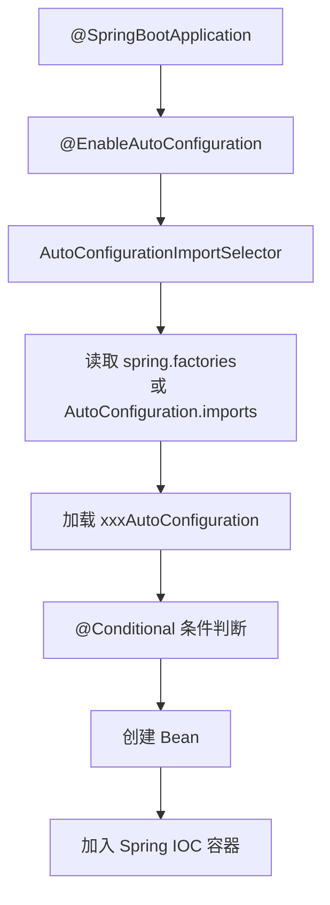
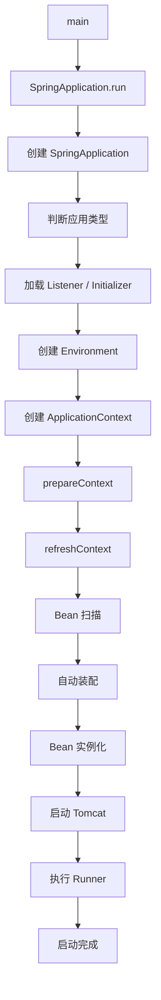
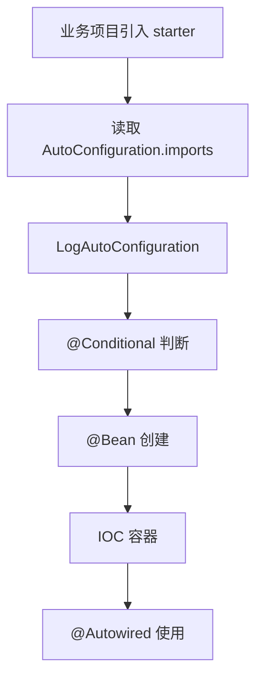

# Spring Boot

## 一、Spring Boot 是什么？有哪些优点？

### 1. Spring Boot 是什么？

Spring Boot 是基于 Spring 框架的一套**快速开发框架**，通过自动配置、Starter 依赖、内嵌服务器等机制，简化 Spring 应用的创建和部署。

简单理解：Spring 解决了企业级 Java 开发问题，但配置复杂；Spring Boot 在 Spring 基础上封装，让开发者可以快速搭建、运行和部署项目。

传统 Spring MVC 需要配置 `web.xml`、Spring 配置、数据源、事务、MVC、Tomcat 部署等；Spring Boot 只需启动类即可运行：

```java
@SpringBootApplication
public class Application {
    public static void main(String[] args) {
        SpringApplication.run(Application.class, args);
    }
}
```

### 2. Spring Boot 解决了什么问题？

| 问题 | 传统方式 | Spring Boot |
|------|---------|-------------|
| 配置复杂 | 大量 XML / `@Bean` | 注解 + 自动配置 |
| 依赖管理 | 手动引入多依赖、易冲突 | `spring-boot-starter-parent` 统一版本 |
| 部署复杂 | war → 安装 Tomcat → 部署 | 内嵌 Tomcat，`java -jar` 直接运行 |

### 3. 核心优点

| 优点 | 说明 |
|------|------|
| **自动配置** | 根据依赖自动创建 DataSource、JdbcTemplate 等 |
| **Starter** | 一组依赖集合，如 `starter-web` 一站式引入 Web 所需依赖 |
| **内嵌服务器** | 默认 Tomcat，也支持 Jetty、Undertow |
| **快速开发** | 几行代码即可完成 REST 接口 |
| **生产监控** | Actuator 提供健康检查、指标等 |
| **微服务集成** | Spring Cloud / Spring Cloud Alibaba 的基础 |

### 面试回答版

Spring Boot 是基于 Spring 的快速开发框架，通过自动配置、Starter 和内嵌服务器简化开发与部署。它主要解决配置复杂、依赖管理困难、部署繁琐的问题。核心特点包括：自动配置、Starter、内嵌 Tomcat（jar 直接运行）、Actuator 监控，以及与 Spring Cloud 微服务体系无缝集成。

---

## 二、Spring、Spring MVC、Spring Boot 有什么区别？

一句话：

> **Spring** 是核心框架，**Spring MVC** 是 Spring 的 Web 模块，**Spring Boot** 是基于 Spring 的快速开发框架。

```
                 Spring Boot
                      |
          -------------------------
          |                       |
       Spring                 Spring MVC
          |
       IOC / AOP
```

### 1. 各自定位

| | Spring | Spring MVC | Spring Boot |
|--|--------|------------|-------------|
| 定位 | 核心框架 | Web 框架 | 快速开发框架 |
| 作用 | 管理对象 | 处理 HTTP 请求 | 简化 Spring 开发 |
| 核心 | IOC / AOP | MVC 流程 | 自动配置 |
| 服务器 | 无 | 通常需外部 Tomcat | 内嵌 Tomcat |
| 配置 | 较多 | 较多 | 少 |

- **Spring**：IOC、DI、AOP、事务、Bean 管理，解决对象创建与依赖管理问题。
- **Spring MVC**：接收 HTTP 请求 → Controller → Service → DAO，返回响应；核心组件有 DispatcherServlet、HandlerMapping、HandlerAdapter 等。
- **Spring Boot**：不是替代 Spring，而是封装 Spring，通过自动配置、Starter、内嵌服务器简化创建、配置和部署。

### 2. 实际项目中的关系

```
Spring Boot 项目
    ├── Spring：IOC 管理 Service、AOP、事务
    └── Spring MVC：Controller、请求处理、JSON 转换
```

`@SpringBootApplication` 来自 Spring Boot，`@RestController` 来自 Spring MVC，`@Service` 来自 Spring，三者一起工作。

### 面试背诵版

Spring 是企业级开发框架，核心是 IOC、AOP 和事务管理。Spring MVC 是 Spring 的 Web 模块，负责 HTTP 请求处理。Spring Boot 是基于 Spring 的快速开发框架，通过自动配置、Starter 和内嵌服务器简化配置与部署。关系：Spring 是基础，Spring MVC 是 Web 层，Spring Boot 是对 Spring 生态的进一步封装。

---

## 三、Spring 有哪些核心注解？

按功能分类记忆，不要简单罗列。

### 1. Bean 管理

| 注解 | 说明 |
|------|------|
| `@Component` | 最基础，交给 IOC 管理 |
| `@Service` | 业务层（本质是 `@Component`） |
| `@Repository` | DAO 层，并转换数据访问异常 |
| `@Controller` | MVC 控制层，常返回页面 |
| `@RestController` | `@Controller` + `@ResponseBody`，返回 JSON |

### 2. 依赖注入

| 注解 | 说明 |
|------|------|
| `@Autowired` | 按类型自动注入 |
| `@Qualifier` | 指定 Bean 名称，解决多实现 |
| `@Resource` | Java 标准，默认按名称再按类型 |
| `@Primary` | 指定默认优先 Bean |

### 3. 配置相关

| 注解 | 说明 |
|------|------|
| `@Configuration` | 配置类，替代 XML |
| `@Bean` | 方法返回对象注册为 Bean |
| `@ComponentScan` | 指定扫描包 |
| `@Import` | 导入其他配置类 |

`@Component`：类自动注册；`@Bean`：方法返回对象注册。

### 4. Spring Boot 常用

| 注解 | 说明 |
|------|------|
| `@SpringBootApplication` | 组合 `@SpringBootConfiguration` + `@EnableAutoConfiguration` + `@ComponentScan` |
| `@EnableAutoConfiguration` | 开启自动配置 |
| `@ConfigurationProperties` | 批量绑定配置前缀 |
| `@Value` | 读取单个配置项 |

### 5. AOP

`@Aspect`、`@Before`、`@After`、`@Around`（环绕最常用）

### 6. 事务

`@Transactional`：声明式事务，底层 AOP 代理。

### 7. Spring MVC

`@RequestMapping`、`@GetMapping`、`@PostMapping`、`@RequestBody`、`@RequestParam`、`@PathVariable`

### 面试回答版

Spring 注解分几类：Bean 管理（`@Component`/`@Service`/`@Repository`/`@Controller`/`@RestController`）；依赖注入（`@Autowired`/`@Resource`/`@Qualifier`）；配置（`@Configuration`/`@Bean`）；AOP（`@Aspect`/`@Around`）；事务（`@Transactional`）。Spring Boot 最核心是 `@SpringBootApplication`，组合了配置、自动装配和组件扫描。

---

## 四、Spring Boot 自动装配原理？

一句话总结：

> Spring Boot 自动装配就是通过 `@EnableAutoConfiguration` 读取框架提供的自动配置类，根据项目中的依赖、配置条件判断哪些 Bean 需要创建，并自动注册到 Spring 容器中。

### 核心流程



### 1. 自动装配入口

```java
@SpringBootApplication
public class Application {
    public static void main(String[] args) {
        SpringApplication.run(Application.class, args);
    }
}
```

`@SpringBootApplication` 源码包含三个重要注解：

```java
@Target(ElementType.TYPE)
@SpringBootConfiguration
@EnableAutoConfiguration
@ComponentScan
public @interface SpringBootApplication {
}
```

| 注解 | 作用 |
|------|------|
| `@SpringBootConfiguration` | 本质是 `@Configuration`，声明这是配置类 |
| `@ComponentScan` | 扫描 `@Controller` / `@Service` / `@Repository` / `@Component` |
| `@EnableAutoConfiguration` | **自动装配核心** |

### 2. `@EnableAutoConfiguration` 做了什么？

```java
@Import(AutoConfigurationImportSelector.class)
public @interface EnableAutoConfiguration {
}
```

`@Import` 向 Spring 容器导入 `AutoConfigurationImportSelector`，由它负责加载自动配置。

### 3. `AutoConfigurationImportSelector` 做什么？

核心方法是 `selectImports()`，大致流程：

```
获取所有候选配置类 → 过滤无效配置 → 判断条件 → 返回需要加载的配置类
```

Spring Boot 内置大量自动配置类，例如：

- `DataSourceAutoConfiguration`
- `RedisAutoConfiguration`
- `WebMvcAutoConfiguration`
- `SecurityAutoConfiguration`

但**不是全部加载**，只会加载满足条件的。

### 4. 自动配置类在哪里？

| 版本 | 配置文件 |
|------|---------|
| Spring Boot 2.x | `META-INF/spring.factories` |
| Spring Boot 3.x | `META-INF/spring/org.springframework.boot.autoconfigure.AutoConfiguration.imports` |

**Boot 2.x 示例：**

```properties
org.springframework.boot.autoconfigure.EnableAutoConfiguration=\
org.springframework.boot.autoconfigure.jdbc.DataSourceAutoConfiguration
```

**Boot 3.x 示例：**

```text
org.springframework.boot.autoconfigure.jdbc.DataSourceAutoConfiguration
org.springframework.boot.autoconfigure.web.servlet.WebMvcAutoConfiguration
```

### 5. 条件注解决定是否加载

自动配置不会无脑创建 Bean，大量使用 `@Conditional` 系列注解：

```java
@Configuration
@ConditionalOnClass(DataSource.class)
@ConditionalOnMissingBean(DataSource.class)
public class DataSourceAutoConfiguration {
}
```

| 条件注解 | 含义 |
|---------|------|
| `@ConditionalOnClass` | classpath 有该类才生效（如引入了 mysql 驱动） |
| `@ConditionalOnMissingBean` | 用户未自定义同类型 Bean 才创建默认 Bean |
| `@ConditionalOnProperty` | 配置项满足才开启 |

体现：**约定大于配置，同时支持用户覆盖**。

### 6. 实际例子：数据源自动装配

引入依赖并配置：

```yaml
spring:
  datasource:
    url: jdbc:mysql://localhost:3306/test
    username: root
    password: 123456
```

启动时 Spring Boot 发现：

- classpath 存在 `DataSource`
- 配置存在 `spring.datasource.*`

于是：

```
DataSourceAutoConfiguration
        ↓
创建 HikariDataSource
        ↓
注册到 IOC
```

无需手写：

```java
@Bean
public DataSource dataSource() { ... }
```

### 7. Starter 和自动装配的关系

很多人容易混淆二者：

| | Starter | AutoConfiguration |
|--|---------|-------------------|
| 职责 | **引入依赖** | **自动创建 Bean** |
| 例子 | `starter-web` 引入 spring-web、tomcat、jackson | `WebMvcAutoConfiguration` 创建 DispatcherServlet、HandlerMapping 等 |

关系：

```
Starter 引入 jar → 触发 AutoConfiguration → 创建 Bean
```

### 8. 自定义自动装配（面试常问）

例如开发 `my-redis-spring-boot-starter`：

```
my-starter
├── MyRedisAutoConfiguration.java
├── MyRedisProperties.java
└── META-INF/spring/
    └── org.springframework.boot.autoconfigure.AutoConfiguration.imports
```

```java
@Configuration
@EnableConfigurationProperties(MyRedisProperties.class)
public class MyRedisAutoConfiguration {

    @Bean
    @ConditionalOnMissingBean
    public MyRedisClient redisClient() {
        return new MyRedisClient();
    }
}
```

在 `AutoConfiguration.imports` 中注册：

```text
com.xxx.MyRedisAutoConfiguration
```

其他项目引入该 Starter 后即可：

```java
@Autowired
MyRedisClient client;
```

### 9. 启动流程和自动装配的关系

```
main()
  → SpringApplication.run()
  → 创建 Spring 容器
  → 准备 Environment / 加载配置
  → 创建 ApplicationContext
  → 执行 refresh()
  → BeanFactory 加载 Bean
  → @EnableAutoConfiguration 触发
  → 加载自动配置类
  → 创建 Bean
```

### 面试回答模板

Spring Boot 自动装配主要通过 `@EnableAutoConfiguration` 实现。该注解通过 `@Import` 导入 `AutoConfigurationImportSelector`，在启动过程中读取 `META-INF/spring.factories`（Boot 2）或 `AutoConfiguration.imports`（Boot 3）中的自动配置类，再根据 `@Conditional` 条件判断是否满足（类是否存在、Bean 是否已存在、配置是否开启等），最终将符合条件的配置类加载到 Spring IOC 容器，实现自动创建 Bean。用户也可以通过自定义 Bean 覆盖默认配置。

---

## 五、Spring Boot 启动流程是什么？

### 一、整体流程（一句话）

Spring Boot 启动主要通过 `SpringApplication.run()` 完成，流程包括：创建 SpringApplication 对象、准备 Environment、执行监听器、创建 IOC 容器、加载 Bean、执行自动装配，最后启动完成。

### 二、启动入口

```java
@SpringBootApplication
public class Application {
    public static void main(String[] args) {
        SpringApplication.run(Application.class, args);
    }
}
```

执行入口：`SpringApplication.run()`。

### 三、启动详细流程

#### 第一步：创建 SpringApplication 对象

调用 `new SpringApplication(primarySources)`，主要做两件事：

**1. 判断应用类型**

| classpath 情况 | 应用类型 |
|---------------|---------|
| 存在 `DispatcherServlet` 等 | Web / Servlet 环境 |
| 存在 Reactive 相关类 | Reactive Web |
| 都不存在 | 非 Web 环境 |

**2. 加载初始化器和监听器**

读取 `META-INF/spring.factories`，加载：

- `ApplicationContextInitializer`
- `ApplicationListener`

用于日志初始化、环境准备、上下文刷新监听等。

#### 第二步：调用 run 方法

进入 `SpringApplication.run()`：

```
run()
  → 创建 StopWatch
  → 获取 SpringApplicationRunListeners
  → 发布启动事件
```

#### 第三步：准备 Environment

创建 `Environment`，加载配置文件（如 `application.yml`）：

```yaml
server:
  port: 8080
spring:
  datasource:
    url: xxx
```

流程：`配置文件 → Environment → Bean 读取配置`。

#### 第四步：创建 ApplicationContext

创建 Spring IOC 容器：

| 项目类型 | ApplicationContext |
|---------|-------------------|
| Web 项目 | `AnnotationConfigServletWebServerApplicationContext` |
| 普通项目 | `AnnotationConfigApplicationContext` |

#### 第五步：准备 Context（prepareContext）

主要工作：

1. 设置 Environment
2. 将启动类（`@SpringBootApplication`）加入容器
3. 扫描 `@Component` / `@Service` / `@Repository` / `@Controller`，生成 `BeanDefinition`

#### 第六步：刷新 Spring 容器（refreshContext）——核心

调用 `refreshContext()`，完成：

1. **扫描 Bean**：注册 `BeanDefinition`（如 `UserService`）
2. **自动装配**：`@EnableAutoConfiguration` 加载 `DataSourceAutoConfiguration`、`WebMvcAutoConfiguration` 等
3. **创建 Bean**：实例化并完成 `@Autowired` 依赖注入
4. **初始化 Bean**：Aware 接口、`BeanPostProcessor`、`@PostConstruct`、`InitializingBean`

#### 第七步：启动内嵌服务器

Web 项目会创建并启动内嵌 Tomcat：

```
Spring Boot → Embedded Tomcat → DispatcherServlet → Controller
```

此时接口可访问。

#### 第八步：执行 Runner

最后执行 `CommandLineRunner` / `ApplicationRunner`：

```java
@Component
public class InitRunner implements CommandLineRunner {
    @Override
    public void run(String... args) {
        System.out.println("启动完成");
    }
}
```

常用于：初始化数据、加载缓存、注册任务。

### 四、完整流程图



### 五、重点源码关系

| 类 | 作用 |
|----|------|
| `SpringApplication` | 启动入口 |
| `SpringApplicationRunListeners` | 启动事件监听 |
| `ApplicationContext` | IOC 容器 |
| `BeanFactory` | Bean 管理 |
| `AutoConfigurationImportSelector` | 自动配置 |
| `AbstractApplicationContext` | 刷新容器 |

### 六、面试回答版本

Spring Boot 启动入口是 `SpringApplication.run()`。

首先创建 `SpringApplication` 对象，判断应用类型并加载初始化器和监听器；然后执行 `run`，创建 Environment 并加载配置文件；接着创建 `ApplicationContext`（IOC 容器），通过 `refreshContext` 刷新容器。刷新过程中会扫描 BeanDefinition、执行自动装配、创建 Bean，并完成依赖注入与初始化。若是 Web 应用，会启动内嵌 Tomcat；最后执行 `CommandLineRunner` / `ApplicationRunner`，启动完成。

---

## 六、Spring Boot Starter 是什么？

一句话：

> Starter 是一组依赖集合，将某功能所需依赖统一封装；引入一个 Starter 即可快速使用该功能。

**Starter ≈ 功能依赖包 + 自动配置**

### 解决什么问题？

1. **简化依赖管理**：一个 `starter-web` 代替手动引入 webmvc、tomcat、jackson 等
2. **统一版本管理**：由 `spring-boot-dependencies` 管理版本
3. **配合自动配置**：引入后自动创建如 `RedisTemplate` 等 Bean

### 工作原理（以 starter-web 为例）

```
引入 Starter → 拉取相关依赖 → @EnableAutoConfiguration
  → 读取自动配置清单 → 加载 WebMvcAutoConfiguration → 创建相关 Bean
```

### 与普通依赖区别

| | 普通依赖 | Starter |
|--|---------|---------|
| 作用 | 提供代码 | 提供一整套功能 |
| 自动配置 | 无 | 有 |
| 目标 | 使用某个类 | 快速使用某个功能 |

### 面试回答版

Starter 将某功能所需多个 Maven 依赖封装起来，通常还配合 AutoConfiguration 自动创建 Bean。常见如 `starter-web`、`starter-data-redis`、`starter-security` 等。

---

## 七、Spring Boot 有哪些 Starter？

### 分类概览

| 分类 | Starter | 说明 |
|------|---------|------|
| Web | `starter-web` | MVC + Tomcat + Jackson（最常用） |
| Web | `starter-webflux` | 响应式 Web |
| 数据库 | `starter-jdbc` | JdbcTemplate、数据源 |
| 数据库 | `starter-data-jpa` | Spring Data JPA + Hibernate |
| 数据库 | `mybatis-spring-boot-starter` / `mybatis-plus-boot-starter` | 第三方，企业常用 |
| 缓存 | `starter-cache` | 缓存抽象 |
| 缓存 | `starter-data-redis` | RedisTemplate 等 |
| 安全 | `starter-security` | 认证鉴权 |
| 消息 | `starter-amqp` | RabbitMQ |
| 消息 | `spring-kafka` | Kafka |
| 测试 | `starter-test` | JUnit、Mockito、Spring Test |
| 监控 | `starter-actuator` | 健康检查、指标 |
| 日志 | `starter-logging` | 默认 SLF4J + Logback |
| 校验 | `starter-validation` | `@Valid`、`@NotNull` 等 |
| 开发 | `devtools` | 热部署 |
| 邮件 | `starter-mail` | 发邮件 |

### 企业最常用

`starter-web`、`starter-test`、`starter-validation`、`starter-data-redis`、`mybatis-plus-boot-starter`、`starter-actuator`、`starter-security`、`starter-amqp`

### 面试回答版

常见 Starter 包括：web（REST）、data-redis、jdbc、data-jpa、security、test、actuator、validation。企业中还大量使用 MyBatis-Plus 的 starter。

---

## 八、如何自定义一个 Starter？

适用场景：公司内部通用能力复用（统一日志、脱敏、签名校验、分布式 ID、短信、统一异常等）。

### 核心原理

> 定义自动配置类，通过 `AutoConfiguration.imports`（或 `spring.factories`）注册，用 `@Bean` 创建对象。

### 标准结构

```
my-log-spring-boot-starter          ← 依赖聚合
my-log-spring-boot-autoconfigure    ← 自动配置代码
    ├── LogAutoConfiguration.java
    ├── LogProperties.java
    └── META-INF/spring/AutoConfiguration.imports
```

### 步骤

1. **配置属性类**：`@ConfigurationProperties(prefix = "mylog")`
2. **业务类**：如 `LogService`
3. **自动配置类**：`@Configuration` + `@EnableConfigurationProperties` + `@Bean`
4. **注册**：Boot 3 写 `META-INF/spring/org.springframework.boot.autoconfigure.AutoConfiguration.imports`；Boot 2 写 `META-INF/spring.factories`
5. **打包发布**：`mvn install` 到私服
6. **业务项目引入**：配置 + `@Autowired` 即可使用

企业常用条件注解：

- `@ConditionalOnMissingBean`：用户已自定义则不创建默认 Bean
- `@ConditionalOnProperty`：配置开启才生效



### 面试回答版

自定义 Starter：创建 starter + autoconfigure 模块；编写 Properties 与业务类；写 AutoConfiguration 用 `@Bean` 注册；在 `AutoConfiguration.imports`（Boot 3）或 `spring.factories`（Boot 2）中声明；其他项目引入后自动加载。常配合条件注解实现灵活开关。

---

## 九、Spring Boot 配置文件的加载顺序？

核心原则：**高优先级覆盖低优先级**。

### 优先级（从高到低）

1. 命令行参数：`java -jar app.jar --server.port=9000`
2. Java 系统属性：`-Dserver.port=9000`
3. 操作系统环境变量：`SERVER_PORT` → `server.port`
4. 外部配置文件（如 `/opt/config/application.yml`）
5. 项目内部 `application.yml` / `application.properties`
6. 默认配置

记忆：`命令行 > 环境变量 > 外部配置文件 > 项目内部配置文件 > 默认配置`

### 配置文件搜索位置（高 → 低）

1. 项目根目录 `/config/application.yml`
2. 项目根目录 `/application.yml`
3. `classpath:/config/application.yml`
4. `classpath:/application.yml`

### 多环境

`application.yml` + `application-{profile}.yml`，通过 `spring.profiles.active` 激活；同名配置以 profile 文件优先。

同时存在 `application.properties` 与 `application.yml` 时，properties 优先，实际项目建议二选一。

### 面试回答版

配置最终进入 Environment。优先级大致为：命令行 → 系统属性 → 环境变量 → 外部配置 → 项目内 application 配置 → 默认配置。多环境通过 `spring.profiles.active` 合并基础配置与环境配置。

---

## 十、bootstrap.properties 和 application.properties 有什么区别？

一句话：

> **bootstrap** 用于启动早期配置，优先加载，常用于配置中心地址；**application** 用于业务配置，在容器启动阶段加载。

| | bootstrap | application |
|--|-----------|-------------|
| 时机 | 更早（Spring Cloud 上下文） | ApplicationContext 创建后 |
| 用途 | 「去哪找配置」 | 「应用需要什么配置」 |
| 示例 | Nacos / Config Server 地址 | 数据源、Redis、端口 |

加载顺序（传统 Spring Cloud）：`bootstrap` → 拉远程配置 → `application` → 创建 Bean。

Spring Boot 2.4 之后更推荐 `spring.config.import`（如 `nacos:xxx.yml`），bootstrap 逐渐弱化，但很多企业 Nacos 项目仍使用 `bootstrap.yml` 放服务名与注册/配置中心地址。

### 面试回答版

二者加载阶段不同：bootstrap 属于 Spring Cloud 早期配置，用于配置中心地址；application 是 Spring Boot 业务配置。通常 bootstrap 优先。Boot 2.4 后可用 `spring.config.import`，bootstrap 不再必须。

---

## 十一、Spring Boot Actuator 是什么？

一句话：

> Actuator 是生产环境监控与管理模块，通过 HTTP Endpoint 暴露健康状态、指标、Bean 等信息。

### 使用

引入 `spring-boot-starter-actuator`，默认访问 `/actuator`。

### 常用 Endpoint

| Endpoint | 作用 |
|----------|------|
| `/actuator/health` | 健康检查（K8s 探活、注册检查） |
| `/actuator/info` | 应用信息 |
| `/actuator/metrics` | JVM、HTTP、线程等指标 |
| `/actuator/beans` | 容器中的 Bean |
| `/actuator/mappings` | 接口映射 |
| `/actuator/env` | 环境与配置（生产慎开） |
| `/actuator/loggers` | 动态调整日志级别 |

### 原理简述

引入依赖 → 自动装配 → 注册 Endpoint Bean → 映射 HTTP → 暴露监控数据。

生产常配合：`exposure.include` 控制暴露范围；与 **Prometheus + Grafana** 做指标采集与可视化。

### 面试回答版

Actuator 通过 Endpoint 监控应用：health、metrics、beans、mappings、env 等；底层靠自动装配创建 Endpoint。生产常结合 Prometheus、Grafana 做可视化监控。

---

## 十二、Spring Boot 项目热部署？

一句话：修改代码后无需手动停服重启即可生效（主要用于**开发环境**）。

### 常见方式

1. **spring-boot-devtools**（官方，开发推荐）
2. IDEA HotSwap（Debug 热替换方法体）
3. JRebel（商业，能力更强）

### DevTools 使用

1. 引入 `spring-boot-devtools`（`runtime`）
2. IDEA 勾选 Build project automatically
3. Registry 开启 `compiler.automake.allow.when.app.running`

### DevTools 原理

双 ClassLoader：

- **Base ClassLoader**：第三方 jar（Spring、MyBatis 等）
- **Restart ClassLoader**：业务代码

修改业务类 → 重新编译 → 只重启 Restart ClassLoader 与 Spring Context，第三方不重载，速度更快。

注意：这是**热部署**（重启应用上下文），不是 JVM 字节码级 HotSwap。

| | 热部署 Hot Deploy | 热加载 Hot Swap |
|--|------------------|-----------------|
| 方式 | 重载应用 / Context | 替换 JVM 中方法 |
| 代表 | DevTools | IDEA Debug HotSwap |
| 限制 | 会重启 Context | 通常不能改类结构 |

### 生产为何不用？

生产要求稳定、可控、可追踪，一般走：打包 → Docker 镜像 → K8s 滚动发布，而不是改代码自动加载。

### 面试回答版

开发环境常用 DevTools：监听 class 变化后触发快速重启；双 ClassLoader 只重载业务代码。也可用 IDEA HotSwap 或 JRebel。热部署仅适合开发，生产通过重新构建与发布更新。
