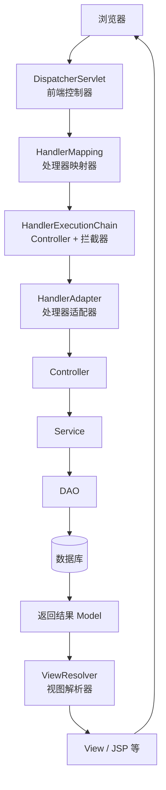
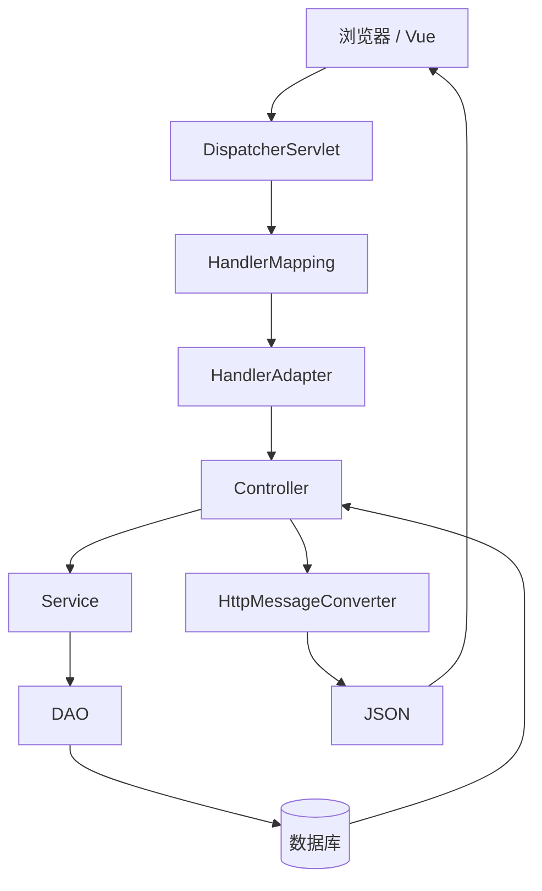
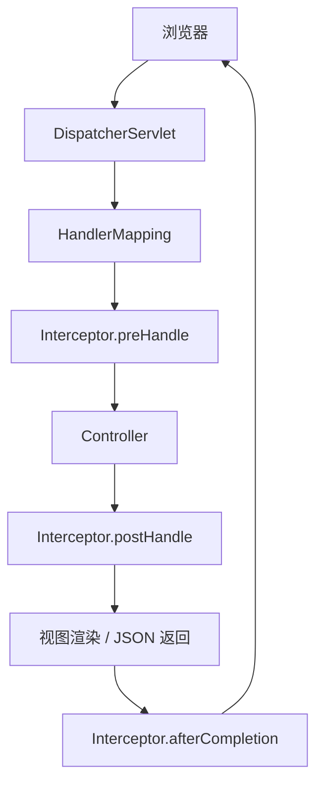

# Spring MVC

## 一、SpringMVC，MVC 设计模式的好处？

MVC（Model-View-Controller）是一种经典的软件架构设计模式，Spring MVC 就是 Spring 对该模式的实现。它将系统划分为 **Model、View 和 Controller** 三层：

| 层级 | 职责 |
|------|------|
| **Model** | 业务逻辑和数据处理 |
| **View** | 页面或 JSON 的展示 |
| **Controller** | 接收请求、调用业务并返回结果 |

在 Spring MVC 中，请求首先由 `DispatcherServlet` 接收，再通过 `HandlerMapping` 找到对应的 Controller，Controller 调用 Service 和 DAO 完成业务处理，最后将结果返回给 View 或直接返回 JSON。

**MVC 的优点：**

1. **职责分离**：控制层、业务层和数据访问层各司其职
2. **降低耦合**：提高代码的可维护性和可扩展性
3. **便于协作**：前后端可以并行开发
4. **业务复用**：多个 Controller 可以共享同一个 Service
5. **便于测试**：更容易进行单元测试，符合高内聚、低耦合的设计原则

这也是 Spring MVC 被广泛采用的重要原因。

---

## 二、Spring MVC 核心流程？

### 1. 流程概览

Spring MVC 的核心流程可以概括为：

```
客户端发起请求
  → DispatcherServlet 接收请求
  → HandlerMapping 找到 Controller
  → HandlerAdapter 调用 Controller
  → Service 执行业务
  → 返回 ModelAndView（或 JSON）
  → ViewResolver 解析视图
  → 渲染响应返回客户端
```

传统流程（含视图渲染）：



前后端分离（Spring Boot + Vue，更常见）：



现在企业开发基本都是这条流程：`ViewResolver` 使用得越来越少，而 `HttpMessageConverter` 使用得更多。

### 2. 核心组件详解

#### ① DispatcherServlet（前端控制器）

Spring MVC 的入口，所有请求都会先到这里。

**主要职责：**

- 接收 HTTP 请求
- 调度整个 MVC 流程
- 调用其他组件完成请求处理
- 返回最终响应

可以理解为：DispatcherServlet 像项目经理，不干具体业务，只负责协调。

#### ② HandlerMapping（处理器映射器）

负责找到哪个 Controller 来处理请求。

```java
@RestController
@RequestMapping("/user")
public class UserController {

    @GetMapping("/{id}")
    public User get(@PathVariable Long id) {
        // ...
    }
}
```

访问 `GET /user/1` 时，HandlerMapping 会找到 `UserController#get()`。

#### ③ HandlerAdapter（处理器适配器）

Spring 支持多种类型的 Handler，例如：

- `@RequestMapping`
- `HttpRequestHandler`
- `Controller` 接口
- `RouterFunction`（WebFlux）

HandlerAdapter 的作用是**统一调用不同类型的 Handler**：

```
DispatcherServlet
       ↓
HandlerAdapter
       ↓
invoke(controllerMethod)
```

这样 DispatcherServlet 不需要关心 Controller 的具体实现，体现了**适配器模式（Adapter Pattern）**。

#### ④ Controller

Controller 负责：接收参数、参数绑定、参数校验、调用 Service、返回结果。

```java
@GetMapping("/{id}")
public UserVO get(@PathVariable Long id) {
    return userService.get(id);
}
```

注意：Controller 不应该写复杂业务。

#### ⑤ Service

真正的业务逻辑：

```java
@Transactional
public UserVO get(Long id) {
    User user = userMapper.selectById(id);
    return convert(user);
}
```

#### ⑥ DAO（Mapper）

负责数据库访问，例如：`userMapper.selectById(id)`。

#### ⑦ 返回结果

Controller 返回通常有两种情况：

**第一种：返回页面**

```java
return "index";
```

```
DispatcherServlet → ViewResolver → JSP → HTML → 浏览器
```

**第二种：返回 JSON（最常见）**

```java
@RestController
@GetMapping("/user")
public User get() {
    return user;
}
```

Spring MVC 会调用 `HttpMessageConverter`（底层一般是 Jackson），把 Java 对象转换成 JSON 返回浏览器。

### 3. 为什么需要 HandlerAdapter？

因为 Spring 支持很多 Handler：`Controller` 接口、`HttpRequestHandler`、`@RequestMapping`、`RouterFunction` 等。

若 DispatcherServlet 直接调用 `handler.execute()`，就需要知道每一种 Handler。因此 Spring 引入 HandlerAdapter，统一调用：

```java
adapter.handle(request, response, handler);
```

以后新增新的 Handler 类型，只需新增对应的 `XXXHandlerAdapter`，DispatcherServlet 完全不用修改，符合**开闭原则（OCP）**。

### 4. 面试容易追问的几个点

| 问题 | 回答要点 |
|------|---------|
| **DispatcherServlet 是什么？** | Spring MVC 的前端控制器，是整个请求处理流程的统一入口，负责协调 HandlerMapping、HandlerAdapter、ViewResolver 等组件 |
| **HandlerMapping 的作用？** | 根据请求 URL、HTTP 方法等信息，找到对应的 Controller 方法 |
| **HandlerAdapter 为什么存在？** | 统一调用不同类型的 Handler，屏蔽实现差异，体现适配器模式 |
| **HttpMessageConverter 的作用？** | 负责请求体与 Java 对象、Java 对象与响应体之间的转换。请求：JSON → 对象（`@RequestBody`）；响应：对象 → JSON（`@ResponseBody` / `@RestController`）。底层默认使用 Jackson |

### 面试回答（3 分钟版）

Spring MVC 的核心流程是：客户端请求首先进入 **DispatcherServlet**，它作为前端控制器统一接收请求；然后通过 **HandlerMapping** 根据 URL 和请求方式找到对应的 Controller 方法；接着 DispatcherServlet 调用 **HandlerAdapter**，由它统一执行目标 Controller。Controller 完成参数处理后调用 Service 和 DAO 执行业务逻辑，得到处理结果。

如果 Controller 返回的是页面名称，DispatcherServlet 会交给 **ViewResolver** 解析视图并渲染页面；如果返回的是对象，并使用了 `@ResponseBody` 或 `@RestController`，则会通过 **HttpMessageConverter**（通常基于 Jackson）将对象转换为 JSON 返回给客户端。

其中 DispatcherServlet 是整个流程的调度中心；HandlerMapping 负责路由；HandlerAdapter 体现了适配器模式，用于统一调用不同类型的 Handler；HttpMessageConverter 负责对象与 JSON 的转换。这几个组件共同构成了 Spring MVC 的请求处理机制。

---

## 三、Spring MVC 拦截器是什么？

### 1. 什么是拦截器（Interceptor）？

Spring MVC 拦截器（Interceptor）是 Spring MVC 提供的一种请求拦截机制，用于在 **Controller 方法执行前后**插入一些通用逻辑，而无需修改业务代码。

它类似于 AOP，但只作用于 Spring MVC 请求。

```
浏览器
    │
DispatcherServlet
    │
Interceptor（前置）
    │
Controller
    │
Interceptor（后置）
    │
返回结果
```

**常用于：** 登录校验、权限认证、操作日志、请求耗时统计、参数检查、国际化处理。

### 2. 拦截器的执行流程



### 3. 拦截器的三个方法

Spring MVC 拦截器通常实现 `HandlerInterceptor` 接口：

```java
public class LoginInterceptor implements HandlerInterceptor {
}
```

#### ① preHandle()

Controller 执行之前调用：

```java
boolean preHandle(HttpServletRequest request,
                  HttpServletResponse response,
                  Object handler)
```

| 返回值 | 含义 |
|-------|------|
| `true` | 继续执行 Controller |
| `false` | 请求结束 |

```java
public boolean preHandle(...) {
    if (loginSuccess) {
        return true;
    }
    response.sendRedirect("/login");
    return false;
}
```

最常用于：登录校验、Token 校验、权限校验。

#### ② postHandle()

Controller 执行完成后、**View 渲染之前**调用：

```java
public void postHandle(...) {
    System.out.println("Controller执行完成");
}
```

一般用于：修改 Model、设置公共数据、页面渲染前处理。使用 `@RestController` 时实际使用较少。

#### ③ afterCompletion()

整个请求结束之后执行（View 渲染完成或 JSON 返回完成都会执行）：

```java
public void afterCompletion(...) {
    long cost = ...;
    log.info("耗时：" + cost);
}
```

一般用于：释放资源、删除 ThreadLocal、打印日志、请求耗时统计。

### 4. 执行顺序与异常场景

**正常情况：**

```
preHandle() → Controller → postHandle() → afterCompletion()
```

**preHandle() 返回 false：**

```
preHandle() → 结束请求（Controller 不执行）
```

**Controller 抛异常：**

```
preHandle() → Controller → Exception → afterCompletion()
```

注意：此时 `postHandle()` 不会执行，但 `afterCompletion()` 会执行。

### 5. 如何配置拦截器？

Spring Boot 中一般实现 `WebMvcConfigurer`：

```java
@Configuration
public class WebConfig implements WebMvcConfigurer {

    @Override
    public void addInterceptors(InterceptorRegistry registry) {
        registry.addInterceptor(new LoginInterceptor())
                .addPathPatterns("/**")
                .excludePathPatterns("/login", "/static/**");
    }
}
```

- `/**`：全部拦截
- `excludePathPatterns()`：放行指定路径

### 6. 实际应用

用户访问 `GET /order/list`：

```
浏览器 → DispatcherServlet → LoginInterceptor 检查 Token
  → token 有效 → Controller → 返回 JSON
  → token 无效 → preHandle 中 setStatus(401) 并 return false → Controller 不执行
```

### 7. 拦截器、过滤器、AOP 的区别

| 对比项 | Filter | Interceptor | AOP |
|-------|--------|-------------|-----|
| 属于 | Servlet 规范 | Spring MVC | Spring Framework |
| 拦截范围 | 所有请求 | Spring MVC 请求 | 方法调用 |
| 是否依赖 Spring MVC | 否 | 是 | 否 |
| 拦截对象 | Servlet 请求 | Controller | Bean 方法 |
| 是否能获取 Controller | 否 | 能 | 能 |
| 是否能拦截静态资源 | 能 | 默认不能 | 不能 |
| 常见用途 | 编码、CORS、XSS、统一日志 | 登录、权限、Token 校验 | 事务、日志、缓存、权限 |

### 8. 面试容易追问

**为什么登录校验通常使用拦截器，而不是 AOP？**

因为登录校验属于 HTTP 请求处理阶段的逻辑，需要直接访问 `HttpServletRequest`、`HttpServletResponse`，甚至可以中断请求并返回 401、403 等状态码。拦截器正是为此设计的。AOP 更适合处理业务方法的横切逻辑，例如事务、日志、缓存、监控等。

**一个请求经过多个拦截器，执行顺序是什么？**

假设有两个拦截器 A、B：

```
A.preHandle()
  → B.preHandle()
  → Controller
  → B.postHandle()
  → A.postHandle()
  → B.afterCompletion()
  → A.afterCompletion()
```

- `preHandle()` 按注册顺序执行
- `postHandle()` 和 `afterCompletion()` 按逆序执行，类似于栈（先进后出）

### 面试回答（2~3 分钟）

Spring MVC 拦截器（Interceptor）是 Spring MVC 提供的一种请求拦截机制，可以在 Controller 执行前后织入公共逻辑，而不用修改业务代码。它主要通过实现 `HandlerInterceptor` 接口来完成。

拦截器有三个核心方法：`preHandle()` 在 Controller 执行前调用，可以做登录认证、权限校验、Token 校验等，返回 false 可以直接终止请求；`postHandle()` 在 Controller 执行后、视图渲染前调用，可以修改模型数据；`afterCompletion()` 在整个请求完成后执行，常用于释放资源、清理 ThreadLocal、记录日志和统计耗时。

在实际项目中，拦截器常用于登录认证、权限控制、接口访问日志和请求耗时统计。相比 Filter，拦截器能够获取到具体的 Controller 信息；相比 AOP，它专门针对 Spring MVC 请求生命周期，更适合处理 Web 层的通用逻辑。

---

## 四、拦截器和过滤器的区别是什么？

一句话概括：

> **Filter（过滤器）** 是 Servlet 规范提供的，作用于所有请求；**Interceptor（拦截器）** 是 Spring MVC 提供的，作用于 Controller。

### 1. Filter（过滤器）

Filter 是 **Servlet 规范**中定义的组件，不属于 Spring。所有进入 Web 容器（Tomcat、Jetty）的请求，都可以经过 Filter。

```
浏览器 → Filter1 → Filter2 → DispatcherServlet → Controller
```

```java
public class LoginFilter implements Filter {

    @Override
    public void doFilter(ServletRequest request,
                         ServletResponse response,
                         FilterChain chain)
            throws IOException, ServletException {
        System.out.println("过滤请求");
        chain.doFilter(request, response);
        System.out.println("返回响应");
    }
}
```

**Filter 特点：**

- 属于 Servlet，Spring MVC 出现之前就存在
- 可以拦截所有请求（含静态资源）
- 可以修改 Request、Response
- 生命周期由 Web 容器管理

**常见用途：** 登录过滤、编码过滤（如 `CharacterEncodingFilter`）、XSS 过滤、跨域（`CorsFilter`）、请求日志等。

### 2. Interceptor（拦截器）

Interceptor 是 Spring MVC 提供的，主要拦截 Controller，通常不拦截 html / css / js / 图片等静态资源。

```
浏览器 → Filter → DispatcherServlet → Interceptor → Controller
```

### 3. 两者最大的区别：工作位置

| 组件 | 工作位置 |
|------|---------|
| **Filter** | 浏览器 → **Filter** → DispatcherServlet（比 Spring MVC 更早） |
| **Interceptor** | DispatcherServlet → **Interceptor** → Controller（属于 Spring MVC） |

### 4. 完整执行顺序

```
请求
  → Filter
  → DispatcherServlet
  → Interceptor.preHandle()
  → Controller
  → Interceptor.postHandle()
  → View（如有）
  → Interceptor.afterCompletion()
  → Filter 返回
```

多个 Filter 时也像栈一样：先进后出。

### 5. 能获取的信息不同

| 组件 | 能拿到的信息 |
|------|-------------|
| **Filter** | `ServletRequest` / `ServletResponse`，不知道哪个 Controller、哪个方法 |
| **Interceptor** | 可拿到 `Object handler`（如 `HandlerMethod`），可知类名、方法、注解、参数等 |

因此做权限、登录、AOP 风格日志时，Interceptor 更方便。

### 6. 异常处理区别

- **Filter**：对 Controller 异常一般不好处理，因为它不感知 Spring MVC 的异常机制
- **Interceptor**：可以配合 `@ControllerAdvice` 做统一异常处理

### 7. Spring Boot 中如何选择？

| 场景 | Filter | Interceptor |
|------|--------|-------------|
| 字符编码 | ✅ | ❌ |
| CORS | ✅ | ⚠️（也可用 Spring MVC 配置） |
| XSS 过滤 | ✅ | ❌ |
| 请求日志 | ✅ | ✅（需要 Controller 信息时更适合） |
| 登录认证 | ⚠️ | ✅ |
| JWT 校验 | ⚠️ | ✅ |
| 权限校验 | ❌ | ✅ |
| 获取 Controller 方法信息 | ❌ | ✅ |
| 统计接口耗时 | ✅ | ✅ |

### 面试回答（推荐）

Filter 和 Interceptor 的主要区别在于**所属规范**和**拦截范围**。Filter 是 Servlet 规范提供的组件，由 Web 容器管理，在请求进入 Spring MVC 之前执行，可以拦截所有请求（包括静态资源），并且可以对 Request、Response 进行包装和修改，因此常用于字符编码、CORS、XSS 防护等通用功能。

Interceptor 是 Spring MVC 提供的，由 Spring 容器管理，只拦截经过 DispatcherServlet 的请求，主要针对 Controller。它提供了 `preHandle`、`postHandle` 和 `afterCompletion` 三个生命周期方法，还可以获取 `HandlerMethod`，知道当前执行的是哪个 Controller 和哪个方法，因此更适合实现登录认证、权限校验、接口日志、操作审计等业务相关功能。

实际项目中，两者通常配合使用：Filter 负责 Web 层的通用处理，Interceptor 负责 Spring MVC 层的业务拦截。
