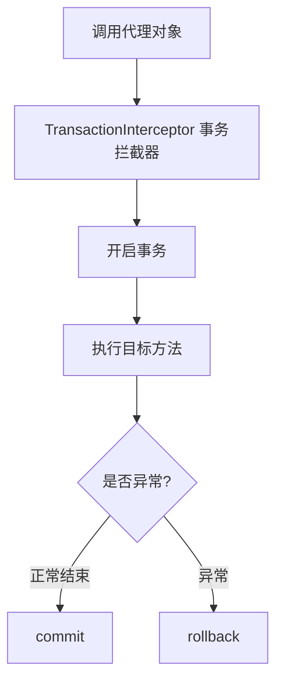
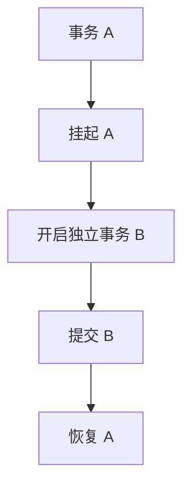

# Spring 事务

## 一、Spring 事务中的隔离级别有哪些？

Spring 的事务隔离级别沿用了 JDBC 的定义，共有 **五种**：

| 隔离级别 | 说明 | 脏读 | 不可重复读 | 幻读 |
|---------|------|------|-----------|------|
| **DEFAULT** | 使用数据库默认隔离级别 | 取决于数据库 | 取决于数据库 | 取决于数据库 |
| **READ_UNCOMMITTED** | 读未提交 | ✔ | ✔ | ✔ |
| **READ_COMMITTED** | 读已提交 | ✘ | ✔ | ✔ |
| **REPEATABLE_READ** | 可重复读 | ✘ | ✘ | 视实现而定 |
| **SERIALIZABLE** | 串行化 | ✘ | ✘ | ✘ |

- **DEFAULT**：使用数据库默认隔离级别。例如 MySQL InnoDB 默认是 `REPEATABLE_READ`。
- **READ_UNCOMMITTED**：会产生脏读、不可重复读和幻读。
- **READ_COMMITTED**：解决了脏读，但仍可能出现不可重复读。
- **REPEATABLE_READ**：解决了脏读和不可重复读；在 MySQL InnoDB 中结合 MVCC 和 Next-Key Lock，大多数情况下也能避免幻读。
- **SERIALIZABLE**：隔离级别最高，可避免所有并发读问题，但会显著降低并发性能。

实际项目中通常直接使用数据库默认隔离级别，只有在特殊业务场景下才会显式指定。

---

## 二、声明式事务实现原理了解吗？

这是 Spring 事务面试非常高频的问题。面试官想听的不是 `@Transactional` 怎么写，而是你是否理解：**Spring AOP + 动态代理 + 事务拦截器 + 数据库连接绑定** 这一套流程。

### 1. 核心结论

Spring 的声明式事务，本质是：

> 通过 AOP 动态代理，在目标方法执行前开启事务，执行完成后根据结果提交或回滚事务。



### 2. `@Transactional` 做了什么？

```java
@Service
public class OrderService {

    @Transactional
    public void createOrder() {
        saveOrder();
        updateStock();
    }
}
```

Spring 启动时扫描到 `@Transactional`，发现该类需要增强：

- 原对象：`OrderService`
- 包装成代理对象：`Proxy(OrderService)`

之后调用 `orderService.createOrder()`，实际走的是 `Proxy.createOrder()`，而不是原始对象。

### 3. Spring 如何生成代理？

Spring AOP 有两种代理方式：

| 代理方式 | 条件 | 原理 |
|---------|------|------|
| **JDK 动态代理** | 目标类实现接口 | 生成实现同接口的代理类 |
| **CGLIB 代理** | 目标类无接口（或强制使用） | 生成目标类子类并重写方法 |

```java
// JDK：目标类实现接口
public interface OrderService {
    void createOrder();
}
// Proxy implements OrderService

// CGLIB：无接口时生成子类
// OrderService$$EnhancerBySpringCGLIB
```

Spring Boot 默认使用 **CGLIB** 代理。

### 4. 方法调用时发生什么？

```
客户端
  ↓
代理对象
  ↓
TransactionInterceptor
  ↓
事务管理器
  ↓
目标方法
```

### 5. `TransactionInterceptor` 做什么？

核心类是 `TransactionInterceptor`，负责事务控制。伪代码：

```java
public Object invoke() {
    // 开启事务
    TransactionStatus status = transactionManager.getTransaction(...);

    try {
        // 执行业务方法
        Object result = method.invoke(...);
        // 提交事务
        transactionManager.commit(status);
        return result;
    } catch (Exception e) {
        // 回滚事务
        transactionManager.rollback(status);
        throw e;
    }
}
```

### 6. 事务怎么和数据库连接关联？

Spring 使用 `TransactionSynchronizationManager` 管理事务资源。

开启事务时获取数据库 `Connection`，并通过 **ThreadLocal** 绑定到当前线程：

```
ThreadLocal
    |
    ↓
Connection
```

因此同一个线程里的 `insert()` / `update()` / `delete()` 都会使用同一个 `Connection`，最终一次 `commit()` 提交。

### 7. 为什么 `@Transactional` 可以实现事务传播？

```java
@Transactional
public void A() {
    B();
}

@Transactional
public void B() {
}
```

Spring 会根据 `@Transactional(propagation = ...)` 判断：使用当前事务、创建新事务，还是挂起事务。底层同样由 `TransactionInterceptor` → `PlatformTransactionManager` 处理。

### 8. 为什么 `@Transactional` 会失效？

#### ① 同类方法调用

```java
@Service
public class UserService {

    public void A() {
        B(); // this.B()，绕过代理
    }

    @Transactional
    public void B() {
    }
}
```

调用 `userService.A()` 不会开启事务，因为 `A()` 内部是 `this.B()`，绕过了代理。正确做法是通过 Spring Bean（代理对象）调用 `B()`。

#### ② 方法不是 public

```java
@Transactional
private void test() {
}
```

默认不会生效，因为代理无法增强非 public 方法。

#### ③ 异常被吃掉

```java
@Transactional
public void test() {
    try {
        // ...
    } catch (Exception e) {
        // 吃掉异常
    }
}
```

没有异常抛出，Spring 认为成功，会 `commit`。

#### ④ 抛出的异常不是 RuntimeException

默认只有 `RuntimeException` 和 `Error` 才回滚。`throw new Exception()` 不会回滚，需要：

```java
@Transactional(rollbackFor = Exception.class)
```

### 面试简洁回答版

Spring 声明式事务底层是通过 **AOP** 实现的。Spring 会为添加 `@Transactional` 的方法生成代理对象，调用方法时实际先进入 `TransactionInterceptor` 事务拦截器，由拦截器通过 `PlatformTransactionManager` 开启事务，再执行目标方法。正常则提交，抛出符合条件的异常则回滚。事务期间数据库连接会绑定到当前线程，通过 `TransactionSynchronizationManager` 保证同一事务内使用同一个 `Connection`。

常见失效场景：同类方法调用绕过代理、方法不是 public、异常被捕获、异常类型不满足默认回滚规则等。

---

## 三、Spring 事务传播行为有哪些，加入事务和嵌套事务有什么区别？

### 1. 什么是事务传播行为？

事务传播行为（Propagation）决定的是：一个带 `@Transactional` 的方法，在调用另一个带 `@Transactional` 的方法时，事务应该如何传播。

```java
@Service
public class OrderService {

    @Transactional
    public void createOrder() {
        saveOrder();
        stockService.reduceStock();
        accountService.pay();
    }
}
```

```
A事务
   │
   ├──B事务
   │
   └──C事务
```

B、C 是否共用 A 的事务，由传播行为决定。

```java
@Transactional(propagation = Propagation.REQUIRED)
```

### 2. Spring 一共有 7 种传播行为

| 传播行为 | 说明 | 是否常用 |
|---------|------|---------|
| **REQUIRED** | 加入当前事务，没有就新建 | ⭐⭐⭐⭐⭐ |
| **SUPPORTS** | 有事务就加入，没有就不用事务 | ⭐⭐ |
| **MANDATORY** | 必须在事务中运行，否则异常 | ⭐ |
| **REQUIRES_NEW** | 挂起当前事务，新建事务 | ⭐⭐⭐⭐⭐ |
| **NOT_SUPPORTED** | 挂起事务，以非事务方式运行 | ⭐ |
| **NEVER** | 不能在事务中运行，否则异常 | ⭐ |
| **NESTED** | 嵌套事务（保存点） | ⭐⭐⭐ |

面试重点：**REQUIRED、REQUIRES_NEW、NESTED、SUPPORTS**。

### 3. REQUIRED（默认）

```java
@Transactional
// 等价于
@Transactional(propagation = Propagation.REQUIRED)
```

含义：**有事务就加入；没有事务就新建。**

```
A 有事务 → B(REQUIRED) → 加入 A 事务
A 无事务 → B(REQUIRED) → 创建新事务
```

这是项目中 95% 以上的情况。

### 4. REQUIRES_NEW（新建事务）

含义：**不管有没有事务，都创建新事务**，并挂起外层事务。



```java
@Transactional
public void createOrder() {
    orderDao.save();
    logService.saveLog(); // 新事务
    stockDao.update();
}

@Transactional(propagation = Propagation.REQUIRES_NEW)
public void saveLog() {
}
```

若库存失败导致订单回滚，日志事务已独立提交，**不会回滚**。适用于：操作日志、审计日志、消息记录、短信记录等希望业务失败仍保留记录的场景。

### 5. NESTED（嵌套事务）

最容易和 `REQUIRES_NEW` 混淆。含义：创建事务**保存点（Savepoint）**，而不是开启独立事务。

```
事务 A
  保存订单
    ↓
  Savepoint
    ↓
  扣库存（失败）
    ↓
  回滚到 Savepoint（局部回滚）
    ↓
  继续执行，最终由事务 A commit
```

结果：订单可成功，库存失败部分回滚。若最后外层 A 也 rollback，则内层效果一并消失——本质仍是**同一个事务**。

### 6. REQUIRED、REQUIRES_NEW、NESTED 区别

| 比较项 | REQUIRED | REQUIRES_NEW | NESTED |
|-------|----------|--------------|--------|
| 加入已有事务 | ✔ | ✘（挂起原事务） | ✔ |
| 新建事务 | 没有事务才建 | 始终新建 | 不新建独立事务 |
| 是否独立提交 | 否 | 是 | 否 |
| 是否影响外层事务 | 会 | 不会（事务独立） | 最终仍受外层事务影响 |
| 底层实现 | 共享事务 | 独立事务 | Savepoint（保存点） |

假设 `A() { B(); }`：

| 传播 | 行为 | 结果 |
|------|------|------|
| **REQUIRED** | B 加入 A；B 失败 → 整个 A 失败 | 内外一体 |
| **REQUIRES_NEW** | 挂起 A → 事务 B 提交 → 恢复 A；A 失败不影响已提交的 B | B 成功、A 失败可并存 |
| **NESTED** | Savepoint → B 失败回滚到保存点 → A 可继续并提交；若 A 最终 rollback，B 也没了 | 局部回滚，仍属同一事务 |

**加入事务（REQUIRED）** vs **嵌套事务（NESTED）**：

- **REQUIRED**：内外共用一个事务，内层失败通常导致整个事务回滚。
- **NESTED**：仍是同一事务，但内层有 Savepoint，可局部回滚；最终提交/回滚仍由外层决定。
- 与 **REQUIRES_NEW** 的最大区别：`REQUIRES_NEW` 是真正的独立事务；`NESTED` 是同一事务中的嵌套回滚机制。

### 7. SUPPORTS

含义：有事务就加入，没有事务就直接执行。常用于只读查询：

```java
@Transactional(propagation = Propagation.SUPPORTS)
public User query() {
}
```

### 8. 其他三个了解即可

| 传播行为 | 说明 |
|---------|------|
| **MANDATORY** | 必须有事务，否则抛异常 |
| **NOT_SUPPORTED** | 有事务则挂起，以非事务方式执行 |
| **NEVER** | 当前有事务则直接抛异常 |

### 9. 实际项目最常用哪些？

| 传播行为 | 典型场景 |
|---------|---------|
| **REQUIRED（默认）** | 业务方法：下单、支付、转账等 |
| **REQUIRES_NEW** | 操作日志、审计日志、消息记录（主业务回滚也要保留） |
| **SUPPORTS** | 部分只读查询 |
| **NESTED** | 使用较少，需数据库/事务管理器支持 Savepoint |

### 面试回答（1~2 分钟版）

Spring 一共定义了七种事务传播行为，最常用的是 **REQUIRED、REQUIRES_NEW、NESTED** 和 **SUPPORTS**。默认是 **REQUIRED**，表示当前有事务就加入，没有事务就新建。**REQUIRES_NEW** 表示无论是否存在事务，都开启一个新的独立事务并挂起外层事务，内外互不影响，常用于日志、审计等场景。**NESTED** 表示在当前事务中创建保存点（Savepoint），内部失败可回滚到保存点实现局部回滚，但最终是否提交仍由外层决定。因此它和 REQUIRES_NEW 的最大区别是：REQUIRES_NEW 是真正的独立事务，而 NESTED 是同一事务中的嵌套回滚机制。实际项目中主要用 REQUIRED，少量场景用 REQUIRES_NEW，NESTED 使用相对较少。
