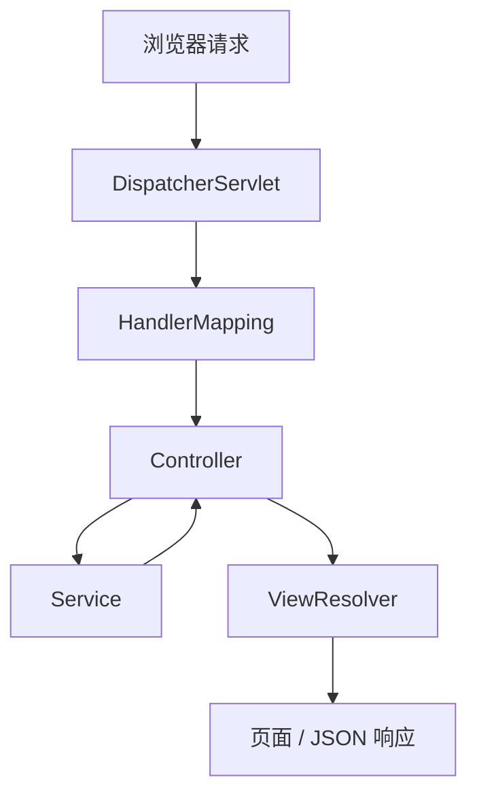
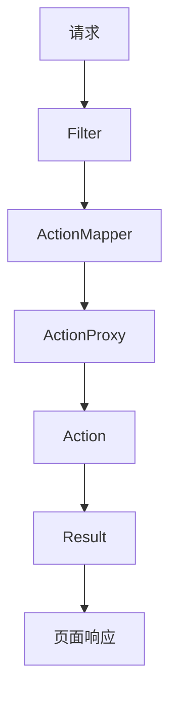
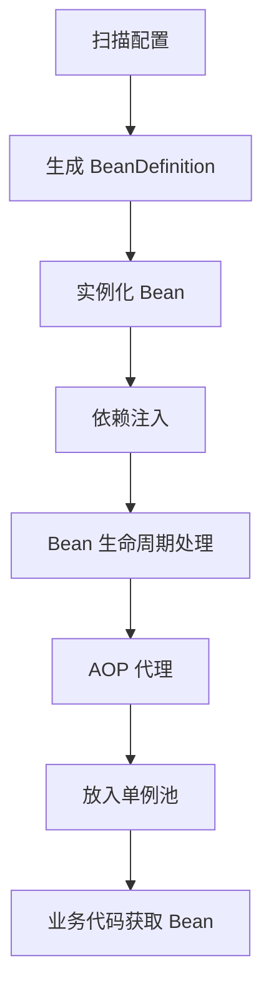

# Spring

## 一、Spring 概述

### 1. 什么是 Spring？

Spring 是一个**轻量级**的 Java 企业级开发框架，核心目标是**降低对象之间的耦合**，提高系统的可维护性和扩展性。

Spring 的两大核心思想：

| 核心 | 全称 | 一句话理解 |
|------|------|-----------|
| **IOC** | Inversion of Control（控制反转） | 对象的创建和管理交给 Spring 容器 |
| **AOP** | Aspect Oriented Programming（面向切面编程） | 将横切逻辑从业务代码中抽离 |

---

### 1.1 IOC（控制反转）

**传统开发**：业务代码主动 `new` 对象，对象之间高度耦合。

```java
UserService userService = new UserService();
```

**使用 Spring 后**：对象由容器创建，通过依赖注入完成组装。

```java
@Autowired
private UserService userService;
```

---

### 1.2 AOP（面向切面编程）

将**日志、事务、权限、监控**等横切逻辑从业务代码中抽离，通过**动态代理**在不修改业务代码的情况下增强目标方法。

常见应用：

- 事务控制（`@Transactional`）
- 日志记录
- 权限校验
- 性能监控

> **记忆要点**：Spring = IOC（解耦对象）+ AOP（增强方法）

---

## 二、Spring 最大的优点

### 1. 解耦

对象不需要自己创建，由 Spring 容器统一管理，降低对象之间的依赖关系。

### 2. 可维护性高

配置和对象管理集中在容器中；修改实现类时，不需要大量修改业务代码。

### 3. 可扩展性强

Spring 面向接口编程，可以方便地替换具体实现。

```
PaymentService（接口）
    ├── AliPayService
    └── WeChatPayService
```

### 4. 易测试

对象由容器管理，测试时可以方便地替换为 Mock 对象，提高单元测试效率。

---

## 三、Spring 容器

### 1. 什么是 Spring 容器？

Spring 容器本质上就是一个 **Bean 工厂**，主要负责：

| 职责 | 说明 |
|------|------|
| 创建 Bean | 根据配置实例化对象 |
| 保存 Bean | 管理 Bean 的生命周期 |
| 依赖注入 | 自动装配对象之间的依赖 |
| AOP 代理 | 生成代理对象实现切面增强 |
| Bean 销毁 | 容器关闭时释放资源 |

### 1.1 BeanFactory

Spring 最基础的 IOC 容器。

- 提供基本 Bean 管理能力
- **延迟加载** Bean（用到时才创建）

### 1.2 ApplicationContext

BeanFactory 的增强版本，**实际开发中主要使用它**。

除 IOC 功能外，还提供：

- 国际化支持
- 事件机制
- 资源加载
- 环境配置

---

## 四、Spring 框架模块

```
Spring Framework
├── Spring Core             ← 核心：IOC 容器、依赖注入
├── Spring Beans            ← Bean 管理与生命周期
├── Spring Context          ← ApplicationContext、事件、国际化
├── Spring Data Access      ← 简化数据库访问,集成ORM框架
├── Spring Web              ← Web 开发、Spring MVC
├── Spring AOP              ← 面向切面编程
└── Spring Test             ← 集成 JUnit、Mock 测试
```

| 模块                     | 主要功能                                                        |
|------------------------|-------------------------------------------------------------|
| **Spring Core**        | IOC 容器、Bean 管理、依赖注入；其他模块都依赖它                                |
| **Spring Beans**       | BeanFactory、Bean 生命周期、BeanDefinition                        |
| **Spring Context**     | ApplicationContext、国际化、事件机制、资源加载                            |
| **Spring Data Access** | 包含JDBC支持简化数据库操作，还能集成Mybatis、Hibernate这些ORM框架，事务管理，保证数据库操一致性 |
| **Spring Web**         | Web 请求处理、Servlet 支持、Spring MVC                              |
| **Spring AOP**         | 事务、日志、权限、监控等横切增强                                            |
| **Spring Test**        | 集成 JUnit、Mock 测试                                            |

> Spring 将由容器管理的对象称为 **Bean**。

---

## 五、Spring MVC 与 Struts2 对比

两者都属于 Java **Web 层框架**，负责接收请求、调用业务逻辑、返回页面或数据。

| 对比项 | Spring MVC | Struts2 |
|--------|-----------|---------|
| 底层基础 | Servlet + IOC 容器 | Filter |
| 核心组件 | `DispatcherServlet` | `Action` |
| 编程风格 | 注解驱动 | Action + OGNL |
| Controller 作用域 | 单例（默认） | 每次请求新建 Action |

---

## 六、Spring MVC 请求流程



**流程说明**：

1. 请求到达 `DispatcherServlet`（前端控制器）
2. `HandlerMapping` 找到对应的 Controller 方法
3. Controller 调用 Service 处理业务
4. 返回 ModelAndView 或数据
5. `ViewResolver` 解析视图，响应给客户端

---

## 七、Struts2 请求流程



---

## 八、Controller 生命周期对比

### Spring MVC — 默认单例

```
一个 Controller 实例 → 处理多个请求
```

**优点**：减少对象创建，性能更高。

**注意**：Controller 的**成员变量不能保存请求数据**，否则可能产生线程安全问题（应使用局部变量或方法参数）。

### Struts2 — 每次请求新建 Action

每次请求创建新的 Action 对象，**线程安全性更好**，但对象创建开销更大。

---

## 九、Spring 中使用的设计模式

| 设计模式 | Spring 中的体现 | 说明 |
|---------|----------------|------|
| **工厂模式** | `BeanFactory` / `ApplicationContext` | IOC 容器本身就是大型工厂 |
| **单例模式** | Bean 默认作用域 `singleton` | 同一 Bean 在容器中只有一个实例 |
| **代理模式** | Spring AOP | JDK 动态代理 / CGLIB 动态代理，如 `@Transactional` |
| **适配器模式** | `HandlerAdapter` | 适配不同类型的 Controller |
| **模板模式** | `JdbcTemplate`、`RestTemplate` | 固定执行流程，变化部分由调用方提供 |
| **观察者模式** | 事件机制 | `ApplicationEventPublisher.publishEvent()` |
| **策略模式** | `Resource` 接口 | `ClassPathResource` / `FileSystemResource` / `UrlResource` |
| **责任链模式** | Filter、Interceptor | 多个处理器按链式顺序执行 |

---

## 十、IOC 详解

### 1. 什么是 IOC？

**IOC（Inversion of Control，控制反转）**：将对象的**创建和管理权**交给 Spring 容器。

```java
// 传统方式：业务代码负责创建
UserService service = new UserService();

// Spring 方式：容器负责创建和注入
@Autowired
private UserService service;
```

---

## 十一、为什么叫「控制反转」？

**传统模式**：

```
业务代码 → 创建对象 → 使用对象
控制权在：业务代码
```

**IOC 模式**：

```
Spring 容器 → 创建对象 → 注入到业务代码
控制权在：Spring 容器
```

控制权从业务代码**反转**到容器，因此称为**控制反转**。

---

## 十二、依赖注入（DI）

### 1. 什么是依赖注入？

**DI（Dependency Injection，依赖注入）** 是实现 IOC 的**具体方式**。

对象不主动创建依赖对象，而是由 Spring 容器**注入**。

### 2. 常见注入方式

| 方式 | 示例 | 特点 |
|------|------|------|
| **构造器注入** | `public UserService(UserDao dao) { ... }` | 依赖关系明确，支持不可变对象，**推荐** |
| **Setter 注入** | `public void setUserDao(UserDao dao) { ... }` | 可选依赖，灵活性高 |
| **字段注入** | `@Autowired private UserDao userDao;` | 写法简洁，开发中最常见 |
| **接口回调注入** | 实现 `Aware` 系列接口 | 由 Spring 回调完成注入 |

```java
// 构造器注入（推荐）
public UserService(UserDao userDao) {
    this.userDao = userDao;
}

// Setter 注入
public void setUserDao(UserDao userDao) {
    this.userDao = userDao;
}

// 字段注入（最常见）
@Autowired
private UserDao userDao;
```

---

## 十三、IOC 实现原理

Spring IOC 的核心流程：

### 1. 扫描配置

扫描 XML 配置或注解配置，生成 `BeanDefinition`（Bean 的元数据描述）。

### 2. Bean 实例化

根据 `BeanDefinition`，通过**反射**创建对象。

### 3. 依赖注入

解析对象之间的依赖关系，通过反射完成属性赋值。

```java
@Autowired
private UserService userService;  // 容器自动注入
```

### 4. Bean 生命周期管理

执行初始化方法、`BeanPostProcessor` 后置处理、销毁方法等。

### 5. AOP 代理

在 Bean 初始化阶段，通过 `BeanPostProcessor` 生成代理对象（如 `@Transactional` 的事务增强），最终放入单例池 `singletonObjects`。

---

## 十四、IOC 核心流程总结



---

## 十五、IOC 与 DI 的关系

```
IOC（思想）—— 谁创建对象？
    │
    ↓ 通过 DI 实现
DI（实现方式）—— 对象之间如何建立关系？
```

| 概念 | 定位 | 关注点 |
|------|------|--------|
| **IOC** | 设计思想 | 将对象控制权交给 Spring 容器 |
| **DI** | 实现方式 | 容器通过注入完成对象关系组装 |

> **一句话总结**：Spring 通过 **DI（依赖注入）** 来实现 **IOC（控制反转）**。
